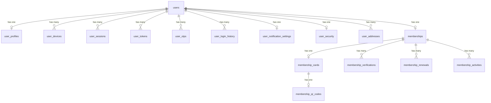

# Module 01: Authentication & Membership

> Handles user registration, authentication, digital membership cards, QR-based verification, renewals, and complete identity lifecycle management.

---

## Module Overview

| Property | Value |
|----------|-------|
| **Module ID** | `AUTH_MEMBERSHIP` |
| **Entities** | 16 |
| **Priority** | Critical (foundation of all other modules) |
| **Dependencies** | None (core module) |

Every user must register, verify their identity (OTP + optional document upload), and receive an approved membership before accessing donor, volunteer, or administrative features. Memberships are categorized and renewed periodically.

---

## Database Schema

### Table: `users`

The root identity table for all platform accounts.

| Column | Type | Constraints | Description |
|--------|------|-------------|-------------|
| `id` | `BIGSERIAL` | PK | Auto-incrementing unique identifier |
| `first_name` | `VARCHAR(100)` | NOT NULL | Given name |
| `last_name` | `VARCHAR(100)` | NOT NULL | Family name |
| `full_name` | `VARCHAR(200)` | GENERATED | `first_name || ' ' || last_name` |
| `email` | `VARCHAR(255)` | UNIQUE, NOT NULL | Login address |
| `phone` | `VARCHAR(20)` | UNIQUE, NOT NULL | For OTP delivery |
| `password` | `VARCHAR(255)` | NOT NULL | bcrypt hash (cost 12) |
| `profile_photo` | `VARCHAR(500)` | NULL | URL to stored image |
| `date_of_birth` | `DATE` | NULL | For age-restricted campaigns |
| `gender` | `VARCHAR(20)` | CHECK | `male`, `female`, `other`, `prefer_not_to_say` |
| `blood_group` | `VARCHAR(10)` | NULL | `A+`, `B-`, etc. |
| `national_id` | `VARCHAR(50)` | UNIQUE, NULL | Government ID (NID/Passport) |
| `status` | `VARCHAR(20)` | NOT NULL, DEFAULT `pending` | `pending`, `active`, `suspended`, `banned` |
| `is_verified` | `BOOLEAN` | DEFAULT FALSE | Email + phone verified |
| `last_login` | `TIMESTAMPTZ` | NULL | Most recent successful login |
| `created_at` | `TIMESTAMPTZ` | DEFAULT NOW() | Registration timestamp |
| `updated_at` | `TIMESTAMPTZ` | DEFAULT NOW() | Auto-refreshed on update |

**Indexes:** `email` (unique), `phone` (unique), `national_id` (unique), `status`, `created_at`

**Relationships:**
- `hasOne` → `user_profiles`
- `hasMany` → `user_devices`, `user_sessions`, `user_tokens`, `user_otps`, `user_login_history`, `memberships`

---

### Table: `user_profiles`

Extended demographic and social information.

| Column | Type | Constraints | Description |
|--------|------|-------------|-------------|
| `id` | `BIGSERIAL` | PK | |
| `user_id` | `BIGINT` | FK → `users.id`, ON DELETE CASCADE | |
| `father_name` | `VARCHAR(200)` | NULL | |
| `mother_name` | `VARCHAR(200)` | NULL | |
| `occupation` | `VARCHAR(100)` | NULL | |
| `organization` | `VARCHAR(200)` | NULL | Employer or affiliated org |
| `designation` | `VARCHAR(100)` | NULL | Job title |
| `education` | `VARCHAR(100)` | NULL | Highest degree |
| `bio` | `TEXT` | NULL | Short biography |
| `facebook` | `VARCHAR(500)` | NULL | Profile URL |
| `linkedin` | `VARCHAR(500)` | NULL | Profile URL |
| `website` | `VARCHAR(500)` | NULL | Personal website |
| `created_at` | `TIMESTAMPTZ` | DEFAULT NOW() | |
| `updated_at` | `TIMESTAMPTZ` | DEFAULT NOW() | |

---

### Table: `user_devices`

Tracks all devices used to access the account (for security and push notifications).

| Column | Type | Constraints | Description |
|--------|------|-------------|-------------|
| `id` | `BIGSERIAL` | PK | |
| `user_id` | `BIGINT` | FK → `users.id`, ON DELETE CASCADE | |
| `device_id` | `VARCHAR(255)` | NOT NULL | Unique device identifier |
| `device_name` | `VARCHAR(100)` | NULL | e.g., "iPhone 14 Pro" |
| `device_type` | `VARCHAR(50)` | NOT NULL | `mobile`, `tablet`, `desktop` |
| `operating_system` | `VARCHAR(50)` | NULL | iOS 17, Android 14, etc. |
| `browser` | `VARCHAR(50)` | NULL | Chrome, Safari, etc. |
| `app_version` | `VARCHAR(20)` | NULL | Mobile app build number |
| `ip_address` | `INET` | NULL | Last known IP |
| `last_login` | `TIMESTAMPTZ` | NULL | |
| `created_at` | `TIMESTAMPTZ` | DEFAULT NOW() | |
| `updated_at` | `TIMESTAMPTZ` | DEFAULT NOW() | |

---

### Table: `user_sessions`

Active JWT sessions for token revocation and device management.

| Column | Type | Constraints | Description |
|--------|------|-------------|-------------|
| `id` | `BIGSERIAL` | PK | |
| `user_id` | `BIGINT` | FK → `users.id`, ON DELETE CASCADE | |
| `device_id` | `VARCHAR(255)` | NULL | Links to `user_devices` |
| `access_token` | `TEXT` | NOT NULL | Hashed token identifier |
| `refresh_token` | `TEXT` | NOT NULL | Hashed refresh token |
| `expires_at` | `TIMESTAMPTZ` | NOT NULL | Access token expiry |
| `login_time` | `TIMESTAMPTZ` | DEFAULT NOW() | |
| `logout_time` | `TIMESTAMPTZ` | NULL | Set on explicit logout |
| `status` | `VARCHAR(20)` | DEFAULT `active` | `active`, `revoked`, `expired` |
| `created_at` | `TIMESTAMPTZ` | DEFAULT NOW() | |

---

### Table: `user_tokens`

Single-use tokens for email verification, password reset, and membership verification.

| Column | Type | Constraints | Description |
|--------|------|-------------|-------------|
| `id` | `BIGSERIAL` | PK | |
| `user_id` | `BIGINT` | FK → `users.id`, ON DELETE CASCADE | |
| `token` | `VARCHAR(512)` | NOT NULL | Cryptographically random string |
| `token_type` | `VARCHAR(50)` | NOT NULL | `email_verification`, `password_reset`, `login_verification`, `membership_verification` |
| `expires_at` | `TIMESTAMPTZ` | NOT NULL | Usually 1 hour |
| `is_used` | `BOOLEAN` | DEFAULT FALSE | One-time use flag |
| `created_at` | `TIMESTAMPTZ` | DEFAULT NOW() | |

**Index:** `token` (unique), `user_id` + `token_type`

---

### Table: `user_otps`

Time-based OTP codes sent via SMS or email.

| Column | Type | Constraints | Description |
|--------|------|-------------|-------------|
| `id` | `BIGSERIAL` | PK | |
| `user_id` | `BIGINT` | FK → `users.id`, ON DELETE CASCADE | |
| `phone` | `VARCHAR(20)` | NOT NULL | Destination number |
| `otp` | `VARCHAR(10)` | NOT NULL | Hashed OTP code |
| `purpose` | `VARCHAR(50)` | NOT NULL | `registration`, `login`, `password_reset`, `2fa` |
| `expires_at` | `TIMESTAMPTZ` | NOT NULL | Usually 5 minutes |
| `verified_at` | `TIMESTAMPTZ` | NULL | Set on successful verification |
| `status` | `VARCHAR(20)` | DEFAULT `pending` | `pending`, `verified`, `expired` |
| `created_at` | `TIMESTAMPTZ` | DEFAULT NOW() | |

---

### Table: `user_login_history`

Immutable audit trail of all login attempts (success and failure).

| Column | Type | Constraints | Description |
|--------|------|-------------|-------------|
| `id` | `BIGSERIAL` | PK | |
| `user_id` | `BIGINT` | FK → `users.id`, ON DELETE CASCADE | |
| `device_id` | `VARCHAR(255)` | NULL | |
| `ip_address` | `INET` | NOT NULL | |
| `location` | `VARCHAR(200)` | NULL | GeoIP city/country |
| `login_time` | `TIMESTAMPTZ` | DEFAULT NOW() | |
| `logout_time` | `TIMESTAMPTZ` | NULL | |
| `status` | `VARCHAR(20)` | NOT NULL | `success`, `failed`, `blocked` |
| `created_at` | `TIMESTAMPTZ` | DEFAULT NOW() | |

---

### Table: `user_notification_settings`

Per-user preference for communication channels.

| Column | Type | Constraints | Description |
|--------|------|-------------|-------------|
| `id` | `BIGSERIAL` | PK | |
| `user_id` | `BIGINT` | FK → `users.id`, ON DELETE CASCADE, UNIQUE | One row per user |
| `push_notification` | `BOOLEAN` | DEFAULT TRUE | |
| `email_notification` | `BOOLEAN` | DEFAULT TRUE | |
| `sms_notification` | `BOOLEAN` | DEFAULT TRUE | |
| `campaign_notification` | `BOOLEAN` | DEFAULT TRUE | |
| `emergency_notification` | `BOOLEAN` | DEFAULT TRUE | |
| `newsletter` | `BOOLEAN` | DEFAULT TRUE | |
| `created_at` | `TIMESTAMPTZ` | DEFAULT NOW() | |
| `updated_at` | `TIMESTAMPTZ` | DEFAULT NOW() | |

---

### Table: `user_security`

Account security settings and intrusion detection.

| Column | Type | Constraints | Description |
|--------|------|-------------|-------------|
| `id` | `BIGSERIAL` | PK | |
| `user_id` | `BIGINT` | FK → `users.id`, ON DELETE CASCADE, UNIQUE | |
| `two_factor_enabled` | `BOOLEAN` | DEFAULT FALSE | TOTP 2FA status |
| `security_question` | `VARCHAR(255)` | NULL | Backup question |
| `security_answer` | `VARCHAR(255)` | NULL | Hashed answer |
| `failed_login_attempts` | `INT` | DEFAULT 0 | Resets on successful login |
| `account_locked_until` | `TIMESTAMPTZ` | NULL | Auto-unlock after cooldown |
| `last_password_changed` | `TIMESTAMPTZ` | NULL | |
| `created_at` | `TIMESTAMPTZ` | DEFAULT NOW() | |
| `updated_at` | `TIMESTAMPTZ` | DEFAULT NOW() | |

---

### Table: `user_addresses`

Geographic address linked to the Bangladesh administrative hierarchy.

| Column | Type | Constraints | Description |
|--------|------|-------------|-------------|
| `id` | `BIGSERIAL` | PK | |
| `user_id` | `BIGINT` | FK → `users.id`, ON DELETE CASCADE | |
| `country_id` | `INT` | FK → `countries.id` | Usually Bangladesh |
| `division_id` | `INT` | FK → `divisions.id` | |
| `district_id` | `INT` | FK → `districts.id` | |
| `upazila_id` | `INT` | FK → `upazilas.id` | |
| `union_id` | `INT` | FK → `unions.id` | |
| `village` | `VARCHAR(200)` | NULL | |
| `post_code` | `VARCHAR(20)` | NULL | |
| `address_line` | `TEXT` | NULL | Street address |
| `latitude` | `DECIMAL(10,8)` | NULL | |
| `longitude` | `DECIMAL(11,8)` | NULL | |
| `is_default` | `BOOLEAN` | DEFAULT FALSE | |
| `created_at` | `TIMESTAMPTZ` | DEFAULT NOW() | |
| `updated_at` | `TIMESTAMPTZ` | DEFAULT NOW() | |

---

### Table: `memberships`

Core membership record linking a user to their organizational role.

| Column | Type | Constraints | Description |
|--------|------|-------------|-------------|
| `id` | `BIGSERIAL` | PK | |
| `user_id` | `BIGINT` | FK → `users.id`, ON DELETE CASCADE, UNIQUE | One active membership per user |
| `membership_number` | `VARCHAR(50)` | UNIQUE, NOT NULL | Auto-generated (e.g., ASH-2026-000001) |
| `membership_type` | `VARCHAR(50)` | NOT NULL | `volunteer`, `general_member`, `individual_donor`, `corporate_donor`, `staff`, `executive_member`, `coordinator` |
| `organization_role` | `VARCHAR(50)` | NULL | Specific title within the org |
| `joining_date` | `DATE` | NOT NULL | |
| `expiry_date` | `DATE` | NULL | For time-bound memberships |
| `monthly_contribution` | `DECIMAL(12,2)` | DEFAULT 0.00 | For general members |
| `status` | `VARCHAR(20)` | DEFAULT `pending` | `pending`, `active`, `suspended`, `expired` |
| `approved_by` | `BIGINT` | FK → `users.id`, NULL | Admin who approved |
| `approved_at` | `TIMESTAMPTZ` | NULL | |
| `created_at` | `TIMESTAMPTZ` | DEFAULT NOW() | |
| `updated_at` | `TIMESTAMPTZ` | DEFAULT NOW() | |

**Indexes:** `membership_number` (unique), `membership_type`, `status`, `user_id`

---

### Table: `membership_cards`

Physical or digital membership card metadata.

| Column | Type | Constraints | Description |
|--------|------|-------------|-------------|
| `id` | `BIGSERIAL` | PK | |
| `membership_id` | `BIGINT` | FK → `memberships.id`, ON DELETE CASCADE | |
| `card_number` | `VARCHAR(100)` | UNIQUE, NOT NULL | |
| `card_type` | `VARCHAR(50)` | NOT NULL | `digital`, `physical` |
| `issue_date` | `DATE` | NOT NULL | |
| `expiry_date` | `DATE` | NULL | |
| `card_status` | `VARCHAR(20)` | DEFAULT `active` | `active`, `revoked`, `expired` |
| `profile_photo` | `VARCHAR(500)` | NULL | URL to card photo |
| `signature` | `VARCHAR(500)` | NULL | URL to signature image |
| `created_at` | `TIMESTAMPTZ` | DEFAULT NOW() | |
| `updated_at` | `TIMESTAMPTZ` | DEFAULT NOW() | |

---

### Table: `membership_qr_codes`

QR and barcode data for instant verification at events.

| Column | Type | Constraints | Description |
|--------|------|-------------|-------------|
| `id` | `BIGSERIAL` | PK | |
| `membership_card_id` | `BIGINT` | FK → `membership_cards.id`, ON DELETE CASCADE | |
| `qr_code` | `TEXT` | NOT NULL | Base64 or URL to QR image |
| `barcode` | `VARCHAR(255)` | UNIQUE, NOT NULL | Scannable barcode value |
| `verification_url` | `VARCHAR(500)` | NOT NULL | Public URL that validates QR |
| `scan_count` | `INT` | DEFAULT 0 | Analytics |
| `last_scanned_at` | `TIMESTAMPTZ` | NULL | |
| `created_at` | `TIMESTAMPTZ` | DEFAULT NOW() | |
| `updated_at` | `TIMESTAMPTZ` | DEFAULT NOW() | |

---

### Table: `membership_verifications`

Audit log of manual or automatic membership verification events.

| Column | Type | Constraints | Description |
|--------|------|-------------|-------------|
| `id` | `BIGSERIAL` | PK | |
| `membership_id` | `BIGINT` | FK → `memberships.id`, ON DELETE CASCADE | |
| `verification_method` | `VARCHAR(50)` | NOT NULL | `manual_review`, `document_upload`, `face_verification`, `qr_scan` |
| `verified_by` | `BIGINT` | FK → `users.id`, NULL | Admin or system |
| `verification_status` | `VARCHAR(20)` | NOT NULL | `pending`, `approved`, `rejected` |
| `verification_date` | `TIMESTAMPTZ` | DEFAULT NOW() | |
| `remarks` | `TEXT` | NULL | |
| `created_at` | `TIMESTAMPTZ` | DEFAULT NOW() | |
| `updated_at` | `TIMESTAMPTZ` | DEFAULT NOW() | |

---

### Table: `membership_renewals`

Tracks periodic membership renewals with payment history.

| Column | Type | Constraints | Description |
|--------|------|-------------|-------------|
| `id` | `BIGSERIAL` | PK | |
| `membership_id` | `BIGINT` | FK → `memberships.id`, ON DELETE CASCADE | |
| `renewal_date` | `DATE` | NOT NULL | |
| `renewal_amount` | `DECIMAL(12,2)` | NOT NULL | |
| `payment_status` | `VARCHAR(20)` | DEFAULT `pending` | `pending`, `paid`, `failed` |
| `next_expiry_date` | `DATE` | NOT NULL | |
| `processed_by` | `BIGINT` | FK → `users.id`, NULL | |
| `created_at` | `TIMESTAMPTZ` | DEFAULT NOW() | |
| `updated_at` | `TIMESTAMPTZ` | DEFAULT NOW() | |

---

### Table: `membership_activities`

Immutable log of every membership state change.

| Column | Type | Constraints | Description |
|--------|------|-------------|-------------|
| `id` | `BIGSERIAL` | PK | |
| `membership_id` | `BIGINT` | FK → `memberships.id`, ON DELETE CASCADE | |
| `activity_type` | `VARCHAR(50)` | NOT NULL | `registration`, `membership_approved`, `membership_rejected`, `card_generated`, `qr_generated`, `qr_verified`, `membership_renewed`, `membership_suspended`, `membership_expired`, `membership_reactivated` |
| `description` | `TEXT` | NULL | Human-readable context |
| `performed_by` | `BIGINT` | FK → `users.id`, NULL | |
| `ip_address` | `INET` | NULL | |
| `created_at` | `TIMESTAMPTZ` | DEFAULT NOW() | |

---

## Entity Relationship Diagram (Module)



---

## API Endpoints

### 1. User Registration

**Endpoint:** `POST /api/v1/auth/register`  
**Access:** Public  
**Description:** Create a new user account. Triggers OTP verification.

**Request Body (DTO)**
```json
{
  "first_name": "John",
  "last_name": "Doe",
  "email": "john.doe@example.com",
  "phone": "+8801XXXXXXXXX",
  "password": "SecurePass123!",
  "date_of_birth": "1990-05-15",
  "gender": "male",
  "blood_group": "O+",
  "national_id": "1234567890",
  "address": {
    "division_id": 1,
    "district_id": 2,
    "upazila_id": 3,
    "union_id": 4,
    "village": "Dhanmondi",
    "address_line": "House 12, Road 5"
  }
}
```

**Validation Rules**
| Field | Rule | Message |
|-------|------|---------|
| `first_name` | required, min=2, max=100 | |
| `last_name` | required, min=2, max=100 | |
| `email` | required, email, unique | Email already registered |
| `phone` | required, e164 format, unique | Phone already registered |
| `password` | required, min=8, contains upper+lower+number+special | Weak password |
| `date_of_birth` | omitempty, date | |
| `gender` | omitempty, oneof=male female other prefer_not_to_say | |
| `blood_group` | omitempty, oneof=A+ A- B+ B- O+ O- AB+ AB- | |
| `national_id` | omitempty, min=10, unique | NID already registered |

**Business Logic**
1. Validate DTO.
2. Check uniqueness of `email`, `phone`, `national_id` (case-insensitive).
3. Hash password with bcrypt (cost 12).
4. Create `users` record with `status = pending`, `is_verified = false`.
5. Create `user_addresses` record if provided.
6. Generate 6-digit OTP, hash it, store in `user_otps` with purpose `registration`.
7. Send OTP via SMS queue.
8. Generate `email_verification` token, queue welcome email.

**Success Response (201 Created)**
```json
{
  "success": true,
  "message": "Registration successful. Please verify your phone with the OTP sent.",
  "data": {
    "id": 1,
    "first_name": "John",
    "last_name": "Doe",
    "email": "john.doe@example.com",
    "phone": "+8801XXXXXXXXX",
    "status": "pending",
    "is_verified": false,
    "created_at": "2026-07-12T10:00:00Z"
  }
}
```

**Error Responses**
| Status | Message | Condition |
|--------|---------|-----------|
| 400 | Validation failed | Invalid input format |
| 409 | Email already registered | Duplicate email |
| 409 | Phone already registered | Duplicate phone |
| 409 | National ID already registered | Duplicate NID |
| 500 | Failed to send OTP | SMS gateway error |

---

### 2. Verify OTP

**Endpoint:** `POST /api/v1/auth/verify-otp`  
**Access:** Public  
**Description:** Verify phone/email OTP to activate account.

**Request Body**
```json
{
  "phone": "+8801XXXXXXXXX",
  "otp": "123456",
  "purpose": "registration"
}
```

**Validation Rules**
- `phone`: required, e164
- `otp`: required, len=6, numeric
- `purpose`: required, oneof=`registration`, `login`, `password_reset`, `2fa`

**Business Logic**
1. Find latest `user_otps` record for phone + purpose where `status = pending`.
2. Check `expires_at > NOW()`. If expired, return 400.
3. Compare bcrypt hash of submitted OTP with stored hash.
4. On match: set `user_otps.status = verified`, `users.is_verified = true`.
5. If purpose is `registration`, create default `membership` record with `status = pending` and `membership_type = general_member`.
6. Create `membership_activities` record: `registration`.

**Success Response (200 OK)**
```json
{
  "success": true,
  "message": "OTP verified successfully",
  "data": {
    "user_id": 1,
    "verified": true,
    "membership_status": "pending"
  }
}
```

**Error Responses**
| Status | Message | Condition |
|--------|---------|-----------|
| 400 | Invalid or expired OTP | Wrong code or timeout |
| 400 | OTP already used | Idempotency violation |
| 404 | User not found | Phone not registered |

---

### 3. User Login

**Endpoint:** `POST /api/v1/auth/login`  
**Access:** Public  
**Description:** Authenticate and receive JWT access + refresh tokens.

**Request Body**
```json
{
  "email": "john.doe@example.com",
  "password": "SecurePass123!",
  "device_id": "abc-123-device",
  "device_name": "Chrome on Windows",
  "device_type": "desktop"
}
```

**Validation Rules**
- `email`: required, email
- `password`: required, min=8
- `device_id`: required
- `device_type`: required, oneof=`mobile`, `tablet`, `desktop`

**Business Logic**
1. Find user by email (case-insensitive).
2. If not found or password mismatch, increment `user_security.failed_login_attempts`. If >= 5, lock account for 30 minutes.
3. If `user_security.two_factor_enabled`, generate OTP and return `2fa_required: true` with a temporary token.
4. If account locked, return 403.
5. On success: reset `failed_login_attempts`.
6. Generate JWT access token (15 min) and refresh token (7 days). Include `user_id`, `role`, `membership_type` in claims.
7. Hash tokens and store in `user_sessions`.
8. Upsert `user_devices`.
9. Log to `user_login_history`.

**Success Response (200 OK)**
```json
{
  "success": true,
  "message": "Login successful",
  "data": {
    "access_token": "eyJhbGciOiJIUzI1NiIs...",
    "refresh_token": "eyJhbGciOiJIUzI1NiIs...",
    "expires_in": 900,
    "token_type": "Bearer",
    "user": {
      "id": 1,
      "first_name": "John",
      "last_name": "Doe",
      "email": "john.doe@example.com",
      "role": "general_member",
      "membership_status": "active",
      "is_verified": true
    }
  }
}
```

**Error Responses**
| Status | Message | Condition |
|--------|---------|-----------|
| 401 | Invalid credentials | Wrong email or password |
| 403 | Account locked | Too many failed attempts |
| 403 | Account suspended | Admin action |
| 422 | 2FA required | TOTP enabled; temp token returned |

---

### 4. Refresh Token

**Endpoint:** `POST /api/v1/auth/refresh`  
**Access:** Public (requires valid refresh token)  
**Description:** Rotate access token using refresh token.

**Request Body**
```json
{
  "refresh_token": "eyJhbGciOiJIUzI1NiIs..."
}
```

**Business Logic**
1. Hash incoming refresh token and look up in `user_sessions` where `status = active`.
2. Verify not expired.
3. Revoke old session (set `status = revoked`).
4. Issue new access + refresh tokens.
5. Store new session.

**Success Response (200 OK)**
```json
{
  "success": true,
  "message": "Token refreshed",
  "data": {
    "access_token": "eyNEW...",
    "refresh_token": "eyNEW...",
    "expires_in": 900
  }
}
```

---

### 5. Logout

**Endpoint:** `POST /api/v1/auth/logout`  
**Access:** Authenticated  
**Description:** Revoke current session.

**Headers:** `Authorization: Bearer <access_token>`

**Business Logic**
1. Extract session ID from JWT claims.
2. Set `user_sessions.status = revoked`, `logout_time = NOW()`.

**Success Response (200 OK)**
```json
{
  "success": true,
  "message": "Logged out successfully"
}
```

---

### 6. Request Password Reset

**Endpoint:** `POST /api/v1/auth/password-reset-request`  
**Access:** Public  
**Description:** Send password reset link to email.

**Request Body**
```json
{
  "email": "john.doe@example.com"
}
```

**Business Logic**
1. Find user by email.
2. Generate `password_reset` token (UUID, 1-hour expiry).
3. Store in `user_tokens`.
4. Queue email with reset link.

**Success Response (200 OK)** — Always returns 200 to prevent email enumeration.
```json
{
  "success": true,
  "message": "If the email exists, a reset link has been sent."
}
```

---

### 7. Reset Password

**Endpoint:** `POST /api/v1/auth/password-reset`  
**Access:** Public (requires token)  
**Description:** Set new password using reset token.

**Request Body**
```json
{
  "token": "uuid-reset-token",
  "new_password": "NewSecurePass123!",
  "confirm_password": "NewSecurePass123!"
}
```

**Validation Rules**
- `new_password`: required, min=8, complexity rules
- `confirm_password`: eqfield=NewPassword

**Business Logic**
1. Look up `user_tokens` by token where `token_type = password_reset`, `is_used = false`, `expires_at > NOW()`.
2. Hash new password.
3. Update `users.password`.
4. Mark token as used.
5. Revoke all active sessions for this user (force re-login).
6. Log to `user_security.last_password_changed`.

**Success Response (200 OK)**
```json
{
  "success": true,
  "message": "Password reset successful. Please log in again."
}
```

**Error Responses**
| Status | Message | Condition |
|--------|---------|-----------|
| 400 | Invalid or expired token | Token not found or expired |
| 400 | Token already used | Idempotency violation |

---

### 8. Get My Profile

**Endpoint:** `GET /api/v1/users/me`  
**Access:** Authenticated  
**Description:** Retrieve full profile with membership and address.

**Business Logic**
1. Extract `user_id` from JWT claims.
2. Query `users` with Preload(`UserProfile`, `Membership`, `UserAddresses`, `UserNotificationSettings`).

**Success Response (200 OK)**
```json
{
  "success": true,
  "message": "Profile retrieved",
  "data": {
    "id": 1,
    "first_name": "John",
    "last_name": "Doe",
    "email": "john.doe@example.com",
    "phone": "+8801XXXXXXXXX",
    "profile_photo": "https://cdn.ashray.org/photos/1.jpg",
    "status": "active",
    "is_verified": true,
    "membership": {
      "id": 10,
      "membership_number": "ASH-2026-000001",
      "membership_type": "volunteer",
      "status": "active",
      "joining_date": "2026-01-15",
      "expiry_date": "2027-01-15"
    },
    "profile": {
      "occupation": "Software Engineer",
      "education": "BSc in CSE",
      "facebook": "https://facebook.com/johndoe"
    },
    "addresses": [
      {
        "division": "Dhaka",
        "district": "Dhaka",
        "upazila": "Mohammadpur",
        "union": "Adabor",
        "address_line": "House 12, Road 5",
        "is_default": true
      }
    ]
  }
}
```

---

### 9. Update My Profile

**Endpoint:** `PUT /api/v1/users/me`  
**Access:** Authenticated  
**Description:** Update user profile and notification settings.

**Request Body**
```json
{
  "first_name": "John",
  "last_name": "Doe",
  "profile_photo": "https://cdn.ashray.org/photos/1.jpg",
  "profile": {
    "occupation": "Senior Engineer",
    "bio": "Passionate about humanitarian work."
  },
  "notification_settings": {
    "push_notification": true,
    "email_notification": false,
    "sms_notification": true
  }
}
```

**Business Logic**
1. Update `users` basic fields.
2. Upsert `user_profiles`.
3. Upsert `user_notification_settings`.
4. Return updated profile.

**Success Response (200 OK)**
```json
{
  "success": true,
  "message": "Profile updated successfully",
  "data": { ... }
}
```

---

### 10. Upload Profile Photo

**Endpoint:** `POST /api/v1/users/me/photo`  
**Access:** Authenticated  
**Content-Type:** `multipart/form-data`

**Request Body**
- `photo`: File (jpg, png, max 5MB)

**Business Logic**
1. Validate MIME type and size.
2. Generate presigned S3 URL or upload directly.
3. Virus scan.
4. Update `users.profile_photo`.

**Success Response (200 OK)**
```json
{
  "success": true,
  "message": "Photo uploaded",
  "data": {
    "profile_photo": "https://cdn.ashray.org/photos/1_abc123.jpg"
  }
}
```

---

### 11. Approve Membership (Admin)

**Endpoint:** `POST /api/v1/admin/memberships/:id/approve`  
**Access:** Admin (`membership:approve` permission)  
**Description:** Approve a pending membership and generate digital card.

**Request Body**
```json
{
  "remarks": "Documents verified via NID portal."
}
```

**Business Logic**
1. Fetch `memberships` by ID. Verify `status = pending`.
2. Update `status = active`, `approved_by = adminID`, `approved_at = NOW()`.
3. Generate unique `membership_number`: `ASH-{YYYY}-{SEQUENCE}`.
4. Create `membership_cards` record (`card_type = digital`).
5. Generate QR code image + barcode value. Store in `membership_qr_codes`.
6. Create `membership_verifications` record (`verification_method = manual_review`, `status = approved`).
7. Create `membership_activities` record (`membership_approved`).
8. Queue welcome notification + digital card email.

**Success Response (200 OK)**
```json
{
  "success": true,
  "message": "Membership approved",
  "data": {
    "membership_id": 10,
    "membership_number": "ASH-2026-000001",
    "status": "active",
    "card": {
      "card_number": "DC-2026-000001",
      "qr_code_url": "https://cdn.ashray.org/qr/10.png",
      "verification_url": "https://ashray.org/verify/qr/abc123"
    }
  }
}
```

**Error Responses**
| Status | Message | Condition |
|--------|---------|-----------|
| 403 | Insufficient permissions | Missing `membership:approve` |
| 404 | Membership not found | Invalid ID |
| 422 | Membership already approved | Status != pending |

---

### 12. Reject Membership (Admin)

**Endpoint:** `POST /api/v1/admin/memberships/:id/reject`  
**Access:** Admin  
**Description:** Reject a pending membership with reason.

**Request Body**
```json
{
  "reason": "Incomplete documentation. National ID not provided."
}
```

**Business Logic**
1. Update `memberships.status = suspended` (or keep pending with rejection flag).
2. Create `membership_verifications` record (`status = rejected`).
3. Create `membership_activities` record (`membership_rejected`).
4. Notify user.

**Success Response (200 OK)**
```json
{
  "success": true,
  "message": "Membership rejected",
  "data": {
    "membership_id": 10,
    "status": "rejected",
    "reason": "Incomplete documentation."
  }
}
```

---

### 13. Get Membership Card

**Endpoint:** `GET /api/v1/memberships/my-card`  
**Access:** Authenticated  
**Description:** Retrieve current user's digital membership card.

**Business Logic**
1. Find `memberships` by `user_id` with Preload(`MembershipCard`, `MembershipCard.MembershipQRCode`).
2. Return card details.

**Success Response (200 OK)**
```json
{
  "success": true,
  "message": "Membership card retrieved",
  "data": {
    "membership_number": "ASH-2026-000001",
    "full_name": "John Doe",
    "membership_type": "volunteer",
    "issue_date": "2026-01-15",
    "expiry_date": "2027-01-15",
    "qr_code": "https://cdn.ashray.org/qr/10.png",
    "barcode": "BAR-2026-000001",
    "verification_url": "https://ashray.org/verify/qr/abc123"
  }
}
```

---

### 14. Verify Membership QR Code

**Endpoint:** `POST /api/v1/memberships/verify-qr`  
**Access:** Authenticated (Volunteer, Admin, Staff)  
**Description:** Scan and verify a member's QR code at events or field activities.

**Request Body**
```json
{
  "qr_code_value": "abc123qr",
  "event_id": 5
}
```

**Business Logic**
1. Look up `membership_qr_codes` by `qr_code` or `barcode`.
2. Verify linked `membership.status = active` and `card_status = active`.
3. Increment `scan_count`, update `last_scanned_at`.
4. Create `membership_activities` record (`qr_verified`).
5. If `event_id` provided, record attendance.

**Success Response (200 OK)**
```json
{
  "success": true,
  "message": "QR verified successfully",
  "data": {
    "valid": true,
    "member": {
      "id": 1,
      "full_name": "John Doe",
      "membership_type": "volunteer",
      "membership_number": "ASH-2026-000001"
    },
    "scanned_at": "2026-07-12T14:30:00Z"
  }
}
```

**Error Responses**
| Status | Message | Condition |
|--------|---------|-----------|
| 404 | QR code not found | Invalid code |
| 410 | Membership expired | `expiry_date < NOW()` |
| 403 | Membership suspended | Status != active |

---

### 15. Renew Membership

**Endpoint:** `POST /api/v1/memberships/:id/renew`  
**Access:** Authenticated (own membership) or Admin  
**Description:** Process membership renewal with payment.

**Request Body**
```json
{
  "renewal_amount": 500.00,
  "payment_method": "bkash",
  "duration_months": 12
}
```

**Business Logic**
1. Fetch membership. Verify ownership or admin role.
2. Calculate `next_expiry_date` from current `expiry_date` + `duration_months`.
3. Create `membership_renewals` record with `payment_status = pending`.
4. Initiate payment via Payment module.
5. On payment callback success: update `payment_status = paid`, `memberships.expiry_date`, create `membership_activities` (`membership_renewed`).

**Success Response (200 OK)**
```json
{
  "success": true,
  "message": "Renewal initiated",
  "data": {
    "renewal_id": 45,
    "payment_status": "pending",
    "payment_url": "https://payment.bkash.com/..."
  }
}
```

---

### 16. List Membership Activities

**Endpoint:** `GET /api/v1/memberships/:id/activities`  
**Access:** Authenticated (own) or Admin  
**Query Params:** `page`, `limit`, `sort`

**Success Response (200 OK)**
```json
{
  "success": true,
  "message": "Activities retrieved",
  "data": [
    {
      "id": 101,
      "activity_type": "membership_approved",
      "description": "Approved by Admin A",
      "performed_by": { "id": 5, "name": "Admin A" },
      "created_at": "2026-01-15T10:00:00Z"
    }
  ],
  "meta": { "page": 1, "limit": 20, "total": 15 }
}
```

---

## Business Rules Summary

1. **One Membership Per User**: The `users` → `memberships` relationship is `1:1`. A user cannot hold multiple active memberships.
2. **Unique Identifiers**: `email`, `phone`, `national_id`, and `membership_number` must be globally unique.
3. **Password Security**: Minimum 8 characters, at least one uppercase, one lowercase, one digit, one special character. bcrypt cost = 12.
4. **OTP Security**: 6-digit numeric, 5-minute expiry, hashed storage. Max 3 attempts before requiring new OTP.
5. **Session Hygiene**: Access tokens expire in 15 minutes; refresh tokens in 7 days. All sessions are revoked on password change.
6. **Account Lockout**: 5 failed login attempts trigger a 30-minute lockout.
7. **Membership Lifecycle**: `pending` → `active` (via admin approval) → `expired` (auto on date) or `suspended` (admin action) → `reactivated`.
8. **QR Verification**: Only valid for `active` memberships with non-expired cards. Each scan is logged.
9. **Audit Trail**: Every approval, rejection, renewal, QR scan, and login is recorded in an immutable log table.

---

*Next: See `02_RBAC_AND_SECURITY.md` for authorization and access control specifications.*
