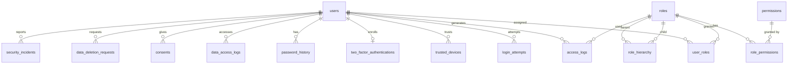

# Module 02: RBAC, Security & Compliance

> Enterprise-grade authorization, authentication hardening, audit logging, and regulatory compliance.

---

## Module Overview

| Property | Value |
|----------|-------|
| **Module ID** | `RBAC_SECURITY` |
| **Entities** | 41 (Part 2 + Part 15 consolidated) |
| **Priority** | Critical |
| **Dependencies** | Authentication & Membership (users must exist) |

ASHRAY implements a complete Role-Based Access Control (RBAC) system with granular module-level permissions, hierarchical role inheritance, two-factor authentication, IP filtering, and comprehensive audit trails suitable for nationwide foundation operations.

---

## Database Schema

### Core RBAC Tables

#### Table: `roles`

| Column | Type | Constraints | Description |
|--------|------|-------------|-------------|
| `id` | `BIGSERIAL` | PK | |
| `role_name` | `VARCHAR(50)` | UNIQUE, NOT NULL | Machine name: `super_admin`, `national_admin`, etc. |
| `display_name` | `VARCHAR(100)` | NOT NULL | Human-readable |
| `description` | `TEXT` | NULL | |
| `role_type` | `VARCHAR(50)` | NOT NULL | `system`, `custom` |
| `priority` | `INT` | DEFAULT 0 | Higher = more authority |
| `status` | `VARCHAR(20)` | DEFAULT `active` | `active`, `inactive` |
| `created_at` | `TIMESTAMPTZ` | DEFAULT NOW() | |
| `updated_at` | `TIMESTAMPTZ` | DEFAULT NOW() | |

**Seed Data:**
- `super_admin` (priority 100)
- `national_admin` (priority 90)
- `division_coordinator` (priority 80)
- `district_coordinator` (priority 70)
- `upazila_coordinator` (priority 60)
- `union_coordinator` (priority 50)
- `executive_member` (priority 40)
- `staff` (priority 30)
- `volunteer` (priority 20)
- `corporate_donor` (priority 10)
- `individual_donor` (priority 10)
- `general_member` (priority 5)

---

#### Table: `permissions`

| Column | Type | Constraints | Description |
|--------|------|-------------|-------------|
| `id` | `BIGSERIAL` | PK | |
| `permission_name` | `VARCHAR(100)` | UNIQUE, NOT NULL | e.g., `membership.view`, `membership.approve` |
| `module` | `VARCHAR(50)` | NOT NULL | Grouping: `membership`, `donation`, `campaign`, etc. |
| `description` | `TEXT` | NULL | |
| `created_at` | `TIMESTAMPTZ` | DEFAULT NOW() | |
| `updated_at` | `TIMESTAMPTZ` | DEFAULT NOW() | |

**Permission Naming Convention:** `{module}.{action}`  
Actions: `view`, `create`, `update`, `delete`, `approve`, `export`, `assign`

---

#### Table: `role_permissions`

Granular CRUD+ flags per role per permission.

| Column | Type | Constraints | Description |
|--------|------|-------------|-------------|
| `id` | `BIGSERIAL` | PK | |
| `role_id` | `BIGINT` | FK → `roles.id`, ON DELETE CASCADE | |
| `permission_id` | `BIGINT` | FK → `permissions.id`, ON DELETE CASCADE | |
| `can_view` | `BOOLEAN` | DEFAULT FALSE | |
| `can_create` | `BOOLEAN` | DEFAULT FALSE | |
| `can_update` | `BOOLEAN` | DEFAULT FALSE | |
| `can_delete` | `BOOLEAN` | DEFAULT FALSE | |
| `can_approve` | `BOOLEAN` | DEFAULT FALSE | |
| `created_at` | `TIMESTAMPTZ` | DEFAULT NOW() | |
| `updated_at` | `TIMESTAMPTZ` | DEFAULT NOW() | |

**Unique:** `role_id` + `permission_id`

---

#### Table: `user_roles`

Links users to one or more roles.

| Column | Type | Constraints | Description |
|--------|------|-------------|-------------|
| `id` | `BIGSERIAL` | PK | |
| `user_id` | `BIGINT` | FK → `users.id`, ON DELETE CASCADE | |
| `role_id` | `BIGINT` | FK → `roles.id`, ON DELETE CASCADE | |
| `assigned_by` | `BIGINT` | FK → `users.id`, NULL | Admin who assigned |
| `assigned_date` | `TIMESTAMPTZ` | DEFAULT NOW() | |
| `status` | `VARCHAR(20)` | DEFAULT `active` | `active`, `revoked` |
| `created_at` | `TIMESTAMPTZ` | DEFAULT NOW() | |
| `updated_at` | `TIMESTAMPTZ` | DEFAULT NOW() | |

---

#### Table: `role_hierarchy`

Defines reporting relationships and inherited access.

| Column | Type | Constraints | Description |
|--------|------|-------------|-------------|
| `id` | `BIGSERIAL` | PK | |
| `parent_role_id` | `BIGINT` | FK → `roles.id`, ON DELETE CASCADE | |
| `child_role_id` | `BIGINT` | FK → `roles.id`, ON DELETE CASCADE | |
| `hierarchy_level` | `INT` | NOT NULL | Distance from root (1, 2, 3...) |
| `created_at` | `TIMESTAMPTZ` | DEFAULT NOW() | |
| `updated_at` | `TIMESTAMPTZ` | DEFAULT NOW() | |

**Hierarchy Example:**
```
super_admin (1)
  └── national_admin (2)
        └── division_coordinator (3)
              └── district_coordinator (4)
                    └── upazila_coordinator (5)
                          └── union_coordinator (6)
                                └── volunteer (7)
                                      └── general_member (8)
```

---

#### Table: `access_logs`

Immutable audit of every system module access.

| Column | Type | Constraints | Description |
|--------|------|-------------|-------------|
| `id` | `BIGSERIAL` | PK | |
| `user_id` | `BIGINT` | FK → `users.id`, ON DELETE SET NULL | |
| `role_id` | `BIGINT` | FK → `roles.id`, ON DELETE SET NULL | |
| `module` | `VARCHAR(50)` | NOT NULL | |
| `action` | `VARCHAR(50)` | NOT NULL | `view`, `create`, `update`, `delete`, `approve`, `login`, `logout` |
| `ip_address` | `INET` | NOT NULL | |
| `device` | `VARCHAR(255)` | NULL | |
| `browser` | `VARCHAR(100)` | NULL | |
| `created_at` | `TIMESTAMPTZ` | DEFAULT NOW() | |

---

### Security Hardening Tables

#### Table: `login_attempts`

| Column | Type | Constraints | Description |
|--------|------|-------------|-------------|
| `id` | `BIGSERIAL` | PK | |
| `user_id` | `BIGINT` | FK → `users.id`, ON DELETE CASCADE | |
| `ip_address` | `INET` | NOT NULL | |
| `attempt_time` | `TIMESTAMPTZ` | DEFAULT NOW() | |
| `status` | `VARCHAR(20)` | NOT NULL | `success`, `failed` |
| `reason` | `VARCHAR(255)` | NULL | `wrong_password`, `account_locked`, etc. |

---

#### Table: `trusted_devices`

| Column | Type | Constraints | Description |
|--------|------|-------------|-------------|
| `id` | `BIGSERIAL` | PK | |
| `device_id` | `VARCHAR(255)` | NOT NULL | References `user_devices.device_id` |
| `user_id` | `BIGINT` | FK → `users.id`, ON DELETE CASCADE | |
| `verified_at` | `TIMESTAMPTZ` | DEFAULT NOW() | |
| `status` | `VARCHAR(20)` | DEFAULT `active` | `active`, `revoked` |

---

#### Table: `two_factor_authentications`

| Column | Type | Constraints | Description |
|--------|------|-------------|-------------|
| `id` | `BIGSERIAL` | PK | |
| `user_id` | `BIGINT` | FK → `users.id`, ON DELETE CASCADE, UNIQUE | |
| `method` | `VARCHAR(20)` | NOT NULL | `sms`, `email`, `authenticator_app` |
| `secret` | `VARCHAR(255)` | NOT NULL | Encrypted TOTP secret |
| `enabled` | `BOOLEAN` | DEFAULT FALSE | |
| `created_at` | `TIMESTAMPTZ` | DEFAULT NOW() | |

---

#### Table: `password_history`

Prevents password reuse.

| Column | Type | Constraints | Description |
|--------|------|-------------|-------------|
| `id` | `BIGSERIAL` | PK | |
| `user_id` | `BIGINT` | FK → `users.id`, ON DELETE CASCADE | |
| `password_hash` | `VARCHAR(255)` | NOT NULL | Old bcrypt hash |
| `changed_at` | `TIMESTAMPTZ` | DEFAULT NOW() | |

**Rule:** New password cannot match last 5 hashes.

---

#### Table: `ip_whitelist`

| Column | Type | Constraints | Description |
|--------|------|-------------|-------------|
| `id` | `BIGSERIAL` | PK | |
| `ip_address` | `INET` | NOT NULL | |
| `description` | `VARCHAR(255)` | NULL | |
| `status` | `VARCHAR(20)` | DEFAULT `active` | |
| `created_at` | `TIMESTAMPTZ` | DEFAULT NOW() | |

---

#### Table: `ip_blacklist`

| Column | Type | Constraints | Description |
|--------|------|-------------|-------------|
| `id` | `BIGSERIAL` | PK | |
| `ip_address` | `INET` | NOT NULL | |
| `reason` | `VARCHAR(255)` | NULL | |
| `blocked_until` | `TIMESTAMPTZ` | NULL | NULL = permanent |
| `status` | `VARCHAR(20)` | DEFAULT `active` | |
| `created_at` | `TIMESTAMPTZ` | DEFAULT NOW() | |

---

#### Table: `security_incidents`

| Column | Type | Constraints | Description |
|--------|------|-------------|-------------|
| `id` | `BIGSERIAL` | PK | |
| `incident_type` | `VARCHAR(50)` | NOT NULL | `brute_force`, `sql_injection_attempt`, `privilege_escalation`, `data_exfiltration` |
| `severity` | `VARCHAR(20)` | NOT NULL | `low`, `medium`, `high`, `critical` |
| `reported_by` | `BIGINT` | FK → `users.id`, NULL | |
| `description` | `TEXT` | NOT NULL | |
| `status` | `VARCHAR(20)` | DEFAULT `open` | `open`, `investigating`, `resolved` |
| `resolved_at` | `TIMESTAMPTZ` | NULL | |
| `created_at` | `TIMESTAMPTZ` | DEFAULT NOW() | |

---

#### Table: `data_access_logs`

GDPR/CCPA compliant access tracking.

| Column | Type | Constraints | Description |
|--------|------|-------------|-------------|
| `id` | `BIGSERIAL` | PK | |
| `user_id` | `BIGINT` | FK → `users.id`, ON DELETE SET NULL | |
| `module` | `VARCHAR(50)` | NOT NULL | |
| `record_id` | `BIGINT` | NOT NULL | Primary key of accessed record |
| `action` | `VARCHAR(50)` | NOT NULL | `read`, `write`, `delete`, `export` |
| `ip_address` | `INET` | NOT NULL | |
| `created_at` | `TIMESTAMPTZ` | DEFAULT NOW() | |

---

#### Table: `consents`

| Column | Type | Constraints | Description |
|--------|------|-------------|-------------|
| `id` | `BIGSERIAL` | PK | |
| `user_id` | `BIGINT` | FK → `users.id`, ON DELETE CASCADE | |
| `consent_type` | `VARCHAR(50)` | NOT NULL | `marketing`, `analytics`, `data_sharing` |
| `accepted` | `BOOLEAN` | DEFAULT FALSE | |
| `accepted_at` | `TIMESTAMPTZ` | NULL | |

---

#### Table: `data_deletion_requests`

GDPR "Right to be Forgotten".

| Column | Type | Constraints | Description |
|--------|------|-------------|-------------|
| `id` | `BIGSERIAL` | PK | |
| `user_id` | `BIGINT` | FK → `users.id`, ON DELETE CASCADE | |
| `reason` | `TEXT` | NULL | |
| `requested_at` | `TIMESTAMPTZ` | DEFAULT NOW() | |
| `approved_by` | `BIGINT` | FK → `users.id`, NULL | |
| `deleted_at` | `TIMESTAMPTZ` | NULL | Soft deletion timestamp |
| `status` | `VARCHAR(20)` | DEFAULT `pending` | `pending`, `approved`, `rejected`, `completed` |

---

#### Table: `api_keys`

For third-party integrations and service accounts.

| Column | Type | Constraints | Description |
|--------|------|-------------|-------------|
| `id` | `BIGSERIAL` | PK | |
| `name` | `VARCHAR(100)` | NOT NULL | e.g., "Mobile App v2" |
| `api_key` | `VARCHAR(255)` | UNIQUE, NOT NULL | Hashed key |
| `secret_key` | `VARCHAR(255)` | NOT NULL | Hashed secret |
| `status` | `VARCHAR(20)` | DEFAULT `active` | |
| `expires_at` | `TIMESTAMPTZ` | NULL | |
| `created_at` | `TIMESTAMPTZ` | DEFAULT NOW() | |
| `updated_at` | `TIMESTAMPTZ` | DEFAULT NOW() | |

---

#### Table: `webhooks`

| Column | Type | Constraints | Description |
|--------|------|-------------|-------------|
| `id` | `BIGSERIAL` | PK | |
| `name` | `VARCHAR(100)` | NOT NULL | |
| `url` | `VARCHAR(500)` | NOT NULL | HTTPS only |
| `secret` | `VARCHAR(255)` | NOT NULL | For HMAC signature |
| `event` | `VARCHAR(50)` | NOT NULL | `donation.created`, `campaign.milestone`, etc. |
| `status` | `VARCHAR(20)` | DEFAULT `active` | |
| `created_at` | `TIMESTAMPTZ` | DEFAULT NOW() | |

---

## Entity Relationship Diagram



---

## API Endpoints

### 1. List Roles

**Endpoint:** `GET /api/v1/admin/roles`  
**Access:** Super Admin, National Admin (`role:view`)  
**Query:** `page`, `limit`, `status`

**Success Response (200 OK)**
```json
{
  "success": true,
  "message": "Roles retrieved",
  "data": [
    {
      "id": 1,
      "role_name": "super_admin",
      "display_name": "Super Administrator",
      "priority": 100,
      "status": "active",
      "user_count": 3
    }
  ],
  "meta": { "page": 1, "limit": 20, "total": 12 }
}
```

---

### 2. Create Role

**Endpoint:** `POST /api/v1/admin/roles`  
**Access:** Super Admin (`role:create`)

**Request Body**
```json
{
  "role_name": "finance_manager",
  "display_name": "Finance Manager",
  "description": "Manages donations, expenses, and settlements",
  "role_type": "custom",
  "priority": 35,
  "permissions": [
    { "permission_id": 15, "can_view": true, "can_create": true, "can_update": true, "can_delete": false, "can_approve": true }
  ]
}
```

**Business Logic**
1. Validate `role_name` is unique and snake_case.
2. Create `roles` record.
3. Bulk insert into `role_permissions`.
4. Log to `access_logs`.

**Success Response (201 Created)**
```json
{
  "success": true,
  "message": "Role created",
  "data": { "id": 13, "role_name": "finance_manager", ... }
}
```

---

### 3. Update Role Permissions

**Endpoint:** `PUT /api/v1/admin/roles/:id/permissions`  
**Access:** Super Admin (`role:update`)

**Request Body**
```json
{
  "permissions": [
    { "permission_id": 15, "can_view": true, "can_create": true, "can_update": true, "can_delete": true, "can_approve": true }
  ]
}
```

**Business Logic**
1. Delete existing `role_permissions` for this role.
2. Insert new permission matrix.
3. Invalidate user permission cache in Redis.

**Success Response (200 OK)**
```json
{
  "success": true,
  "message": "Permissions updated",
  "data": { "role_id": 13, "permission_count": 25 }
}
```

---

### 4. Assign Role to User

**Endpoint:** `POST /api/v1/admin/users/:id/roles`  
**Access:** Admin (`user_role:assign`)

**Request Body**
```json
{
  "role_id": 5,
  "branch_id": 2
}
```

**Business Logic**
1. Verify target user exists.
2. Verify role exists and is active.
3. Check hierarchy: assigner must have higher priority than the role being assigned.
4. Create `user_roles` record.
5. If role is coordinator type, create/update `coordinator_roles` with geographic scope.

**Success Response (201 Created)**
```json
{
  "success": true,
  "message": "Role assigned",
  "data": {
    "user_id": 42,
    "role": "district_coordinator",
    "assigned_by": 1,
    "assigned_date": "2026-07-12T10:00:00Z"
  }
}
```

**Error Responses**
| Status | Message | Condition |
|--------|---------|-----------|
| 403 | Cannot assign higher privilege role | Assigner priority <= target role priority |
| 409 | User already has this role | Duplicate assignment |

---

### 5. Revoke User Role

**Endpoint:** `DELETE /api/v1/admin/users/:id/roles/:role_id`  
**Access:** Admin (`user_role:revoke`)

**Business Logic**
1. Soft-delete (set `status = revoked`) rather than hard-delete for audit.
2. Log to `access_logs`.

**Success Response (200 OK)**
```json
{
  "success": true,
  "message": "Role revoked"
}
```

---

### 6. Check My Permissions

**Endpoint:** `GET /api/v1/users/me/permissions`  
**Access:** Authenticated  
**Description:** Returns aggregated permission matrix for the current user (resolved from all assigned roles + hierarchy inheritance).

**Business Logic**
1. Fetch all `user_roles` for this user where `status = active`.
2. For each role, fetch `role_permissions`.
3. Aggregate with OR logic: if any role grants `can_view = true`, user has view permission.
4. Cache result in Redis (TTL: 5 minutes).

**Success Response (200 OK)**
```json
{
  "success": true,
  "message": "Permissions retrieved",
  "data": {
    "roles": ["volunteer", "upazila_coordinator"],
    "permissions": {
      "membership": { "view": true, "create": false, "update": false, "delete": false, "approve": false },
      "campaign": { "view": true, "create": true, "update": true, "delete": false, "approve": false },
      "donation": { "view": true, "create": true, "update": false, "delete": false, "approve": false }
    }
  }
}
```

---

### 7. Enable Two-Factor Authentication

**Endpoint:** `POST /api/v1/auth/2fa/enable`  
**Access:** Authenticated  
**Description:** Setup TOTP-based 2FA.

**Request Body**
```json
{
  "method": "authenticator_app"
}
```

**Business Logic**
1. Generate TOTP secret (base32).
2. Encrypt secret with AES-256 before storing.
3. Return QR code URL (otpauth://) for user to scan.
4. User must verify first OTP before `enabled = true`.

**Success Response (200 OK)**
```json
{
  "success": true,
  "message": "2FA setup initiated",
  "data": {
    "qr_code_url": "otpauth://totp/ASHRAY:john.doe?secret=JBSWY3DPEHPK3PXP&issuer=ASHRAY",
    "manual_entry_key": "JBSWY3DPEHPK3PXP",
    "backup_codes": ["12345678", "87654321"]
  }
}
```

---

### 8. Verify 2FA and Enable

**Endpoint:** `POST /api/v1/auth/2fa/verify`  
**Access:** Authenticated (with temp token)

**Request Body**
```json
{
  "otp": "123456",
  "backup_code": null
}
```

**Business Logic**
1. Validate TOTP against stored secret.
2. If valid, set `two_factor_authentications.enabled = true`.
3. If backup code used, invalidate that code.

**Success Response (200 OK)**
```json
{
  "success": true,
  "message": "2FA enabled successfully"
}
```

---

### 9. List Access Logs (Admin)

**Endpoint:** `GET /api/v1/admin/access-logs`  
**Access:** Super Admin (`audit:view`)  
**Query:** `user_id`, `module`, `action`, `from_date`, `to_date`, `page`, `limit`

**Success Response (200 OK)**
```json
{
  "success": true,
  "message": "Access logs retrieved",
  "data": [
    {
      "id": 5001,
      "user": { "id": 42, "name": "John Doe" },
      "role": "volunteer",
      "module": "campaign",
      "action": "create",
      "ip_address": "103.25.48.1",
      "device": "Chrome 120 / Windows 11",
      "created_at": "2026-07-12T08:15:00Z"
    }
  ],
  "meta": { "page": 1, "limit": 50, "total": 15000 }
}
```

---

### 10. Create IP Blacklist Entry

**Endpoint:** `POST /api/v1/admin/security/ip-blacklist`  
**Access:** Super Admin (`security:manage`)

**Request Body**
```json
{
  "ip_address": "192.168.1.100",
  "reason": "Brute force attack detected",
  "blocked_until": "2026-08-12T00:00:00Z"
}
```

**Business Logic**
1. Validate IP format.
2. Check against whitelist (cannot blacklist a whitelisted IP).
3. Insert into `ip_blacklist`.
4. Immediately terminate all active sessions from this IP.

**Success Response (201 Created)**
```json
{
  "success": true,
  "message": "IP blacklisted",
  "data": { "id": 12, "ip_address": "192.168.1.100", "blocked_until": "2026-08-12T00:00:00Z" }
}
```

---

### 11. Report Security Incident

**Endpoint:** `POST /api/v1/admin/security/incidents`  
**Access:** Admin (`security:manage`)

**Request Body**
```json
{
  "incident_type": "privilege_escalation",
  "severity": "high",
  "description": "User 42 attempted to access admin dashboard via modified JWT payload.",
  "user_id": 42
}
```

**Business Logic**
1. Create `security_incidents` record.
2. If severity = `critical`, immediately lock affected user account and notify super admins via SMS + Email.
3. Log to `security_activity_logs`.

**Success Response (201 Created)**
```json
{
  "success": true,
  "message": "Incident reported",
  "data": { "id": 89, "incident_type": "privilege_escalation", "status": "open" }
}
```

---

### 12. Submit Data Deletion Request (GDPR)

**Endpoint:** `POST /api/v1/users/me/data-deletion`  
**Access:** Authenticated

**Request Body**
```json
{
  "reason": "I no longer wish to use the platform."
}
```

**Business Logic**
1. Create `data_deletion_requests` with `status = pending`.
2. Notify admin dashboard.
3. Admin reviews and approves. System then anonymizes PII in `users` (sets name/email/phone to hashed values) and soft-deletes related records per `data_retention_policies`.
4. Financial records are retained (legal requirement) but de-linked from identity.

**Success Response (201 Created)**
```json
{
  "success": true,
  "message": "Data deletion request submitted",
  "data": { "request_id": 34, "status": "pending", "estimated_completion": "7 business days" }
}
```

---

### 13. Create API Key

**Endpoint:** `POST /api/v1/admin/api-keys`  
**Access:** Super Admin (`api_key:create`)

**Request Body**
```json
{
  "name": "Mobile App Production",
  "expires_at": "2027-07-12T00:00:00Z"
}
```

**Business Logic**
1. Generate `api_key` and `secret_key` using crypto/rand (32 bytes each, base64).
2. Hash both with bcrypt before storage.
3. Return plaintext keys **only once** in response.

**Success Response (201 Created)**
```json
{
  "success": true,
  "message": "API key created. Store these credentials securely.",
  "data": {
    "id": 5,
    "name": "Mobile App Production",
    "api_key": "ak_live_abc123...",
    "secret_key": "sk_live_xyz789...",
    "expires_at": "2027-07-12T00:00:00Z"
  }
}
```

> ⚠️ **Warning:** The plaintext `api_key` and `secret_key` are shown only once. If lost, the key must be revoked and regenerated.

---

## Business Rules Summary

1. **Role Priority Enforcement**: A user can only assign roles with priority strictly less than their own highest role priority.
2. **Permission Aggregation**: User permissions are the union (OR) of all active role permissions. There is no "deny" permission; absence of grant = deny.
3. **Hierarchy Inheritance**: Child roles implicitly inherit view permissions from parent roles unless explicitly overridden.
4. **Session Security**: All sessions are revoked on password change, 2FA enablement, or role revocation.
5. **IP Filtering**: Blacklist is checked before authentication. Whitelist bypasses rate limiting.
6. **Audit Immutability**: `access_logs`, `login_attempts`, and `data_access_logs` are append-only. No UPDATE or DELETE operations are permitted via API.
7. **Password History**: Last 5 password hashes are retained. Reuse is rejected with 422.
8. **Data Retention**: PII deletion requests are honored within 30 days, but financial and audit records are anonymized, not destroyed, to maintain legal compliance.
9. **API Key Security**: Keys are hashed in DB. HMAC-SHA256 is used to sign webhook payloads.
10. **Rate Limiting**: Login endpoints = 5 req/min per IP. General API = 100 req/min per user. Admin API = 1000 req/min per user.

---

*Next: See `03_ORGANIZATION_STRUCTURE.md` for branch, committee, and geographic hierarchy specifications.*
