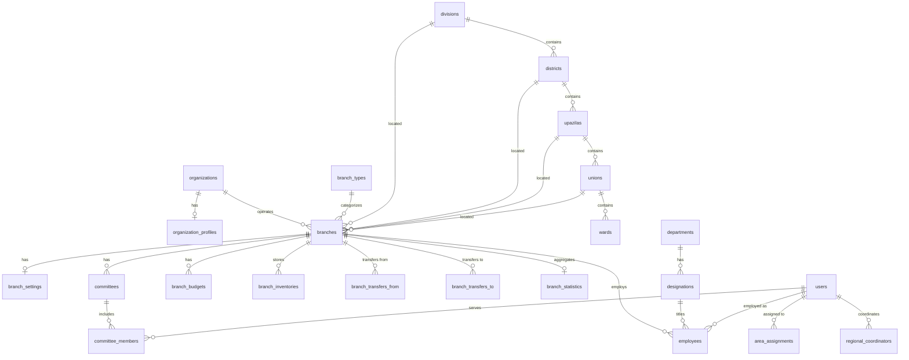

# Module 03: Organization Structure

> Manages the complete organizational hierarchy, branch offices, committees, employees, departments, designations, geographic assignments, and multi-branch operations.

---

## Module Overview

| Property | Value |
|----------|-------|
| **Module ID** | `ORG_STRUCTURE` |
| **Entities** | 36 (Part 3 + Part 13 consolidated) |
| **Priority** | Critical |
| **Dependencies** | Authentication, RBAC |

ASHRAY operates through a strict hierarchical structure: **Head Office → Division → District → Upazila → Union → Ward**. Every branch has its own manager, staff, budget, inventory, and operational dashboard.

---

## Database Schema

### Geographic Hierarchy (Lookup Tables)

These tables form the administrative backbone of Bangladesh. They are seeded once and rarely modified.

#### Table: `divisions`

| Column | Type | Constraints | Description |
|--------|------|-------------|-------------|
| `id` | `SERIAL` | PK | |
| `name` | `VARCHAR(100)` | NOT NULL, UNIQUE | e.g., "Dhaka", "Chittagong" |
| `code` | `VARCHAR(10)` | UNIQUE | BBS statistical code |
| `country_id` | `INT` | FK → `countries.id`, DEFAULT 1 | |
| `status` | `VARCHAR(20)` | DEFAULT `active` | |
| `created_at` | `TIMESTAMPTZ` | DEFAULT NOW() | |
| `updated_at` | `TIMESTAMPTZ` | DEFAULT NOW() | |

---

#### Table: `districts`

| Column | Type | Constraints | Description |
|--------|------|-------------|-------------|
| `id` | `SERIAL` | PK | |
| `division_id` | `INT` | FK → `divisions.id`, ON DELETE RESTRICT | |
| `name` | `VARCHAR(100)` | NOT NULL | |
| `code` | `VARCHAR(10)` | UNIQUE | |
| `status` | `VARCHAR(20)` | DEFAULT `active` | |
| `created_at` | `TIMESTAMPTZ` | DEFAULT NOW() | |
| `updated_at` | `TIMESTAMPTZ` | DEFAULT NOW() | |

**Unique:** `division_id` + `name`

---

#### Table: `upazilas`

| Column | Type | Constraints | Description |
|--------|------|-------------|-------------|
| `id` | `SERIAL` | PK | |
| `district_id` | `INT` | FK → `districts.id`, ON DELETE RESTRICT | |
| `name` | `VARCHAR(100)` | NOT NULL | |
| `code` | `VARCHAR(10)` | UNIQUE | |
| `status` | `VARCHAR(20)` | DEFAULT `active` | |
| `created_at` | `TIMESTAMPTZ` | DEFAULT NOW() | |
| `updated_at` | `TIMESTAMPTZ` | DEFAULT NOW() | |

---

#### Table: `unions`

| Column | Type | Constraints | Description |
|--------|------|-------------|-------------|
| `id` | `SERIAL` | PK | |
| `upazila_id` | `INT` | FK → `upazilas.id`, ON DELETE RESTRICT | |
| `name` | `VARCHAR(100)` | NOT NULL | |
| `code` | `VARCHAR(10)` | UNIQUE | |
| `status` | `VARCHAR(20)` | DEFAULT `active` | |
| `created_at` | `TIMESTAMPTZ` | DEFAULT NOW() | |
| `updated_at` | `TIMESTAMPTZ` | DEFAULT NOW() | |

---

#### Table: `wards`

| Column | Type | Constraints | Description |
|--------|------|-------------|-------------|
| `id` | `SERIAL` | PK | |
| `union_id` | `INT` | FK → `unions.id`, ON DELETE RESTRICT | |
| `name` | `VARCHAR(100)` | NOT NULL | |
| `ward_number` | `INT` | NOT NULL | 1-9 typically |
| `created_at` | `TIMESTAMPTZ` | DEFAULT NOW() | |
| `updated_at` | `TIMESTAMPTZ` | DEFAULT NOW() | |

---

### Organizational Entities

#### Table: `organizations`

| Column | Type | Constraints | Description |
|--------|------|-------------|-------------|
| `id` | `BIGSERIAL` | PK | |
| `organization_name` | `VARCHAR(200)` | NOT NULL | Foundation legal name |
| `short_name` | `VARCHAR(50)` | NOT NULL | e.g., "ASHRAY" |
| `registration_number` | `VARCHAR(100)` | UNIQUE | NGO Bureau registration |
| `tax_number` | `VARCHAR(100)` | UNIQUE, NULL | TIN for tax exemption |
| `foundation_date` | `DATE` | NOT NULL | |
| `logo` | `VARCHAR(500)` | NULL | URL |
| `website` | `VARCHAR(255)` | NULL | |
| `email` | `VARCHAR(255)` | NOT NULL | |
| `phone` | `VARCHAR(20)` | NOT NULL | |
| `status` | `VARCHAR(20)` | DEFAULT `active` | |
| `created_at` | `TIMESTAMPTZ` | DEFAULT NOW() | |
| `updated_at` | `TIMESTAMPTZ` | DEFAULT NOW() | |

---

#### Table: `organization_profiles`

| Column | Type | Constraints | Description |
|--------|------|-------------|-------------|
| `id` | `BIGSERIAL` | PK | |
| `organization_id` | `BIGINT` | FK → `organizations.id`, ON DELETE CASCADE, UNIQUE | |
| `mission` | `TEXT` | NULL | |
| `vision` | `TEXT` | NULL | |
| `history` | `TEXT` | NULL | |
| `chairman_name` | `VARCHAR(200)` | NULL | |
| `executive_director` | `VARCHAR(200)` | NULL | |
| `head_office_address` | `TEXT` | NULL | |
| `facebook` | `VARCHAR(500)` | NULL | |
| `youtube` | `VARCHAR(500)` | NULL | |
| `linkedin` | `VARCHAR(500)` | NULL | |
| `created_at` | `TIMESTAMPTZ` | DEFAULT NOW() | |
| `updated_at` | `TIMESTAMPTZ` | DEFAULT NOW() | |

---

#### Table: `branch_types`

| Column | Type | Constraints | Description |
|--------|------|-------------|-------------|
| `id` | `SERIAL` | PK | |
| `name` | `VARCHAR(50)` | NOT NULL, UNIQUE | `head_office`, `regional_office`, `district_office`, `upazila_office`, `union_office`, `temporary_relief_center` |
| `description` | `TEXT` | NULL | |
| `status` | `VARCHAR(20)` | DEFAULT `active` | |
| `created_at` | `TIMESTAMPTZ` | DEFAULT NOW() | |
| `updated_at` | `TIMESTAMPTZ` | DEFAULT NOW() | |

---

#### Table: `branches`

The core operational unit.

| Column | Type | Constraints | Description |
|--------|------|-------------|-------------|
| `id` | `BIGSERIAL` | PK | |
| `organization_id` | `BIGINT` | FK → `organizations.id`, ON DELETE RESTRICT | |
| `branch_code` | `VARCHAR(50)` | UNIQUE, NOT NULL | e.g., "DHK-MOH-001" |
| `branch_name` | `VARCHAR(200)` | NOT NULL | |
| `branch_type_id` | `INT` | FK → `branch_types.id` | |
| `manager_id` | `BIGINT` | FK → `users.id`, NULL | Branch manager |
| `division_id` | `INT` | FK → `divisions.id` | |
| `district_id` | `INT` | FK → `districts.id` | |
| `upazila_id` | `INT` | FK → `upazilas.id` | |
| `union_id` | `INT` | FK → `unions.id` | |
| `address` | `TEXT` | NULL | |
| `phone` | `VARCHAR(20)` | NULL | |
| `email` | `VARCHAR(255)` | NULL | |
| `latitude` | `DECIMAL(10,8)` | NULL | |
| `longitude` | `DECIMAL(11,8)` | NULL | |
| `status` | `VARCHAR(20)` | DEFAULT `active` | `active`, `inactive`, `closed` |
| `created_at` | `TIMESTAMPTZ` | DEFAULT NOW() | |
| `updated_at` | `TIMESTAMPTZ` | DEFAULT NOW() | |

**Indexes:** `branch_code` (unique), `division_id`, `district_id`, `status`

---

#### Table: `branch_settings`

| Column | Type | Constraints | Description |
|--------|------|-------------|-------------|
| `id` | `BIGSERIAL` | PK | |
| `branch_id` | `BIGINT` | FK → `branches.id`, ON DELETE CASCADE, UNIQUE | |
| `currency` | `VARCHAR(10)` | DEFAULT 'BDT' | |
| `timezone` | `VARCHAR(50)` | DEFAULT 'Asia/Dhaka' | |
| `working_hours` | `JSONB` | NULL | `{ "monday": "09:00-17:00", ... }` |
| `holiday_policy` | `TEXT` | NULL | |
| `status` | `VARCHAR(20)` | DEFAULT `active` | |
| `created_at` | `TIMESTAMPTZ` | DEFAULT NOW() | |
| `updated_at` | `TIMESTAMPTZ` | DEFAULT NOW() | |

---

#### Table: `committees`

| Column | Type | Constraints | Description |
|--------|------|-------------|-------------|
| `id` | `BIGSERIAL` | PK | |
| `branch_id` | `BIGINT` | FK → `branches.id`, ON DELETE CASCADE | |
| `committee_name` | `VARCHAR(200)` | NOT NULL | |
| `committee_level` | `VARCHAR(50)` | NOT NULL | `national`, `division`, `district`, `upazila`, `union` |
| `description` | `TEXT` | NULL | |
| `formation_date` | `DATE` | NOT NULL | |
| `status` | `VARCHAR(20)` | DEFAULT `active` | |
| `created_at` | `TIMESTAMPTZ` | DEFAULT NOW() | |
| `updated_at` | `TIMESTAMPTZ` | DEFAULT NOW() | |

---

#### Table: `committee_members`

| Column | Type | Constraints | Description |
|--------|------|-------------|-------------|
| `id` | `BIGSERIAL` | PK | |
| `committee_id` | `BIGINT` | FK → `committees.id`, ON DELETE CASCADE | |
| `member_id` | `BIGINT` | FK → `users.id`, ON DELETE RESTRICT | |
| `designation_id` | `INT` | FK → `designations.id` | e.g., Chairman, Secretary |
| `joining_date` | `DATE` | NOT NULL | |
| `end_date` | `DATE` | NULL | |
| `status` | `VARCHAR(20)` | DEFAULT `active` | |
| `created_at` | `TIMESTAMPTZ` | DEFAULT NOW() | |
| `updated_at` | `TIMESTAMPTZ` | DEFAULT NOW() | |

---

#### Table: `departments`

| Column | Type | Constraints | Description |
|--------|------|-------------|-------------|
| `id` | `SERIAL` | PK | |
| `department_name` | `VARCHAR(100)` | NOT NULL, UNIQUE | `Administration`, `Finance`, `HR`, `Volunteer Management`, `Donation Management`, `Campaign Management`, `Media & Communication`, `IT & Technology` |
| `description` | `TEXT` | NULL | |
| `status` | `VARCHAR(20)` | DEFAULT `active` | |
| `created_at` | `TIMESTAMPTZ` | DEFAULT NOW() | |
| `updated_at` | `TIMESTAMPTZ` | DEFAULT NOW() | |

---

#### Table: `designations`

| Column | Type | Constraints | Description |
|--------|------|-------------|-------------|
| `id` | `SERIAL` | PK | |
| `department_id` | `INT` | FK → `departments.id`, ON DELETE RESTRICT | |
| `designation_name` | `VARCHAR(100)` | NOT NULL | `Chairman`, `Vice Chairman`, `General Secretary`, `Treasurer`, `Executive Director`, `Coordinator`, `Volunteer` |
| `level` | `INT` | DEFAULT 0 | Hierarchy level |
| `description` | `TEXT` | NULL | |
| `status` | `VARCHAR(20)` | DEFAULT `active` | |
| `created_at` | `TIMESTAMPTZ` | DEFAULT NOW() | |
| `updated_at` | `TIMESTAMPTZ` | DEFAULT NOW() | |

---

#### Table: `employees`

| Column | Type | Constraints | Description |
|--------|------|-------------|-------------|
| `id` | `BIGSERIAL` | PK | |
| `user_id` | `BIGINT` | FK → `users.id`, ON DELETE RESTRICT | |
| `employee_code` | `VARCHAR(50)` | UNIQUE, NOT NULL | |
| `branch_id` | `BIGINT` | FK → `branches.id` | |
| `department_id` | `INT` | FK → `departments.id` | |
| `designation_id` | `INT` | FK → `designations.id` | |
| `joining_date` | `DATE` | NOT NULL | |
| `salary` | `DECIMAL(12,2)` | NULL | |
| `employment_type` | `VARCHAR(50)` | DEFAULT `full_time` | `full_time`, `part_time`, `contractual` |
| `reporting_manager_id` | `BIGINT` | FK → `employees.id`, NULL | Self-referential |
| `status` | `VARCHAR(20)` | DEFAULT `active` | |
| `created_at` | `TIMESTAMPTZ` | DEFAULT NOW() | |
| `updated_at` | `TIMESTAMPTZ` | DEFAULT NOW() | |

---

#### Table: `area_assignments`

Links volunteers/coordinators to geographic areas.

| Column | Type | Constraints | Description |
|--------|------|-------------|-------------|
| `id` | `BIGSERIAL` | PK | |
| `user_id` | `BIGINT` | FK → `users.id`, ON DELETE CASCADE | |
| `branch_id` | `BIGINT` | FK → `branches.id` | |
| `division_id` | `INT` | FK → `divisions.id`, NULL | |
| `district_id` | `INT` | FK → `districts.id`, NULL | |
| `upazila_id` | `INT` | FK → `upazilas.id`, NULL | |
| `union_id` | `INT` | FK → `unions.id`, NULL | |
| `assigned_by` | `BIGINT` | FK → `users.id` | |
| `assigned_date` | `DATE` | DEFAULT NOW() | |
| `status` | `VARCHAR(20)` | DEFAULT `active` | |
| `created_at` | `TIMESTAMPTZ` | DEFAULT NOW() | |
| `updated_at` | `TIMESTAMPTZ` | DEFAULT NOW() | |

---

#### Table: `branch_budgets`

| Column | Type | Constraints | Description |
|--------|------|-------------|-------------|
| `id` | `BIGSERIAL` | PK | |
| `branch_id` | `BIGINT` | FK → `branches.id`, ON DELETE CASCADE | |
| `fiscal_year` | `VARCHAR(10)` | NOT NULL | e.g., "2026-2027" |
| `allocated_budget` | `DECIMAL(15,2)` | NOT NULL | |
| `used_budget` | `DECIMAL(15,2)` | DEFAULT 0.00 | |
| `remaining_budget` | `DECIMAL(15,2)` | GENERATED | `allocated - used` |
| `status` | `VARCHAR(20)` | DEFAULT `active` | |
| `created_at` | `TIMESTAMPTZ` | DEFAULT NOW() | |
| `updated_at` | `TIMESTAMPTZ` | DEFAULT NOW() | |

---

#### Table: `branch_expenses`

| Column | Type | Constraints | Description |
|--------|------|-------------|-------------|
| `id` | `BIGSERIAL` | PK | |
| `branch_budget_id` | `BIGINT` | FK → `branch_budgets.id`, ON DELETE RESTRICT | |
| `expense_category` | `VARCHAR(100)` | NOT NULL | `salary`, `rent`, `utilities`, `relief_materials`, `transport` |
| `amount` | `DECIMAL(12,2)` | NOT NULL, CHECK > 0 | |
| `description` | `TEXT` | NULL | |
| `approved_by` | `BIGINT` | FK → `users.id` | |
| `expense_date` | `DATE` | NOT NULL | |
| `created_at` | `TIMESTAMPTZ` | DEFAULT NOW() | |
| `updated_at` | `TIMESTAMPTZ` | DEFAULT NOW() | |

---

#### Table: `branch_inventories`

| Column | Type | Constraints | Description |
|--------|------|-------------|-------------|
| `id` | `BIGSERIAL` | PK | |
| `branch_id` | `BIGINT` | FK → `branches.id`, ON DELETE CASCADE | |
| `item_name` | `VARCHAR(200)` | NOT NULL | |
| `quantity` | `INT` | NOT NULL, DEFAULT 0 | |
| `unit` | `VARCHAR(50)` | NOT NULL | `kg`, `piece`, `box`, `liter` |
| `condition` | `VARCHAR(50)` | DEFAULT `good` | `good`, `damaged`, `expired` |
| `created_at` | `TIMESTAMPTZ` | DEFAULT NOW() | |
| `updated_at` | `TIMESTAMPTZ` | DEFAULT NOW() | |

---

#### Table: `branch_transfers`

Inter-branch resource movement.

| Column | Type | Constraints | Description |
|--------|------|-------------|-------------|
| `id` | `BIGSERIAL` | PK | |
| `from_branch_id` | `BIGINT` | FK → `branches.id` | |
| `to_branch_id` | `BIGINT` | FK → `branches.id` | |
| `resource_type` | `VARCHAR(50)` | NOT NULL | `inventory`, `fund`, `vehicle` |
| `reference_id` | `BIGINT` | NOT NULL | ID of the resource being transferred |
| `approved_by` | `BIGINT` | FK → `users.id` | |
| `transfer_date` | `DATE` | NOT NULL | |
| `status` | `VARCHAR(20)` | DEFAULT `pending` | `pending`, `approved`, `in_transit`, `completed`, `cancelled` |
| `created_at` | `TIMESTAMPTZ` | DEFAULT NOW() | |
| `updated_at` | `TIMESTAMPTZ` | DEFAULT NOW() | |

---

#### Table: `regional_coordinators`

| Column | Type | Constraints | Description |
|--------|------|-------------|-------------|
| `id` | `BIGSERIAL` | PK | |
| `user_id` | `BIGINT` | FK → `users.id`, ON DELETE CASCADE | |
| `region_id` | `INT` | FK → `divisions.id` | |
| `designation` | `VARCHAR(100)` | NOT NULL | |
| `status` | `VARCHAR(20)` | DEFAULT `active` | |
| `created_at` | `TIMESTAMPTZ` | DEFAULT NOW() | |
| `updated_at` | `TIMESTAMPTZ` | DEFAULT NOW() | |

---

#### Table: `branch_statistics`

Materialized view or cached aggregate table for dashboard performance.

| Column | Type | Constraints | Description |
|--------|------|-------------|-------------|
| `id` | `BIGSERIAL` | PK | |
| `branch_id` | `BIGINT` | FK → `branches.id`, ON DELETE CASCADE, UNIQUE | |
| `member_count` | `INT` | DEFAULT 0 | |
| `volunteer_count` | `INT` | DEFAULT 0 | |
| `campaign_count` | `INT` | DEFAULT 0 | |
| `project_count` | `INT` | DEFAULT 0 | |
| `beneficiary_count` | `INT` | DEFAULT 0 | |
| `donation_amount` | `DECIMAL(15,2)` | DEFAULT 0.00 | |
| `created_at` | `TIMESTAMPTZ` | DEFAULT NOW() | |
| `updated_at` | `TIMESTAMPTZ` | DEFAULT NOW() | |

---

## Entity Relationship Diagram



---

## API Endpoints

### 1. Create Branch

**Endpoint:** `POST /api/v1/admin/branches`  
**Access:** Super Admin, National Admin (`branch:create`)

**Request Body**
```json
{
  "branch_code": "DHK-MOH-001",
  "branch_name": "Mohammadpur Branch",
  "branch_type_id": 4,
  "manager_id": 15,
  "division_id": 1,
  "district_id": 2,
  "upazila_id": 5,
  "union_id": 12,
  "address": "House 45, Road 12, Mohammadpur",
  "phone": "+8801XXXXXXXXX",
  "email": "mohammadpur@ashray.org",
  "latitude": 23.7645,
  "longitude": 90.3542
}
```

**Validation Rules**
- `branch_code`: required, unique, max 50, alphanumeric + hyphen
- `branch_name`: required, max 200
- `branch_type_id`: required, exists in `branch_types`
- `division_id` through `union_id`: required, must form a valid geographic chain (division contains district, etc.)
- `latitude`: omitempty, range -90 to 90
- `longitude`: omitempty, range -180 to 180

**Business Logic**
1. Validate geographic chain (e.g., district must belong to division).
2. Check `branch_code` uniqueness.
3. Create `branches` record.
4. Create default `branch_settings`.
5. Initialize `branch_statistics` with zeros.
6. Log to `branch_activities` (`branch_created`).

**Success Response (201 Created)**
```json
{
  "success": true,
  "message": "Branch created",
  "data": {
    "id": 8,
    "branch_code": "DHK-MOH-001",
    "branch_name": "Mohammadpur Branch",
    "type": "upazila_office",
    "location": {
      "division": "Dhaka",
      "district": "Dhaka",
      "upazila": "Mohammadpur",
      "union": "Adabor"
    },
    "created_at": "2026-07-12T10:00:00Z"
  }
}
```

---

### 2. List Branches

**Endpoint:** `GET /api/v1/branches`  
**Access:** Public (filtered by status = active) or Authenticated (all if admin)  
**Query:** `division_id`, `district_id`, `type`, `page`, `limit`

**Success Response (200 OK)**
```json
{
  "success": true,
  "message": "Branches retrieved",
  "data": [
    {
      "id": 8,
      "branch_code": "DHK-MOH-001",
      "branch_name": "Mohammadpur Branch",
      "type": "upazila_office",
      "manager": { "id": 15, "name": "Kamal Hossain" },
      "location": { "division": "Dhaka", "district": "Dhaka", "upazila": "Mohammadpur" },
      "statistics": {
        "member_count": 450,
        "volunteer_count": 32,
        "donation_amount": 1250000.00
      }
    }
  ],
  "meta": { "page": 1, "limit": 20, "total": 64 }
}
```

---

### 3. Get Branch Detail

**Endpoint:** `GET /api/v1/branches/:id`  
**Access:** Public

**Success Response (200 OK)**
```json
{
  "success": true,
  "message": "Branch retrieved",
  "data": {
    "id": 8,
    "branch_code": "DHK-MOH-001",
    "branch_name": "Mohammadpur Branch",
    "settings": { "currency": "BDT", "timezone": "Asia/Dhaka" },
    "committees": [
      {
        "id": 3,
        "committee_name": "Mohammadpur Executive Committee",
        "members": [
          { "user_id": 15, "name": "Kamal Hossain", "designation": "Chairman" }
        ]
      }
    ],
    "budgets": [
      { "fiscal_year": "2026-2027", "allocated_budget": 500000.00, "used_budget": 125000.00 }
    ]
  }
}
```

---

### 4. Update Branch

**Endpoint:** `PUT /api/v1/admin/branches/:id`  
**Access:** Admin (`branch:update`)

**Business Logic**
1. Fetch branch. Verify admin has jurisdiction (same or parent division).
2. Update fields. If `manager_id` changes, update `branch_managers` history.
3. Log to `branch_activities` (`branch_updated`).

**Success Response (200 OK)**
```json
{
  "success": true,
  "message": "Branch updated",
  "data": { "id": 8, "branch_name": "Mohammadpur Branch Updated", ... }
}
```

---

### 5. Assign Area to Volunteer

**Endpoint:** `POST /api/v1/admin/area-assignments`  
**Access:** Coordinator or Admin (`area:assign`)

**Request Body**
```json
{
  "user_id": 42,
  "branch_id": 8,
  "division_id": 1,
  "district_id": 2,
  "upazila_id": 5,
  "union_id": 12
}
```

**Business Logic**
1. Verify user has `volunteer` or `coordinator` membership type.
2. Verify geographic chain validity.
3. Create `area_assignments` record.
4. If user is coordinator, update `coordinator_roles` with scope.

**Success Response (201 Created)**
```json
{
  "success": true,
  "message": "Area assigned",
  "data": {
    "id": 99,
    "user": { "id": 42, "name": "Rahim Uddin" },
    "area": { "division": "Dhaka", "district": "Dhaka", "upazila": "Mohammadpur", "union": "Adabor" },
    "assigned_by": { "id": 5, "name": "Admin User" },
    "assigned_date": "2026-07-12T10:00:00Z"
  }
}
```

---

### 6. Create Committee

**Endpoint:** `POST /api/v1/admin/committees`  
**Access:** Admin (`committee:create`)

**Request Body**
```json
{
  "branch_id": 8,
  "committee_name": "Mohammadpur Relief Committee",
  "committee_level": "upazila",
  "description": "Manages local relief operations",
  "formation_date": "2026-01-01",
  "members": [
    { "user_id": 15, "designation_id": 1, "joining_date": "2026-01-01" },
    { "user_id": 22, "designation_id": 3, "joining_date": "2026-01-01" }
  ]
}
```

**Business Logic**
1. Create `committees` record.
2. Bulk create `committee_members`.
3. Verify no duplicate designations that should be unique (e.g., only one Chairman per committee).

**Success Response (201 Created)**
```json
{
  "success": true,
  "message": "Committee created",
  "data": { "id": 5, "committee_name": "Mohammadpur Relief Committee", "member_count": 2 }
}
```

---

### 7. Transfer Branch Resource

**Endpoint:** `POST /api/v1/admin/branch-transfers`  
**Access:** Admin (`branch:transfer`)

**Request Body**
```json
{
  "from_branch_id": 8,
  "to_branch_id": 9,
  "resource_type": "inventory",
  "reference_id": 45,
  "transfer_date": "2026-07-15"
}
```

**Business Logic**
1. Verify both branches are active.
2. Verify resource exists in `from_branch`.
3. Create `branch_transfers` with `status = pending`.
4. Notify receiving branch manager for approval.
5. On approval: update inventory quantities in both branches atomically within a transaction.

**Success Response (201 Created)**
```json
{
  "success": true,
  "message": "Transfer initiated",
  "data": { "transfer_id": 12, "status": "pending", "requires_approval_from": 9 }
}
```

---

### 8. Get Branch Statistics

**Endpoint:** `GET /api/v1/branches/:id/statistics`  
**Access:** Authenticated

**Success Response (200 OK)**
```json
{
  "success": true,
  "message": "Branch statistics retrieved",
  "data": {
    "branch_id": 8,
    "member_count": 450,
    "volunteer_count": 32,
    "campaign_count": 12,
    "project_count": 8,
    "beneficiary_count": 1200,
    "donation_amount": 1250000.00,
    "budget_utilization": 0.25,
    "last_updated": "2026-07-12T09:00:00Z"
  }
}
```

---

## Business Rules Summary

1. **Geographic Integrity**: Every branch must link to a valid chain of Division → District → Upazila → Union. The system validates this chain on create/update.
2. **Branch Code Uniqueness**: `branch_code` is globally unique and immutable after creation.
3. **One Manager Per Branch**: A branch can have only one active manager at a time. Changing managers creates a history record.
4. **Committee Designation Uniqueness**: Each committee can have only one Chairman, one General Secretary, and one Treasurer.
5. **Area Assignment Scope**: A volunteer can be assigned to multiple areas, but a coordinator's scope must match their role level (e.g., a District Coordinator cannot be assigned to a Union-level area only).
6. **Budget Control**: `branch_expenses` cannot exceed `branch_budgets.remaining_budget`. This is enforced via DB trigger or application-level transaction.
7. **Transfer Approval**: Inter-branch transfers require approval from the receiving branch manager and the parent division coordinator.
8. **Statistics Refresh**: `branch_statistics` is updated asynchronously via queue workers after relevant mutations (new member, donation, project completion).
9. **Branch Closure**: A branch cannot be closed if it has active campaigns, unpaid expenses, or unreturned inventory.
10. **Regional Coordinator Scope**: A Regional Coordinator oversees all branches within their assigned Division.

---

*Next: See `04_DONOR_MANAGEMENT.md` for donor profiles, subscriptions, wallets, and engagement tracking.*
