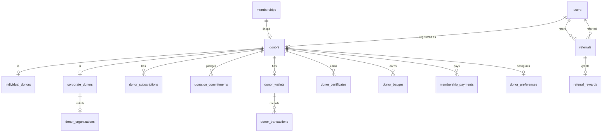

# Module 04: Donor & Membership Management

> Manages donor registration, recurring subscriptions, corporate CSR tracking, donor wallets, certificates, badges, referrals, and engagement.

---

## Module Overview

| Property | Value |
|----------|-------|
| **Module ID** | `DONOR_MGMT` |
| **Entities** | 17 |
| **Priority** | High |
| **Dependencies** | Authentication, Organization |

Every donor is linked to a registered user. The platform supports individual donors, corporate donors (with CSR reporting), lifetime donors, and anonymous donors. Recurring donations, wallet tracking, and gamification (badges/certificates) drive engagement.

---

## Database Schema

### Table: `donors`

The central donor registry.

| Column | Type | Constraints | Description |
|--------|------|-------------|-------------|
| `id` | `BIGSERIAL` | PK | |
| `user_id` | `BIGINT` | FK → `users.id`, ON DELETE RESTRICT | Every donor is a user |
| `donor_code` | `VARCHAR(50)` | UNIQUE, NOT NULL | Auto-generated: `D-2026-000001` |
| `donor_type` | `VARCHAR(50)` | NOT NULL | `individual`, `corporate`, `lifetime`, `anonymous` |
| `membership_id` | `BIGINT` | FK → `memberships.id`, NULL | Links to membership system |
| `registration_date` | `DATE` | DEFAULT NOW() | |
| `status` | `VARCHAR(20)` | DEFAULT `active` | `active`, `inactive`, `blacklisted` |
| `created_at` | `TIMESTAMPTZ` | DEFAULT NOW() | |
| `updated_at` | `TIMESTAMPTZ` | DEFAULT NOW() | |

---

### Table: `individual_donors`

| Column | Type | Constraints | Description |
|--------|------|-------------|-------------|
| `id` | `BIGSERIAL` | PK | |
| `donor_id` | `BIGINT` | FK → `donors.id`, ON DELETE CASCADE, UNIQUE | |
| `profession` | `VARCHAR(100)` | NULL | |
| `organization` | `VARCHAR(200)` | NULL | Employer |
| `monthly_commitment` | `DECIMAL(12,2)` | DEFAULT 0.00 | Pledged monthly amount |
| `preferred_campaign` | `VARCHAR(100)` | NULL | e.g., `education`, `medical` |
| `status` | `VARCHAR(20)` | DEFAULT `active` | |
| `created_at` | `TIMESTAMPTZ` | DEFAULT NOW() | |
| `updated_at` | `TIMESTAMPTZ` | DEFAULT NOW() | |

---

### Table: `corporate_donors`

| Column | Type | Constraints | Description |
|--------|------|-------------|-------------|
| `id` | `BIGSERIAL` | PK | |
| `donor_id` | `BIGINT` | FK → `donors.id`, ON DELETE CASCADE, UNIQUE | |
| `company_name` | `VARCHAR(200)` | NOT NULL | |
| `company_registration_no` | `VARCHAR(100)` | UNIQUE | RJSC number |
| `trade_license` | `VARCHAR(100)` | UNIQUE | |
| `contact_person` | `VARCHAR(200)` | NOT NULL | |
| `designation` | `VARCHAR(100)` | NULL | |
| `website` | `VARCHAR(255)` | NULL | |
| `logo` | `VARCHAR(500)` | NULL | URL |
| `monthly_commitment` | `DECIMAL(15,2)` | DEFAULT 0.00 | |
| `status` | `VARCHAR(20)` | DEFAULT `active` | |
| `created_at` | `TIMESTAMPTZ` | DEFAULT NOW() | |
| `updated_at` | `TIMESTAMPTZ` | DEFAULT NOW() | |

---

### Table: `donor_organizations`

Extended corporate info for CSR reporting.

| Column | Type | Constraints | Description |
|--------|------|-------------|-------------|
| `id` | `BIGSERIAL` | PK | |
| `corporate_donor_id` | `BIGINT` | FK → `corporate_donors.id`, ON DELETE CASCADE | |
| `industry` | `VARCHAR(100)` | NULL | |
| `company_size` | `VARCHAR(50)` | NULL | `startup`, `sme`, `enterprise` |
| `employee_count` | `INT` | NULL | |
| `address` | `TEXT` | NULL | |
| `city` | `VARCHAR(100)` | NULL | |
| `country` | `VARCHAR(100)` | NULL | |
| `created_at` | `TIMESTAMPTZ` | DEFAULT NOW() | |
| `updated_at` | `TIMESTAMPTZ` | DEFAULT NOW() | |

---

### Table: `donor_subscriptions`

Recurring donation plans.

| Column | Type | Constraints | Description |
|--------|------|-------------|-------------|
| `id` | `BIGSERIAL` | PK | |
| `donor_id` | `BIGINT` | FK → `donors.id`, ON DELETE CASCADE | |
| `subscription_type` | `VARCHAR(50)` | NOT NULL | `general`, `zakat`, `sadaqah`, `education` |
| `amount` | `DECIMAL(12,2)` | NOT NULL, CHECK > 0 | |
| `billing_cycle` | `VARCHAR(20)` | NOT NULL | `weekly`, `monthly`, `quarterly`, `yearly` |
| `start_date` | `DATE` | NOT NULL | |
| `next_billing_date` | `DATE` | NOT NULL | |
| `end_date` | `DATE` | NULL | |
| `auto_renew` | `BOOLEAN` | DEFAULT TRUE | |
| `status` | `VARCHAR(20)` | DEFAULT `active` | `active`, `paused`, `cancelled`, `expired` |
| `created_at` | `TIMESTAMPTZ` | DEFAULT NOW() | |
| `updated_at` | `TIMESTAMPTZ` | DEFAULT NOW() | |

---

### Table: `donation_commitments`

Pledged amounts for specific campaigns.

| Column | Type | Constraints | Description |
|--------|------|-------------|-------------|
| `id` | `BIGSERIAL` | PK | |
| `donor_id` | `BIGINT` | FK → `donors.id`, ON DELETE CASCADE | |
| `campaign_id` | `BIGINT` | FK → `campaigns.id`, ON DELETE RESTRICT | |
| `pledged_amount` | `DECIMAL(12,2)` | NOT NULL | |
| `paid_amount` | `DECIMAL(12,2)` | DEFAULT 0.00 | |
| `remaining_amount` | `DECIMAL(12,2)` | GENERATED | `pledged - paid` |
| `due_date` | `DATE` | NULL | |
| `status` | `VARCHAR(20)` | DEFAULT `pending` | `pending`, `partial`, `fulfilled`, `overdue` |
| `created_at` | `TIMESTAMPTZ` | DEFAULT NOW() | |
| `updated_at` | `TIMESTAMPTZ` | DEFAULT NOW() | |

---

### Table: `donor_wallets`

Virtual wallet for tracking total contributions and reward points.

| Column | Type | Constraints | Description |
|--------|------|-------------|-------------|
| `id` | `BIGSERIAL` | PK | |
| `donor_id` | `BIGINT` | FK → `donors.id`, ON DELETE CASCADE, UNIQUE | |
| `balance` | `DECIMAL(12,2)` | DEFAULT 0.00 | Refundable balance (rarely used) |
| `total_donated` | `DECIMAL(15,2)` | DEFAULT 0.00 | Lifetime donation sum |
| `reward_points` | `INT` | DEFAULT 0 | Gamification points |
| `status` | `VARCHAR(20)` | DEFAULT `active` | |
| `created_at` | `TIMESTAMPTZ` | DEFAULT NOW() | |
| `updated_at` | `TIMESTAMPTZ` | DEFAULT NOW() | |

---

### Table: `donor_transactions`

Immutable ledger of wallet movements.

| Column | Type | Constraints | Description |
|--------|------|-------------|-------------|
| `id` | `BIGSERIAL` | PK | |
| `wallet_id` | `BIGINT` | FK → `donor_wallets.id`, ON DELETE RESTRICT | |
| `transaction_type` | `VARCHAR(50)` | NOT NULL | `donation`, `membership_fee`, `refund`, `reward`, `adjustment` |
| `amount` | `DECIMAL(12,2)` | NOT NULL | Positive or negative |
| `reference_no` | `VARCHAR(100)` | NOT NULL | External or internal reference |
| `description` | `TEXT` | NULL | |
| `status` | `VARCHAR(20)` | DEFAULT `completed` | |
| `created_at` | `TIMESTAMPTZ` | DEFAULT NOW() | |
| `updated_at` | `TIMESTAMPTZ` | DEFAULT NOW() | |

---

### Table: `donor_certificates`

Auto-generated appreciation certificates.

| Column | Type | Constraints | Description |
|--------|------|-------------|-------------|
| `id` | `BIGSERIAL` | PK | |
| `donor_id` | `BIGINT` | FK → `donors.id`, ON DELETE CASCADE | |
| `certificate_type` | `VARCHAR(50)` | NOT NULL | `donation`, `appreciation`, `csr`, `volunteer_recognition` |
| `certificate_number` | `VARCHAR(100)` | UNIQUE, NOT NULL | |
| `issue_date` | `DATE` | DEFAULT NOW() | |
| `download_url` | `VARCHAR(500)` | NOT NULL | PDF URL |
| `status` | `VARCHAR(20)` | DEFAULT `active` | |
| `created_at` | `TIMESTAMPTZ` | DEFAULT NOW() | |
| `updated_at` | `TIMESTAMPTZ` | DEFAULT NOW() | |

---

### Table: `donor_badges`

Gamification achievements.

| Column | Type | Constraints | Description |
|--------|------|-------------|-------------|
| `id` | `BIGSERIAL` | PK | |
| `donor_id` | `BIGINT` | FK → `donors.id`, ON DELETE CASCADE | |
| `badge_name` | `VARCHAR(100)` | NOT NULL | `first_donation`, `monthly_supporter`, `gold_donor`, `platinum_donor`, `humanity_hero` |
| `badge_level` | `VARCHAR(20)` | NULL | `bronze`, `silver`, `gold`, `platinum` |
| `earned_at` | `TIMESTAMPTZ` | DEFAULT NOW() | |
| `created_at` | `TIMESTAMPTZ` | DEFAULT NOW() | |

---

### Table: `membership_fees`

Lookup table for membership pricing tiers.

| Column | Type | Constraints | Description |
|--------|------|-------------|-------------|
| `id` | `SERIAL` | PK | |
| `membership_type` | `VARCHAR(50)` | UNIQUE, NOT NULL | |
| `minimum_amount` | `DECIMAL(12,2)` | NOT NULL | |
| `maximum_amount` | `DECIMAL(12,2)` | NULL | |
| `billing_cycle` | `VARCHAR(20)` | DEFAULT `monthly` | |
| `status` | `VARCHAR(20)` | DEFAULT `active` | |
| `created_at` | `TIMESTAMPTZ` | DEFAULT NOW() | |
| `updated_at` | `TIMESTAMPTZ` | DEFAULT NOW() | |

---

### Table: `membership_payments`

| Column | Type | Constraints | Description |
|--------|------|-------------|-------------|
| `id` | `BIGSERIAL` | PK | |
| `membership_id` | `BIGINT` | FK → `memberships.id`, ON DELETE RESTRICT | |
| `payment_method` | `VARCHAR(50)` | NOT NULL | `bkash`, `nagad`, `bank_transfer` |
| `amount` | `DECIMAL(12,2)` | NOT NULL | |
| `transaction_id` | `VARCHAR(100)` | NULL | Gateway transaction ID |
| `payment_status` | `VARCHAR(20)` | DEFAULT `pending` | `pending`, `paid`, `failed`, `refunded` |
| `paid_at` | `TIMESTAMPTZ` | NULL | |
| `created_at` | `TIMESTAMPTZ` | DEFAULT NOW() | |
| `updated_at` | `TIMESTAMPTZ` | DEFAULT NOW() | |

---

### Table: `referrals`

| Column | Type | Constraints | Description |
|--------|------|-------------|-------------|
| `id` | `BIGSERIAL` | PK | |
| `referrer_id` | `BIGINT` | FK → `users.id`, ON DELETE RESTRICT | Existing member |
| `referred_user_id` | `BIGINT` | FK → `users.id`, ON DELETE RESTRICT, UNIQUE | New member |
| `referral_code` | `VARCHAR(50)` | NOT NULL | Code used during registration |
| `status` | `VARCHAR(20)` | DEFAULT `pending` | `pending`, `successful`, `rewarded` |
| `created_at` | `TIMESTAMPTZ` | DEFAULT NOW() | |
| `updated_at` | `TIMESTAMPTZ` | DEFAULT NOW() | |

---

### Table: `referral_rewards`

| Column | Type | Constraints | Description |
|--------|------|-------------|-------------|
| `id` | `BIGSERIAL` | PK | |
| `referral_id` | `BIGINT` | FK → `referrals.id`, ON DELETE RESTRICT | |
| `reward_type` | `VARCHAR(50)` | NOT NULL | `points`, `badge`, `certificate` |
| `reward_value` | `DECIMAL(12,2)` | NULL | Points or monetary value |
| `status` | `VARCHAR(20)` | DEFAULT `pending` | `pending`, `granted` |
| `created_at` | `TIMESTAMPTZ` | DEFAULT NOW() | |
| `updated_at` | `TIMESTAMPTZ` | DEFAULT NOW() | |

---

### Table: `donor_preferences`

| Column | Type | Constraints | Description |
|--------|------|-------------|-------------|
| `id` | `BIGSERIAL` | PK | |
| `donor_id` | `BIGINT` | FK → `donors.id`, ON DELETE CASCADE, UNIQUE | |
| `preferred_category` | `VARCHAR(50)` | NULL | `education`, `medical`, `food`, `emergency` |
| `preferred_campaign` | `VARCHAR(100)` | NULL | |
| `anonymous_donation` | `BOOLEAN` | DEFAULT FALSE | Hide name from public feeds |
| `email_notification` | `BOOLEAN` | DEFAULT TRUE | |
| `sms_notification` | `BOOLEAN` | DEFAULT TRUE | |
| `push_notification` | `BOOLEAN` | DEFAULT TRUE | |
| `created_at` | `TIMESTAMPTZ` | DEFAULT NOW() | |
| `updated_at` | `TIMESTAMPTZ` | DEFAULT NOW() | |

---

## Entity Relationship Diagram



---

## API Endpoints

### 1. Register as Donor

**Endpoint:** `POST /api/v1/donors/register`  
**Access:** Authenticated (any approved member)  
**Description:** Convert existing membership to donor profile.

**Request Body**
```json
{
  "donor_type": "individual",
  "profession": "Engineer",
  "organization": "TechCorp Ltd",
  "monthly_commitment": 1000.00,
  "preferred_category": "education",
  "anonymous_donation": false
}
```

**Business Logic**
1. Verify user has active membership.
2. Check user is not already registered as donor.
3. Generate `donor_code`: `D-{YYYY}-{SEQUENCE}`.
4. Create `donors`, `individual_donors`, `donor_wallets`, `donor_preferences`.
5. If `referral_code` provided in query, validate and create `referrals` record.

**Success Response (201 Created)**
```json
{
  "success": true,
  "message": "Donor profile created",
  "data": {
    "donor_id": 45,
    "donor_code": "D-2026-000045",
    "donor_type": "individual",
    "wallet": { "balance": 0.00, "total_donated": 0.00, "reward_points": 0 }
  }
}
```

---

### 2. Register Corporate Donor

**Endpoint:** `POST /api/v1/donors/corporate`  
**Access:** Authenticated  
**Description:** Create corporate donor profile with CSR tracking.

**Request Body**
```json
{
  "company_name": "TechCorp Bangladesh Ltd",
  "company_registration_no": "C-123456",
  "trade_license": "TL-987654",
  "contact_person": "John Doe",
  "designation": "CSR Manager",
  "website": "https://techcorp.com",
  "industry": "Information Technology",
  "company_size": "enterprise",
  "employee_count": 500,
  "monthly_commitment": 50000.00,
  "address": "Gulshan, Dhaka",
  "city": "Dhaka",
  "country": "Bangladesh"
}
```

**Business Logic**
1. Validate `company_registration_no` and `trade_license` uniqueness.
2. Create `donors` (type = corporate), `corporate_donors`, `donor_organizations`.
3. Generate CSR dashboard access credentials.

**Success Response (201 Created)**
```json
{
  "success": true,
  "message": "Corporate donor registered",
  "data": {
    "donor_id": 46,
    "donor_code": "D-2026-000046",
    "company_name": "TechCorp Bangladesh Ltd",
    "csr_portal_url": "https://ashray.org/csr/D-2026-000046"
  }
}
```

---

### 3. Create Subscription

**Endpoint:** `POST /api/v1/donors/subscriptions`  
**Access:** Authenticated (donor only)

**Request Body**
```json
{
  "subscription_type": "zakat",
  "amount": 5000.00,
  "billing_cycle": "monthly",
  "start_date": "2026-07-01",
  "auto_renew": true
}
```

**Business Logic**
1. Verify donor status is active.
2. Calculate `next_billing_date` based on cycle.
3. Create `donor_subscriptions`.
4. Schedule first payment via queue.

**Success Response (201 Created)**
```json
{
  "success": true,
  "message": "Subscription created",
  "data": {
    "subscription_id": 12,
    "next_billing_date": "2026-08-01",
    "status": "active"
  }
}
```

---

### 4. List My Subscriptions

**Endpoint:** `GET /api/v1/donors/my-subscriptions`  
**Access:** Authenticated (donor)

**Success Response (200 OK)**
```json
{
  "success": true,
  "message": "Subscriptions retrieved",
  "data": [
    {
      "id": 12,
      "subscription_type": "zakat",
      "amount": 5000.00,
      "billing_cycle": "monthly",
      "next_billing_date": "2026-08-01",
      "auto_renew": true,
      "status": "active"
    }
  ]
}
```

---

### 5. Create Donation Commitment

**Endpoint:** `POST /api/v1/donors/commitments`  
**Access:** Authenticated (donor)

**Request Body**
```json
{
  "campaign_id": 5,
  "pledged_amount": 10000.00,
  "due_date": "2026-08-15"
}
```

**Business Logic**
1. Verify campaign exists and is active.
2. Create `donation_commitments` with `status = pending`.
3. Notify campaign manager.

**Success Response (201 Created)**
```json
{
  "success": true,
  "message": "Commitment recorded",
  "data": {
    "commitment_id": 8,
    "pledged_amount": 10000.00,
    "remaining_amount": 10000.00,
    "status": "pending"
  }
}
```

---

### 6. Get My Wallet

**Endpoint:** `GET /api/v1/donors/my-wallet`  
**Access:** Authenticated (donor)

**Success Response (200 OK)**
```json
{
  "success": true,
  "message": "Wallet retrieved",
  "data": {
    "balance": 0.00,
    "total_donated": 45000.00,
    "reward_points": 1200,
    "transactions": [
      {
        "id": 101,
        "type": "donation",
        "amount": -5000.00,
        "reference_no": "DON-2026-00101",
        "description": "Monthly Zakat",
        "created_at": "2026-06-15T10:00:00Z"
      }
    ]
  }
}
```

---

### 7. List My Certificates & Badges

**Endpoint:** `GET /api/v1/donors/my-recognitions`  
**Access:** Authenticated (donor)

**Success Response (200 OK)**
```json
{
  "success": true,
  "message": "Recognitions retrieved",
  "data": {
    "certificates": [
      {
        "id": 3,
        "type": "donation",
        "certificate_number": "CERT-2026-000003",
        "download_url": "https://cdn.ashray.org/certs/3.pdf",
        "issue_date": "2026-06-30"
      }
    ],
    "badges": [
      {
        "id": 5,
        "name": "gold_donor",
        "level": "gold",
        "earned_at": "2026-06-30T12:00:00Z"
      }
    ]
  }
}
```

---

### 8. Update Donor Preferences

**Endpoint:** `PUT /api/v1/donors/preferences`  
**Access:** Authenticated (donor)

**Request Body**
```json
{
  "preferred_category": "medical",
  "anonymous_donation": true,
  "email_notification": true,
  "sms_notification": false,
  "push_notification": true
}
```

**Success Response (200 OK)**
```json
{
  "success": true,
  "message": "Preferences updated",
  "data": { "anonymous_donation": true, ... }
}
```

---

### 9. Generate CSR Report (Corporate)

**Endpoint:** `GET /api/v1/donors/csr-report`  
**Access:** Authenticated (corporate donor)
**Query:** `year`, `format` (pdf, json)

**Business Logic**
1. Aggregate all donations from this corporate donor for the year.
2. Calculate impact metrics: beneficiaries served, projects funded, volunteer hours supported.
3. Generate branded PDF or JSON report.

**Success Response (200 OK)**
```json
{
  "success": true,
  "message": "CSR report generated",
  "data": {
    "year": 2026,
    "company_name": "TechCorp Bangladesh Ltd",
    "total_donated": 600000.00,
    "projects_funded": 5,
    "beneficiaries_served": 2500,
    "report_download_url": "https://cdn.ashray.org/csr/D-2026-000046-2026.pdf"
  }
}
```

---

### 10. List All Donors (Admin)

**Endpoint:** `GET /api/v1/admin/donors`  
**Access:** Admin (`donor:view`)
**Query:** `donor_type`, `status`, `branch_id`, `page`, `limit`, `sort`

**Success Response (200 OK)**
```json
{
  "success": true,
  "message": "Donors retrieved",
  "data": [
    {
      "id": 45,
      "donor_code": "D-2026-000045",
      "user": { "id": 12, "name": "John Doe", "email": "john@example.com" },
      "donor_type": "individual",
      "total_donated": 45000.00,
      "status": "active",
      "subscription_count": 2
    }
  ],
  "meta": { "page": 1, "limit": 20, "total": 1500 }
}
```

---

## Business Rules Summary

1. **Donor Uniqueness**: A user can have only one `donors` record. `donor_code` is immutable after generation.
2. **Corporate Verification**: Corporate donors must provide valid `company_registration_no` and `trade_license`. Admin approval is required before status becomes `active`.
3. **Subscription Billing**: On `next_billing_date`, the queue worker attempts payment. If failed, retry 3 times over 7 days, then mark `status = expired`.
4. **Commitment Fulfillment**: When a donation is made, if a matching `donation_commitments` exists, `paid_amount` is incremented automatically.
5. **Wallet Integrity**: `total_donated` in `donor_wallets` is updated only after payment gateway confirms success. Never decrement.
6. **Badge Automation**: Badges are awarded by queue workers based on donation thresholds:
   - `first_donation`: Any confirmed donation
   - `monthly_supporter`: 3 consecutive months of subscription payments
   - `gold_donor`: Total donated >= 100,000 BDT
   - `platinum_donor`: Total donated >= 500,000 BDT
   - `humanity_hero`: Total donated >= 1,000,000 BDT
7. **Anonymous Donations**: If `anonymous_donation = true`, the donor's name is replaced with "Anonymous" in `live_donation_feeds` and public galleries.
8. **Referral Rewards**: When a referred user makes their first confirmed donation, the referrer receives 500 reward points and a `referral_badge`.
9. **Membership Fee Tiers**: `membership_fees` table defines minimum amounts per membership type. Payments below minimum are rejected.
10. **CSR Report Privacy**: CSR reports contain financial data and are accessible only to the corporate donor and super admins.

---

*Next: See `05_CAMPAIGN_AND_PROJECT.md` for fundraising campaigns, humanitarian projects, and fund allocation.*
