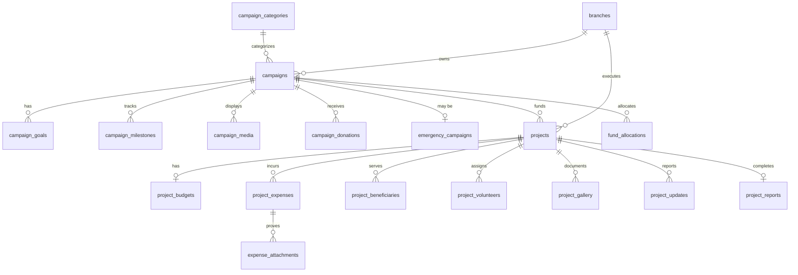

# Module 05: Campaign & Project Management

> Manages fundraising campaigns, humanitarian projects, budgets, expenses, beneficiaries, volunteers, media galleries, updates, and transparent fund allocation.

---

## Module Overview

| Property | Value |
|----------|-------|
| **Module ID** | `CAMPAIGN_PROJECT` |
| **Entities** | 19 |
| **Priority** | Critical |
| **Dependencies** | Organization, Donor, Donation |

Campaigns are the primary fundraising vehicles. Each campaign can contain multiple field projects. Fund allocation maintains a complete audit trail from donation to project execution.

---

## Database Schema

### Table: `campaigns`

| Column | Type | Constraints | Description |
|--------|------|-------------|-------------|
| `id` | `BIGSERIAL` | PK | |
| `campaign_code` | `VARCHAR(50)` | UNIQUE, NOT NULL | e.g., `CMP-2026-0001` |
| `title` | `VARCHAR(255)` | NOT NULL | |
| `slug` | `VARCHAR(255)` | UNIQUE, NOT NULL | URL-friendly identifier |
| `category_id` | `INT` | FK → `campaign_categories.id` | |
| `description` | `TEXT` | NOT NULL | Full HTML/markdown description |
| `short_description` | `VARCHAR(500)` | NOT NULL | Card display text |
| `campaign_type` | `VARCHAR(50)` | NOT NULL | `monthly_donation`, `emergency_relief`, `medical_support`, `education_support`, `food_distribution`, `winter_campaign`, `orphan_support`, `mosque_project`, `shelter_project`, `custom_campaign` |
| `target_amount` | `DECIMAL(15,2)` | NOT NULL, CHECK > 0 | |
| `raised_amount` | `DECIMAL(15,2)` | DEFAULT 0.00 | Auto-updated on confirmed donation |
| `start_date` | `DATE` | NOT NULL | |
| `end_date` | `DATE` | NULL | NULL = ongoing |
| `thumbnail` | `VARCHAR(500)` | NULL | Cover image URL |
| `banner` | `VARCHAR(500)` | NULL | Hero banner URL |
| `status` | `VARCHAR(20)` | DEFAULT `draft` | `draft`, `active`, `paused`, `completed`, `cancelled` |
| `created_by` | `BIGINT` | FK → `users.id` | Campaign manager |
| `branch_id` | `BIGINT` | FK → `branches.id` | Owning branch |
| `created_at` | `TIMESTAMPTZ` | DEFAULT NOW() | |
| `updated_at` | `TIMESTAMPTZ` | DEFAULT NOW() | |

**Indexes:** `slug` (unique), `campaign_type`, `status`, `start_date`, `branch_id`

---

### Table: `campaign_categories`

| Column | Type | Constraints | Description |
|--------|------|-------------|-------------|
| `id` | `SERIAL` | PK | |
| `name` | `VARCHAR(100)` | NOT NULL, UNIQUE | |
| `icon` | `VARCHAR(255)` | NULL | FontAwesome or image URL |
| `description` | `TEXT` | NULL | |
| `status` | `VARCHAR(20)` | DEFAULT `active` | |
| `created_at` | `TIMESTAMPTZ` | DEFAULT NOW() | |
| `updated_at` | `TIMESTAMPTZ` | DEFAULT NOW() | |

---

### Table: `campaign_goals`

| Column | Type | Constraints | Description |
|--------|------|-------------|-------------|
| `id` | `BIGSERIAL` | PK | |
| `campaign_id` | `BIGINT` | FK → `campaigns.id`, ON DELETE CASCADE | |
| `goal_title` | `VARCHAR(255)` | NOT NULL | e.g., "Build 5 tube wells" |
| `target_amount` | `DECIMAL(15,2)` | NOT NULL | |
| `current_amount` | `DECIMAL(15,2)` | DEFAULT 0.00 | |
| `progress_percentage` | `DECIMAL(5,2)` | GENERATED | `(current / target) * 100` |
| `status` | `VARCHAR(20)` | DEFAULT `active` | |
| `created_at` | `TIMESTAMPTZ` | DEFAULT NOW() | |
| `updated_at` | `TIMESTAMPTZ` | DEFAULT NOW() | |

---

### Table: `campaign_milestones`

| Column | Type | Constraints | Description |
|--------|------|-------------|-------------|
| `id` | `BIGSERIAL` | PK | |
| `campaign_id` | `BIGINT` | FK → `campaigns.id`, ON DELETE CASCADE | |
| `title` | `VARCHAR(255)` | NOT NULL | |
| `description` | `TEXT` | NULL | |
| `target_amount` | `DECIMAL(15,2)` | NOT NULL | |
| `achieved_at` | `TIMESTAMPTZ` | NULL | Set when reached |
| `status` | `VARCHAR(20)` | DEFAULT `pending` | `pending`, `achieved` |
| `created_at` | `TIMESTAMPTZ` | DEFAULT NOW() | |
| `updated_at` | `TIMESTAMPTZ` | DEFAULT NOW() | |

---

### Table: `campaign_media`

| Column | Type | Constraints | Description |
|--------|------|-------------|-------------|
| `id` | `BIGSERIAL` | PK | |
| `campaign_id` | `BIGINT` | FK → `campaigns.id`, ON DELETE CASCADE | |
| `media_type` | `VARCHAR(20)` | NOT NULL | `image`, `video`, `pdf`, `document` |
| `title` | `VARCHAR(255)` | NULL | |
| `file_url` | `VARCHAR(500)` | NOT NULL | |
| `thumbnail` | `VARCHAR(500)` | NULL | For videos |
| `uploaded_by` | `BIGINT` | FK → `users.id` | |
| `created_at` | `TIMESTAMPTZ` | DEFAULT NOW() | |
| `updated_at` | `TIMESTAMPTZ` | DEFAULT NOW() | |

---

### Table: `campaign_donations`

Junction table linking donations to campaigns (many-to-many).

| Column | Type | Constraints | Description |
|--------|------|-------------|-------------|
| `id` | `BIGSERIAL` | PK | |
| `campaign_id` | `BIGINT` | FK → `campaigns.id`, ON DELETE RESTRICT | |
| `donation_id` | `BIGINT` | FK → `donations.id`, ON DELETE RESTRICT | |
| `donor_id` | `BIGINT` | FK → `donors.id`, ON DELETE SET NULL | |
| `amount` | `DECIMAL(12,2)` | NOT NULL | Portion of donation to this campaign |
| `payment_status` | `VARCHAR(20)` | DEFAULT `pending` | Mirrors donation status |
| `created_at` | `TIMESTAMPTZ` | DEFAULT NOW() | |

---

### Table: `emergency_campaigns`

Extension for urgent campaigns (flood, fire, medical).

| Column | Type | Constraints | Description |
|--------|------|-------------|-------------|
| `id` | `BIGSERIAL` | PK | |
| `campaign_id` | `BIGINT` | FK → `campaigns.id`, ON DELETE CASCADE, UNIQUE | |
| `emergency_type` | `VARCHAR(50)` | NOT NULL | `flood`, `fire`, `medical`, `cyclone`, `earthquake`, `winter`, `food_crisis` |
| `priority` | `VARCHAR(20)` | DEFAULT `high` | `low`, `medium`, `high`, `critical` |
| `affected_area` | `VARCHAR(255)` | NULL | Description of location |
| `required_amount` | `DECIMAL(15,2)` | NOT NULL | |
| `current_amount` | `DECIMAL(15,2)` | DEFAULT 0.00 | |
| `status` | `VARCHAR(20)` | DEFAULT `active` | |
| `created_at` | `TIMESTAMPTZ` | DEFAULT NOW() | |
| `updated_at` | `TIMESTAMPTZ` | DEFAULT NOW() | |

---

### Table: `projects`

Field implementation of campaign funds.

| Column | Type | Constraints | Description |
|--------|------|-------------|-------------|
| `id` | `BIGSERIAL` | PK | |
| `project_code` | `VARCHAR(50)` | UNIQUE, NOT NULL | e.g., `PRJ-2026-0001` |
| `campaign_id` | `BIGINT` | FK → `campaigns.id`, ON DELETE RESTRICT | |
| `project_name` | `VARCHAR(255)` | NOT NULL | |
| `description` | `TEXT` | NULL | |
| `branch_id` | `BIGINT` | FK → `branches.id` | Executing branch |
| `start_date` | `DATE` | NOT NULL | |
| `end_date` | `DATE` | NULL | |
| `project_manager_id` | `BIGINT` | FK → `users.id` | |
| `status` | `VARCHAR(20)` | DEFAULT `planning` | `planning`, `active`, `on_hold`, `completed`, `cancelled` |
| `created_at` | `TIMESTAMPTZ` | DEFAULT NOW() | |
| `updated_at` | `TIMESTAMPTZ` | DEFAULT NOW() | |

---

### Table: `project_budgets`

| Column | Type | Constraints | Description |
|--------|------|-------------|-------------|
| `id` | `BIGSERIAL` | PK | |
| `project_id` | `BIGINT` | FK → `projects.id`, ON DELETE CASCADE, UNIQUE | |
| `estimated_budget` | `DECIMAL(15,2)` | NOT NULL | Initial estimate |
| `approved_budget` | `DECIMAL(15,2)` | NOT NULL | Admin approved amount |
| `allocated_budget` | `DECIMAL(15,2)` | DEFAULT 0.00 | Funds actually moved to project |
| `remaining_budget` | `DECIMAL(15,2)` | GENERATED | `allocated - SUM(expenses)` |
| `approved_by` | `BIGINT` | FK → `users.id` | |
| `created_at` | `TIMESTAMPTZ` | DEFAULT NOW() | |
| `updated_at` | `TIMESTAMPTZ` | DEFAULT NOW() | |

---

### Table: `project_expenses`

| Column | Type | Constraints | Description |
|--------|------|-------------|-------------|
| `id` | `BIGSERIAL` | PK | |
| `project_id` | `BIGINT` | FK → `projects.id`, ON DELETE RESTRICT | |
| `expense_category` | `VARCHAR(100)` | NOT NULL | `materials`, `transport`, `labor`, `food`, `medical` |
| `description` | `TEXT` | NULL | |
| `amount` | `DECIMAL(12,2)` | NOT NULL, CHECK > 0 | |
| `expense_date` | `DATE` | NOT NULL | |
| `approved_by` | `BIGINT` | FK → `users.id` | |
| `status` | `VARCHAR(20)` | DEFAULT `pending` | `pending`, `approved`, `rejected` |
| `created_at` | `TIMESTAMPTZ` | DEFAULT NOW() | |
| `updated_at` | `TIMESTAMPTZ` | DEFAULT NOW() | |

---

### Table: `project_beneficiaries`

| Column | Type | Constraints | Description |
|--------|------|-------------|-------------|
| `id` | `BIGSERIAL` | PK | |
| `project_id` | `BIGINT` | FK → `projects.id`, ON DELETE CASCADE | |
| `beneficiary_name` | `VARCHAR(200)` | NOT NULL | |
| `phone` | `VARCHAR(20)` | NULL | |
| `address` | `TEXT` | NULL | |
| `district_id` | `INT` | FK → `districts.id` | |
| `beneficiary_type` | `VARCHAR(50)` | NOT NULL | `orphan`, `widow`, `elderly`, `disabled`, `student`, `patient` |
| `assistance_type` | `VARCHAR(100)` | NOT NULL | `cash`, `food_package`, `medical_aid`, `education_kit` |
| `status` | `VARCHAR(20)` | DEFAULT `active` | |
| `created_at` | `TIMESTAMPTZ` | DEFAULT NOW() | |
| `updated_at` | `TIMESTAMPTZ` | DEFAULT NOW() | |

---

### Table: `project_volunteers`

| Column | Type | Constraints | Description |
|--------|------|-------------|-------------|
| `id` | `BIGSERIAL` | PK | |
| `project_id` | `BIGINT` | FK → `projects.id`, ON DELETE CASCADE | |
| `volunteer_id` | `BIGINT` | FK → `volunteers.id`, ON DELETE RESTRICT | |
| `assigned_role` | `VARCHAR(100)` | NOT NULL | `team_lead`, `field_worker`, `logistics` |
| `assigned_date` | `DATE` | DEFAULT NOW() | |
| `completion_status` | `VARCHAR(20)` | DEFAULT `active` | `active`, `completed`, `withdrawn` |
| `created_at` | `TIMESTAMPTZ` | DEFAULT NOW() | |
| `updated_at` | `TIMESTAMPTZ` | DEFAULT NOW() | |

---

### Table: `project_gallery`

| Column | Type | Constraints | Description |
|--------|------|-------------|-------------|
| `id` | `BIGSERIAL` | PK | |
| `project_id` | `BIGINT` | FK → `projects.id`, ON DELETE CASCADE | |
| `title` | `VARCHAR(255)` | NULL | |
| `media_type` | `VARCHAR(20)` | NOT NULL | `image`, `video` |
| `file_url` | `VARCHAR(500)` | NOT NULL | |
| `uploaded_by` | `BIGINT` | FK → `users.id` | |
| `created_at` | `TIMESTAMPTZ` | DEFAULT NOW() | |
| `updated_at` | `TIMESTAMPTZ` | DEFAULT NOW() | |

---

### Table: `project_updates`

Progress reports published to donors.

| Column | Type | Constraints | Description |
|--------|------|-------------|-------------|
| `id` | `BIGSERIAL` | PK | |
| `project_id` | `BIGINT` | FK → `projects.id`, ON DELETE CASCADE | |
| `title` | `VARCHAR(255)` | NOT NULL | |
| `description` | `TEXT` | NOT NULL | |
| `progress_percentage` | `DECIMAL(5,2)` | DEFAULT 0.00 | 0-100 |
| `published_by` | `BIGINT` | FK → `users.id` | |
| `created_at` | `TIMESTAMPTZ` | DEFAULT NOW() | |
| `updated_at` | `TIMESTAMPTZ` | DEFAULT NOW() | |

---

### Table: `fund_allocations`

Audit trail of money moving from campaign to project.

| Column | Type | Constraints | Description |
|--------|------|-------------|-------------|
| `id` | `BIGSERIAL` | PK | |
| `campaign_id` | `BIGINT` | FK → `campaigns.id`, ON DELETE RESTRICT | |
| `project_id` | `BIGINT` | FK → `projects.id`, ON DELETE RESTRICT | |
| `allocated_amount` | `DECIMAL(15,2)` | NOT NULL, CHECK > 0 | |
| `allocation_date` | `DATE` | DEFAULT NOW() | |
| `approved_by` | `BIGINT` | FK → `users.id` | |
| `remarks` | `TEXT` | NULL | |
| `created_at` | `TIMESTAMPTZ` | DEFAULT NOW() | |
| `updated_at` | `TIMESTAMPTZ` | DEFAULT NOW() | |

---

### Table: `expense_attachments`

Receipts and invoices for project expenses.

| Column | Type | Constraints | Description |
|--------|------|-------------|-------------|
| `id` | `BIGSERIAL` | PK | |
| `expense_id` | `BIGINT` | FK → `project_expenses.id`, ON DELETE CASCADE | |
| `file_name` | `VARCHAR(255)` | NOT NULL | |
| `file_url` | `VARCHAR(500)` | NOT NULL | |
| `file_type` | `VARCHAR(50)` | NOT NULL | `image`, `pdf` |
| `uploaded_by` | `BIGINT` | FK → `users.id` | |
| `created_at` | `TIMESTAMPTZ` | DEFAULT NOW() | |

---

### Table: `project_reports`

Final completion report.

| Column | Type | Constraints | Description |
|--------|------|-------------|-------------|
| `id` | `BIGSERIAL` | PK | |
| `project_id` | `BIGINT` | FK → `projects.id`, ON DELETE CASCADE, UNIQUE | |
| `report_title` | `VARCHAR(255)` | NOT NULL | |
| `summary` | `TEXT` | NOT NULL | |
| `beneficiaries_count` | `INT` | DEFAULT 0 | |
| `total_expense` | `DECIMAL(15,2)` | NOT NULL | |
| `report_file` | `VARCHAR(500)` | NULL | PDF URL |
| `published_by` | `BIGINT` | FK → `users.id` | |
| `published_at` | `TIMESTAMPTZ` | DEFAULT NOW() | |
| `created_at` | `TIMESTAMPTZ` | DEFAULT NOW() | |

---

## Entity Relationship Diagram



---

## API Endpoints

### 1. Create Campaign

**Endpoint:** `POST /api/v1/admin/campaigns`  
**Access:** Admin (`campaign:create`)

**Request Body**
```json
{
  "title": "Flood Relief 2026 – Sylhet",
  "slug": "flood-relief-2026-sylhet",
  "category_id": 3,
  "description": "<p>Emergency relief for flood-affected families...</p>",
  "short_description": "Help 500 families in Sylhet with food, medicine, and shelter.",
  "campaign_type": "emergency_relief",
  "target_amount": 500000.00,
  "start_date": "2026-07-01",
  "end_date": "2026-08-31",
  "thumbnail": "https://cdn.ashray.org/campaigns/3/thumb.jpg",
  "banner": "https://cdn.ashray.org/campaigns/3/banner.jpg",
  "branch_id": 5
}
```

**Validation Rules**
- `title`: required, max 255
- `slug`: required, unique, regex `^[a-z0-9-]+$`
- `target_amount`: required, > 0
- `start_date`: required, not past (unless admin override)
- `end_date`: omitempty, after `start_date`
- `campaign_type`: required, oneof enum

**Business Logic**
1. Validate slug uniqueness.
2. Create `campaigns` with `status = draft`.
3. If `campaign_type = emergency_relief`, create `emergency_campaigns` with `priority = high`.
4. Log to `access_logs`.

**Success Response (201 Created)**
```json
{
  "success": true,
  "message": "Campaign created",
  "data": {
    "id": 10,
    "campaign_code": "CMP-2026-0010",
    "title": "Flood Relief 2026 – Sylhet",
    "slug": "flood-relief-2026-sylhet",
    "status": "draft",
    "created_at": "2026-07-12T10:00:00Z"
  }
}
```

---

### 2. Publish Campaign

**Endpoint:** `POST /api/v1/admin/campaigns/:id/publish`  
**Access:** Admin (`campaign:approve`)

**Business Logic**
1. Verify campaign exists and `status = draft`.
2. Verify all required media and descriptions are present.
3. Update `status = active`.
4. If emergency type, trigger `emergency_alert` notifications to all users in affected geographic scope.
5. Publish to live platform.

**Success Response (200 OK)**
```json
{
  "success": true,
  "message": "Campaign published",
  "data": { "id": 10, "status": "active", "published_at": "2026-07-12T10:05:00Z" }
}
```

---

### 3. List Campaigns

**Endpoint:** `GET /api/v1/campaigns`  
**Access:** Public  
**Query:** `type`, `category_id`, `status`, `branch_id`, `sort` (`newest`, `closest_to_goal`, `most_donated`), `page`, `limit`

**Success Response (200 OK)**
```json
{
  "success": true,
  "message": "Campaigns retrieved",
  "data": [
    {
      "id": 10,
      "campaign_code": "CMP-2026-0010",
      "title": "Flood Relief 2026 – Sylhet",
      "slug": "flood-relief-2026-sylhet",
      "campaign_type": "emergency_relief",
      "target_amount": 500000.00,
      "raised_amount": 125000.00,
      "progress_percentage": 25.00,
      "donor_count": 450,
      "days_remaining": 20,
      "thumbnail": "https://cdn.ashray.org/campaigns/3/thumb.jpg",
      "status": "active",
      "created_at": "2026-07-12T10:00:00Z"
    }
  ],
  "meta": { "page": 1, "limit": 12, "total": 45 }
}
```

---

### 4. Get Campaign Detail

**Endpoint:** `GET /api/v1/campaigns/:slug`  
**Access:** Public

**Success Response (200 OK)**
```json
{
  "success": true,
  "message": "Campaign retrieved",
  "data": {
    "id": 10,
    "title": "Flood Relief 2026 – Sylhet",
    "description": "<p>Emergency relief...</p>",
    "target_amount": 500000.00,
    "raised_amount": 125000.00,
    "goals": [
      { "id": 1, "goal_title": "Food packages for 500 families", "target_amount": 200000.00, "current_amount": 50000.00 }
    ],
    "milestones": [
      { "id": 1, "title": "25% funded", "target_amount": 125000.00, "achieved_at": null, "status": "pending" }
    ],
    "media": [ { "id": 1, "media_type": "image", "file_url": "..." } ],
    "projects": [ { "id": 2, "project_name": "Sylhet Food Distribution", "status": "active" } ],
    "recent_donations": [
      { "donor_name": "Anonymous", "amount": 5000.00, "created_at": "2026-07-12T09:00:00Z" }
    ]
  }
}
```

---

### 5. Create Project

**Endpoint:** `POST /api/v1/admin/projects`  
**Access:** Admin (`project:create`)

**Request Body**
```json
{
  "campaign_id": 10,
  "project_name": "Sylhet Food Distribution Phase 1",
  "description": "Distribute dry food to 500 families in Sylhet city.",
  "branch_id": 5,
  "start_date": "2026-07-15",
  "end_date": "2026-07-30",
  "project_manager_id": 22,
  "estimated_budget": 200000.00,
  "approved_budget": 200000.00
}
```

**Business Logic**
1. Verify campaign exists and is active.
2. Verify branch is under admin's jurisdiction.
3. Create `projects` and `project_budgets`.
4. Assign project manager (must be staff or coordinator).

**Success Response (201 Created)**
```json
{
  "success": true,
  "message": "Project created",
  "data": {
    "id": 3,
    "project_code": "PRJ-2026-0003",
    "project_name": "Sylhet Food Distribution Phase 1",
    "status": "planning",
    "budget": { "estimated": 200000.00, "approved": 200000.00, "allocated": 0.00 }
  }
}
```

---

### 6. Allocate Funds to Project

**Endpoint:** `POST /api/v1/admin/fund-allocations`  
**Access:** Admin (`fund:allocate`)  
**⚠️ Critical: Uses DB Transaction + Row Lock**

**Request Body**
```json
{
  "campaign_id": 10,
  "project_id": 3,
  "allocated_amount": 100000.00,
  "remarks": "Initial allocation for Phase 1 procurement"
}
```

**Business Logic**
1. Start DB transaction.
2. Lock `campaigns` row (`FOR UPDATE`). Verify `raised_amount >= allocated_amount` (or at least `remaining_campaign_funds >= amount`).
3. Lock `project_budgets` row (`FOR UPDATE`). Verify `allocated_budget + amount <= approved_budget`.
4. Insert `fund_allocations`.
5. Update `project_budgets.allocated_budget`.
6. Commit transaction.
7. Notify project manager.

**Success Response (201 Created)**
```json
{
  "success": true,
  "message": "Funds allocated",
  "data": {
    "allocation_id": 7,
    "campaign_id": 10,
    "project_id": 3,
    "allocated_amount": 100000.00,
    "allocation_date": "2026-07-12",
    "project_remaining_budget": 100000.00
  }
}
```

**Error Responses**
| Status | Message | Condition |
|--------|---------|-----------|
| 409 | Insufficient campaign funds | Campaign balance < allocation |
| 409 | Exceeds approved project budget | `allocated + amount > approved` |
| 403 | Unauthorized branch | Admin lacks jurisdiction |

---

### 7. Submit Project Expense

**Endpoint:** `POST /api/v1/admin/projects/:id/expenses`  
**Access:** Project Manager or Admin (`expense:create`)

**Request Body**
```json
{
  "expense_category": "materials",
  "description": "Rice, lentils, oil for 500 families",
  "amount": 75000.00,
  "expense_date": "2026-07-14",
  "attachments": [
    { "file_name": "invoice_001.pdf", "file_url": "https://cdn.ashray.org/docs/inv1.pdf", "file_type": "pdf" }
  ]
}
```

**Business Logic**
1. Verify project exists and user is manager or admin.
2. Verify `project_budgets.remaining_budget >= amount`.
3. Create `project_expenses` with `status = pending`.
4. Create `expense_attachments`.
5. Route to admin for approval if amount > threshold (e.g., 50,000 BDT).

**Success Response (201 Created)**
```json
{
  "success": true,
  "message": "Expense submitted for approval",
  "data": { "expense_id": 12, "status": "pending", "requires_approval": true }
}
```

---

### 8. Approve Expense

**Endpoint:** `POST /api/v1/admin/expenses/:id/approve`  
**Access:** Admin (`expense:approve`)

**Business Logic**
1. Update `project_expenses.status = approved`.
2. Update `project_budgets.remaining_budget`.
3. If all expenses approved and project complete, allow final report generation.

**Success Response (200 OK)**
```json
{
  "success": true,
  "message": "Expense approved",
  "data": { "expense_id": 12, "status": "approved", "approved_by": 5 }
}
```

---

### 9. Add Project Update

**Endpoint:** `POST /api/v1/admin/projects/:id/updates`  
**Access:** Project Manager (`project:update`)

**Request Body**
```json
{
  "title": "Phase 1 Distribution Complete",
  "description": "Successfully distributed food to 500 families in Sylhet city area.",
  "progress_percentage": 50.00
}
```

**Business Logic**
1. Create `project_updates`.
2. If `progress_percentage = 100`, update `projects.status = completed`.
3. Notify all campaign donors with update email.

**Success Response (201 Created)**
```json
{
  "success": true,
  "message": "Project update published",
  "data": { "update_id": 8, "published_at": "2026-07-20T10:00:00Z" }
}
```

---

### 10. Generate Transparency Report

**Endpoint:** `GET /api/v1/campaigns/:id/transparency-report`  
**Access:** Public

**Success Response (200 OK)**
```json
{
  "success": true,
  "message": "Transparency report generated",
  "data": {
    "campaign": { "id": 10, "title": "Flood Relief 2026 – Sylhet", "target_amount": 500000.00, "raised_amount": 125000.00 },
    "fund_allocations": [
      { "project_name": "Sylhet Food Distribution Phase 1", "allocated_amount": 100000.00, "date": "2026-07-12" }
    ],
    "expenses": [
      { "category": "materials", "amount": 75000.00, "status": "approved", "attachments": 2 }
    ],
    "beneficiaries_served": 500,
    "volunteers_engaged": 25,
    "gallery_photos": 45,
    "report_download_url": "https://cdn.ashray.org/reports/cmp-10-transparency.pdf"
  }
}
```

---

## Business Rules Summary

1. **Campaign Slug Immutability**: Once published, `slug` cannot change to preserve SEO and shared links.
2. **Fund Allocation Atomicity**: All fund allocations must occur within a transaction with row locks on both campaign and project budget. No partial allocations allowed.
3. **Budget Envelope**: A project cannot spend more than its `approved_budget`. `project_expenses` are rejected if they exceed `remaining_budget`.
4. **Expense Approval Threshold**: Expenses <= 10,000 BDT can be auto-approved by project manager. Expenses > 10,000 BDT require branch admin approval. Expenses > 50,000 BDT require division coordinator approval.
5. **Emergency Campaign Priority**: When an emergency campaign is published, push notifications are sent immediately to all users within the affected geographic area and to all donors who have opted into emergency alerts.
6. **Milestone Automation**: When `campaigns.raised_amount` reaches a milestone `target_amount`, the system auto-updates `campaign_milestones.status = achieved` and notifies donors.
7. **Project Completion**: A project is marked `completed` only when:
   - All expenses are approved
   - A final `project_reports` is submitted
   - All assigned volunteers have `completion_status = completed`
8. **Transparency Requirement**: Every campaign with `raised_amount > 0` must have at least one published transparency report before it can be marked `completed`.
9. **Donor Visibility**: Project updates and gallery photos are visible to all donors of the parent campaign. General public sees only approved updates older than 24 hours (to allow admin review).
10. **Branch Scope**: Coordinators can only create/manage campaigns and projects within their assigned branch or child branches.

---

*Next: See `06_DONATION_AND_PAYMENT.md` for payment processing, receipts, fund management, and settlements.*
