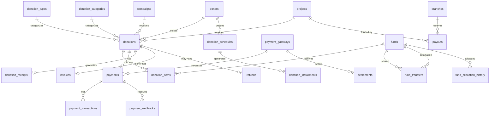

# Module 06: Donation & Payment Management

> Handles donations, recurring contributions, payments, receipts, invoices, fund management, settlements, payouts, and financial reporting while ensuring transparency and accountability.

---

## Module Overview

| Property | Value |
|----------|-------|
| **Module ID** | `DONATION_PAYMENT` |
| **Entities** | 20 |
| **Priority** | Critical |
| **Dependencies** | Campaign, Donor, Organization |

This module is the financial backbone of ASHRAY. Every donation is recorded with campaign linkage, payment gateway integration, automatic receipt generation, and fund allocation tracking.

---

## Database Schema

### Table: `donations`

The central donation record.

| Column | Type | Constraints | Description |
|--------|------|-------------|-------------|
| `id` | `BIGSERIAL` | PK | |
| `donation_number` | `VARCHAR(50)` | UNIQUE, NOT NULL | e.g., `DON-2026-000001` |
| `donor_id` | `BIGINT` | FK → `donors.id`, ON DELETE RESTRICT | |
| `campaign_id` | `BIGINT` | FK → `campaigns.id`, NULL, ON DELETE SET NULL | |
| `project_id` | `BIGINT` | FK → `projects.id`, NULL, ON DELETE SET NULL | |
| `donation_type_id` | `INT` | FK → `donation_types.id` | |
| `category_id` | `INT` | FK → `donation_categories.id` | |
| `amount` | `DECIMAL(12,2)` | NOT NULL, CHECK > 0 | |
| `currency` | `VARCHAR(10)` | DEFAULT 'BDT' | |
| `is_anonymous` | `BOOLEAN` | DEFAULT FALSE | |
| `message` | `TEXT` | NULL | Donor message |
| `payment_status` | `VARCHAR(20)` | DEFAULT `pending` | `pending`, `confirmed`, `failed`, `refunded` |
| `status` | `VARCHAR(20)` | DEFAULT `active` | `active`, `cancelled` |
| `created_at` | `TIMESTAMPTZ` | DEFAULT NOW() | |
| `updated_at` | `TIMESTAMPTZ` | DEFAULT NOW() | |

**Indexes:** `donation_number` (unique), `donor_id`, `campaign_id`, `payment_status`, `created_at`

---

### Table: `donation_items`

Splits a single donation across multiple funds.

| Column | Type | Constraints | Description |
|--------|------|-------------|-------------|
| `id` | `BIGSERIAL` | PK | |
| `donation_id` | `BIGINT` | FK → `donations.id`, ON DELETE CASCADE | |
| `fund_id` | `INT` | FK → `funds.id` | |
| `amount` | `DECIMAL(12,2)` | NOT NULL | |
| `remarks` | `TEXT` | NULL | |
| `created_at` | `TIMESTAMPTZ` | DEFAULT NOW() | |
| `updated_at` | `TIMESTAMPTZ` | DEFAULT NOW() | |

---

### Table: `donation_categories`

| Column | Type | Constraints | Description |
|--------|------|-------------|-------------|
| `id` | `SERIAL` | PK | |
| `name` | `VARCHAR(100)` | NOT NULL, UNIQUE | `General Donation`, `Education`, `Medical`, `Food`, `Shelter`, `Orphan`, `Zakat`, `Sadaqah`, `Emergency Relief`, `Mosque Project` |
| `description` | `TEXT` | NULL | |
| `icon` | `VARCHAR(255)` | NULL | |
| `status` | `VARCHAR(20)` | DEFAULT `active` | |
| `created_at` | `TIMESTAMPTZ` | DEFAULT NOW() | |
| `updated_at` | `TIMESTAMPTZ` | DEFAULT NOW() | |

---

### Table: `donation_types`

| Column | Type | Constraints | Description |
|--------|------|-------------|-------------|
| `id` | `SERIAL` | PK | |
| `name` | `VARCHAR(50)` | NOT NULL, UNIQUE | `One-Time`, `Monthly`, `Weekly`, `Yearly`, `Custom` |
| `description` | `TEXT` | NULL | |
| `status` | `VARCHAR(20)` | DEFAULT `active` | |
| `created_at` | `TIMESTAMPTZ` | DEFAULT NOW() | |
| `updated_at` | `TIMESTAMPTZ` | DEFAULT NOW() | |

---

### Table: `donation_schedules`

Recurring donation schedules.

| Column | Type | Constraints | Description |
|--------|------|-------------|-------------|
| `id` | `BIGSERIAL` | PK | |
| `donor_id` | `BIGINT` | FK → `donors.id`, ON DELETE CASCADE | |
| `donation_type_id` | `INT` | FK → `donation_types.id` | |
| `amount` | `DECIMAL(12,2)` | NOT NULL | |
| `frequency` | `VARCHAR(20)` | NOT NULL | `weekly`, `monthly`, `quarterly`, `yearly` |
| `start_date` | `DATE` | NOT NULL | |
| `next_payment_date` | `DATE` | NOT NULL | |
| `end_date` | `DATE` | NULL | |
| `auto_renew` | `BOOLEAN` | DEFAULT TRUE | |
| `status` | `VARCHAR(20)` | DEFAULT `active` | `active`, `paused`, `cancelled` |
| `created_at` | `TIMESTAMPTZ` | DEFAULT NOW() | |
| `updated_at` | `TIMESTAMPTZ` | DEFAULT NOW() | |

---

### Table: `donation_installments`

Individual occurrences of a schedule.

| Column | Type | Constraints | Description |
|--------|------|-------------|-------------|
| `id` | `BIGSERIAL` | PK | |
| `schedule_id` | `BIGINT` | FK → `donation_schedules.id`, ON DELETE CASCADE | |
| `installment_no` | `INT` | NOT NULL | 1, 2, 3... |
| `amount` | `DECIMAL(12,2)` | NOT NULL | |
| `due_date` | `DATE` | NOT NULL | |
| `paid_date` | `DATE` | NULL | |
| `payment_status` | `VARCHAR(20)` | DEFAULT `pending` | `pending`, `paid`, `failed`, `skipped` |
| `created_at` | `TIMESTAMPTZ` | DEFAULT NOW() | |
| `updated_at` | `TIMESTAMPTZ` | DEFAULT NOW() | |

---

### Table: `payments`

Individual payment attempts.

| Column | Type | Constraints | Description |
|--------|------|-------------|-------------|
| `id` | `BIGSERIAL` | PK | |
| `donation_id` | `BIGINT` | FK → `donations.id`, ON DELETE RESTRICT | |
| `payment_method` | `VARCHAR(50)` | NOT NULL | `bkash`, `nagad`, `sslcommerz`, `stripe`, `paypal`, `bank_transfer` |
| `payment_gateway_id` | `INT` | FK → `payment_gateways.id` | |
| `amount` | `DECIMAL(12,2)` | NOT NULL | |
| `currency` | `VARCHAR(10)` | DEFAULT 'BDT' | |
| `transaction_id` | `VARCHAR(255)` | NULL | Gateway transaction reference |
| `payment_status` | `VARCHAR(20)` | DEFAULT `pending` | `pending`, `processing`, `paid`, `failed`, `refunded` |
| `paid_at` | `TIMESTAMPTZ` | NULL | |
| `created_at` | `TIMESTAMPTZ` | DEFAULT NOW() | |
| `updated_at` | `TIMESTAMPTZ` | DEFAULT NOW() | |

---

### Table: `payment_gateways`

| Column | Type | Constraints | Description |
|--------|------|-------------|-------------|
| `id` | `SERIAL` | PK | |
| `gateway_name` | `VARCHAR(50)` | NOT NULL, UNIQUE | `SSLCommerz`, `bKash`, `Nagad`, `Stripe`, `PayPal` |
| `merchant_id` | `VARCHAR(255)` | NULL | |
| `api_key` | `VARCHAR(255)` | NULL | Encrypted |
| `secret_key` | `VARCHAR(255)` | NULL | Encrypted |
| `environment` | `VARCHAR(20)` | DEFAULT `sandbox` | `sandbox`, `production` |
| `status` | `VARCHAR(20)` | DEFAULT `active` | |
| `created_at` | `TIMESTAMPTZ` | DEFAULT NOW() | |
| `updated_at` | `TIMESTAMPTZ` | DEFAULT NOW() | |

---

### Table: `payment_transactions`

Raw gateway response logging.

| Column | Type | Constraints | Description |
|--------|------|-------------|-------------|
| `id` | `BIGSERIAL` | PK | |
| `payment_id` | `BIGINT` | FK → `payments.id`, ON DELETE CASCADE | |
| `gateway_transaction_id` | `VARCHAR(255)` | NOT NULL | |
| `gateway_response` | `JSONB` | NOT NULL | Full response payload |
| `amount` | `DECIMAL(12,2)` | NOT NULL | |
| `status` | `VARCHAR(20)` | NOT NULL | |
| `created_at` | `TIMESTAMPTZ` | DEFAULT NOW() | |
| `updated_at` | `TIMESTAMPTZ` | DEFAULT NOW() | |

---

### Table: `payment_webhooks`

Incoming webhook audit.

| Column | Type | Constraints | Description |
|--------|------|-------------|-------------|
| `id` | `BIGSERIAL` | PK | |
| `payment_id` | `BIGINT` | FK → `payments.id`, ON DELETE CASCADE | |
| `gateway` | `VARCHAR(50)` | NOT NULL | |
| `payload` | `JSONB` | NOT NULL | |
| `verification_status` | `VARCHAR(20)` | DEFAULT `pending` | `verified`, `failed`, `pending` |
| `received_at` | `TIMESTAMPTZ` | DEFAULT NOW() | |
| `created_at` | `TIMESTAMPTZ` | DEFAULT NOW() | |

---

### Table: `refunds`

| Column | Type | Constraints | Description |
|--------|------|-------------|-------------|
| `id` | `BIGSERIAL` | PK | |
| `payment_id` | `BIGINT` | FK → `payments.id`, ON DELETE RESTRICT | |
| `refund_amount` | `DECIMAL(12,2)` | NOT NULL | |
| `refund_reason` | `TEXT` | NOT NULL | |
| `refund_status` | `VARCHAR(20)` | DEFAULT `pending` | `pending`, `approved`, `processed`, `rejected` |
| `processed_by` | `BIGINT` | FK → `users.id` | |
| `processed_at` | `TIMESTAMPTZ` | NULL | |
| `created_at` | `TIMESTAMPTZ` | DEFAULT NOW() | |

---

### Table: `donation_receipts`

| Column | Type | Constraints | Description |
|--------|------|-------------|-------------|
| `id` | `BIGSERIAL` | PK | |
| `donation_id` | `BIGINT` | FK → `donations.id`, ON DELETE RESTRICT | |
| `receipt_number` | `VARCHAR(50)` | UNIQUE, NOT NULL | |
| `receipt_url` | `VARCHAR(500)` | NOT NULL | PDF URL |
| `issued_at` | `TIMESTAMPTZ` | DEFAULT NOW() | |
| `created_at` | `TIMESTAMPTZ` | DEFAULT NOW() | |
| `updated_at` | `TIMESTAMPTZ` | DEFAULT NOW() | |

---

### Table: `invoices`

For corporate donors and subscriptions.

| Column | Type | Constraints | Description |
|--------|------|-------------|-------------|
| `id` | `BIGSERIAL` | PK | |
| `invoice_number` | `VARCHAR(50)` | UNIQUE, NOT NULL | |
| `donation_id` | `BIGINT` | FK → `donations.id`, ON DELETE RESTRICT | |
| `donor_id` | `BIGINT` | FK → `donors.id`, ON DELETE RESTRICT | |
| `amount` | `DECIMAL(12,2)` | NOT NULL | |
| `tax` | `DECIMAL(12,2)` | DEFAULT 0.00 | |
| `total_amount` | `DECIMAL(12,2)` | GENERATED | `amount + tax` |
| `invoice_url` | `VARCHAR(500)` | NOT NULL | |
| `status` | `VARCHAR(20)` | DEFAULT `issued` | `issued`, `paid`, `overdue`, `cancelled` |
| `created_at` | `TIMESTAMPTZ` | DEFAULT NOW() | |
| `updated_at` | `TIMESTAMPTZ` | DEFAULT NOW() | |

---

### Table: `funds`

Internal fund buckets for categorizing donations.

| Column | Type | Constraints | Description |
|--------|------|-------------|-------------|
| `id` | `SERIAL` | PK | |
| `fund_name` | `VARCHAR(100)` | NOT NULL, UNIQUE | `Emergency Fund`, `Education Fund`, `Medical Fund`, `Food Fund`, `General Fund` |
| `fund_code` | `VARCHAR(50)` | UNIQUE, NOT NULL | |
| `description` | `TEXT` | NULL | |
| `current_balance` | `DECIMAL(15,2)` | DEFAULT 0.00 | |
| `status` | `VARCHAR(20)` | DEFAULT `active` | |
| `created_at` | `TIMESTAMPTZ` | DEFAULT NOW() | |
| `updated_at` | `TIMESTAMPTZ` | DEFAULT NOW() | |

---

### Table: `fund_transfers`

Movement between fund buckets.

| Column | Type | Constraints | Description |
|--------|------|-------------|-------------|
| `id` | `BIGSERIAL` | PK | |
| `from_fund_id` | `INT` | FK → `funds.id` | |
| `to_fund_id` | `INT` | FK → `funds.id` | |
| `amount` | `DECIMAL(15,2)` | NOT NULL, CHECK > 0 | |
| `reason` | `TEXT` | NOT NULL | |
| `approved_by` | `BIGINT` | FK → `users.id` | |
| `created_at` | `TIMESTAMPTZ` | DEFAULT NOW() | |
| `updated_at` | `TIMESTAMPTZ` | DEFAULT NOW() | |

---

### Table: `fund_allocation_history`

Links funds to projects/campaigns.

| Column | Type | Constraints | Description |
|--------|------|-------------|-------------|
| `id` | `BIGSERIAL` | PK | |
| `fund_id` | `INT` | FK → `funds.id` | |
| `project_id` | `BIGINT` | FK → `projects.id`, NULL | |
| `campaign_id` | `BIGINT` | FK → `campaigns.id`, NULL | |
| `allocated_amount` | `DECIMAL(15,2)` | NOT NULL | |
| `allocated_by` | `BIGINT` | FK → `users.id` | |
| `allocation_date` | `DATE` | DEFAULT NOW() | |
| `remarks` | `TEXT` | NULL | |
| `created_at` | `TIMESTAMPTZ` | DEFAULT NOW() | |
| `updated_at` | `TIMESTAMPTZ` | DEFAULT NOW() | |

---

### Table: `settlements`

Reconciliation with payment gateways.

| Column | Type | Constraints | Description |
|--------|------|-------------|-------------|
| `id` | `BIGSERIAL` | PK | |
| `payment_gateway_id` | `INT` | FK → `payment_gateways.id` | |
| `total_collected` | `DECIMAL(15,2)` | NOT NULL | |
| `processing_fee` | `DECIMAL(12,2)` | NOT NULL | |
| `net_amount` | `DECIMAL(15,2)` | GENERATED | `total_collected - processing_fee` |
| `settlement_date` | `DATE` | NOT NULL | |
| `status` | `VARCHAR(20)` | DEFAULT `pending` | `pending`, `settled`, `disputed` |
| `created_at` | `TIMESTAMPTZ` | DEFAULT NOW() | |
| `updated_at` | `TIMESTAMPTZ` | DEFAULT NOW() | |

---

### Table: `payouts`

Branch-level cash disbursements.

| Column | Type | Constraints | Description |
|--------|------|-------------|-------------|
| `id` | `BIGSERIAL` | PK | |
| `branch_id` | `BIGINT` | FK → `branches.id` | |
| `project_id` | `BIGINT` | FK → `projects.id`, NULL | |
| `amount` | `DECIMAL(12,2)` | NOT NULL | |
| `payment_method` | `VARCHAR(50)` | NOT NULL | `cash`, `bank_transfer`, `mobile_money` |
| `approved_by` | `BIGINT` | FK → `users.id` | |
| `payment_status` | `VARCHAR(20)` | DEFAULT `pending` | |
| `paid_at` | `TIMESTAMPTZ` | NULL | |
| `created_at` | `TIMESTAMPTZ` | DEFAULT NOW() | |
| `updated_at` | `TIMESTAMPTZ` | DEFAULT NOW() | |

---

### Table: `financial_reports`

| Column | Type | Constraints | Description |
|--------|------|-------------|-------------|
| `id` | `BIGSERIAL` | PK | |
| `report_type` | `VARCHAR(50)` | NOT NULL | `monthly`, `quarterly`, `annual`, `campaign_specific` |
| `start_date` | `DATE` | NOT NULL | |
| `end_date` | `DATE` | NOT NULL | |
| `total_donation` | `DECIMAL(15,2)` | NOT NULL | |
| `total_expense` | `DECIMAL(15,2)` | NOT NULL | |
| `net_balance` | `DECIMAL(15,2)` | GENERATED | |
| `generated_by` | `BIGINT` | FK → `users.id` | |
| `created_at` | `TIMESTAMPTZ` | DEFAULT NOW() | |

---

### Table: `payment_logs`

Debug and audit logging for all payment operations.

| Column | Type | Constraints | Description |
|--------|------|-------------|-------------|
| `id` | `BIGSERIAL` | PK | |
| `payment_id` | `BIGINT` | FK → `payments.id`, ON DELETE CASCADE | |
| `event` | `VARCHAR(50)` | NOT NULL | `initiated`, `gateway_called`, `callback_received`, `verified`, `failed` |
| `request` | `JSONB` | NULL | |
| `response` | `JSONB` | NULL | |
| `ip_address` | `INET` | NULL | |
| `status` | `VARCHAR(20)` | NOT NULL | |
| `created_at` | `TIMESTAMPTZ` | DEFAULT NOW() | |

---

## Entity Relationship Diagram



---

## API Endpoints

### 1. Make Donation

**Endpoint:** `POST /api/v1/donations`  
**Access:** Authenticated (donor) or Public (guest with email)  
**⚠️ Critical: Payment gateway integration required**

**Request Body**
```json
{
  "campaign_id": 10,
  "donation_type_id": 1,
  "category_id": 3,
  "amount": 5000.00,
  "currency": "BDT",
  "is_anonymous": false,
  "message": "For the children of Sylhet",
  "payment_method": "bkash",
  "fund_allocations": [
    { "fund_id": 1, "amount": 3000.00, "remarks": "Emergency" },
    { "fund_id": 3, "amount": 2000.00, "remarks": "Food" }
  ]
}
```

**Validation Rules**
- `amount`: required, > 0, <= 999,999,999.99
- `campaign_id`: required, exists, status = active
- `fund_allocations`: optional, if provided sum must equal `amount`
- `payment_method`: required, oneof enabled gateways

**Business Logic**
1. Validate campaign is active and not expired.
2. Create `donations` with `payment_status = pending`.
3. Create `donation_items` if fund allocations provided.
4. Create `payments` with `payment_status = pending`.
5. Call payment gateway API to initiate transaction.
6. Return gateway redirect URL or payment instructions.

**Success Response (201 Created)**
```json
{
  "success": true,
  "message": "Donation initiated. Complete payment via gateway.",
  "data": {
    "donation_id": 150,
    "donation_number": "DON-2026-000150",
    "amount": 5000.00,
    "payment": {
      "payment_id": 150,
      "gateway": "bkash",
      "status": "pending",
      "redirect_url": "https://payment.bkash.com/checkout?token=abc123"
    }
  }
}
```

---

### 2. Payment Callback / Webhook

**Endpoint:** `POST /api/v1/payments/webhook/:gateway`  
**Access:** Public (IP-whitelisted to gateway IPs only)  
**Description:** Asynchronous payment confirmation from gateway.

**Request Body** (varies by gateway)
```json
{
  "transaction_id": "BKASH-ABC123",
  "status": "success",
  "amount": 5000.00,
  "merchant_invoice_no": "DON-2026-000150",
  "signature": "hmac_sha256_signature"
}
```

**Business Logic**
1. Verify HMAC signature or gateway IP whitelist.
2. Lookup `payments` by `transaction_id` or `donation_number`.
3. Idempotency check: if already `paid`, return 200 without reprocessing.
4. Start transaction:
   - Update `payments` → `paid`, set `paid_at`.
   - Update `donations` → `payment_status = confirmed`.
   - Update `campaigns.raised_amount`.
   - Update `donor_wallets.total_donated`.
   - Create `donation_receipts` (generate PDF asynchronously).
   - Create `live_donation_feeds` entry (respect `is_anonymous`).
   - Check and award badges.
   - Send notification to donor.
5. Commit transaction.
6. Return 200 OK to gateway.

**Success Response (200 OK)**
```json
{ "success": true, "message": "Webhook processed" }
```

**Error Responses**
| Status | Message | Condition |
|--------|---------|-----------|
| 400 | Invalid signature | HMAC verification failed |
| 404 | Payment not found | Unknown transaction ID |
| 409 | Already processed | Duplicate webhook |

---

### 3. Get My Donations

**Endpoint:** `GET /api/v1/donations/my-donations`  
**Access:** Authenticated

**Query:** `status`, `from_date`, `to_date`, `page`, `limit`

**Success Response (200 OK)**
```json
{
  "success": true,
  "message": "Donations retrieved",
  "data": [
    {
      "id": 150,
      "donation_number": "DON-2026-000150",
      "campaign": { "id": 10, "title": "Flood Relief 2026 – Sylhet" },
      "amount": 5000.00,
      "payment_status": "confirmed",
      "receipt": { "receipt_number": "REC-2026-00150", "download_url": "..." },
      "created_at": "2026-07-12T10:00:00Z"
    }
  ],
  "meta": { "page": 1, "limit": 20, "total": 45 }
}
```

---

### 4. Download Receipt

**Endpoint:** `GET /api/v1/donations/:id/receipt`  
**Access:** Authenticated (owner) or Admin

**Success Response (200 OK)** — Returns PDF or JSON with URL
```json
{
  "success": true,
  "message": "Receipt available",
  "data": {
    "receipt_number": "REC-2026-00150",
    "download_url": "https://cdn.ashray.org/receipts/REC-2026-00150.pdf",
    "issued_at": "2026-07-12T10:05:00Z"
  }
}
```

---

### 5. Request Refund

**Endpoint:** `POST /api/v1/donations/:id/refund`  
**Access:** Authenticated (owner within 24h) or Admin (`refund:approve`)

**Request Body**
```json
{
  "refund_amount": 5000.00,
  "reason": "Duplicate transaction"
}
```

**Business Logic**
1. Verify donation is confirmed and within refund window (24h for donors, unlimited for admin with justification).
2. Create `refunds` with `status = pending`.
3. Admin approves → gateway refund API called → update `refunds.status = processed`.
4. Reverse `campaigns.raised_amount` and `donor_wallets.total_donated`.

**Success Response (201 Created)**
```json
{
  "success": true,
  "message": "Refund request submitted",
  "data": { "refund_id": 5, "status": "pending", "estimated_days": 7 }
}
```

---

### 6. List Payment Gateways

**Endpoint:** `GET /api/v1/payment-gateways`  
**Access:** Public

**Success Response (200 OK)**
```json
{
  "success": true,
  "message": "Gateways retrieved",
  "data": [
    { "id": 1, "name": "bKash", "status": "active", "environment": "production" },
    { "id": 2, "name": "SSLCommerz", "status": "active", "environment": "production" }
  ]
}
```

---

### 7. Transfer Funds Between Funds

**Endpoint:** `POST /api/v1/admin/fund-transfers`  
**Access:** Admin (`fund:transfer`)

**Request Body**
```json
{
  "from_fund_id": 1,
  "to_fund_id": 3,
  "amount": 50000.00,
  "reason": "Reallocating unused emergency funds to food distribution"
}
```

**Business Logic**
1. Start transaction, lock both fund rows (`FOR UPDATE`).
2. Verify `from_fund.current_balance >= amount`.
3. Debit `from_fund`, credit `to_fund`.
4. Create `fund_transfers` record.
5. Commit.

**Success Response (201 Created)**
```json
{
  "success": true,
  "message": "Fund transfer completed",
  "data": {
    "transfer_id": 12,
    "from_fund": "Emergency Fund",
    "to_fund": "Food Fund",
    "amount": 50000.00,
    "from_balance": 150000.00,
    "to_balance": 75000.00
  }
}
```

---

### 8. Generate Financial Report

**Endpoint:** `POST /api/v1/admin/financial-reports`  
**Access:** Admin (`report:generate`)

**Request Body**
```json
{
  "report_type": "monthly",
  "start_date": "2026-06-01",
  "end_date": "2026-06-30",
  "branch_id": null
}
```

**Business Logic**
1. Aggregate `donations` (confirmed) for date range.
2. Aggregate `project_expenses` + `branch_expenses` for date range.
3. Calculate `net_balance = total_donation - total_expense`.
4. Generate PDF report, upload to S3.
5. Create `financial_reports` record.

**Success Response (201 Created)**
```json
{
  "success": true,
  "message": "Financial report generated",
  "data": {
    "report_id": 8,
    "total_donation": 2500000.00,
    "total_expense": 1800000.00,
    "net_balance": 700000.00,
    "download_url": "https://cdn.ashray.org/reports/financial-2026-06.pdf"
  }
}
```

---

### 9. Process Settlement Reconciliation

**Endpoint:** `POST /api/v1/admin/settlements`  
**Access:** Finance Admin (`settlement:manage`)

**Request Body**
```json
{
  "payment_gateway_id": 1,
  "settlement_date": "2026-07-10",
  "total_collected": 500000.00,
  "processing_fee": 12500.00
}
```

**Business Logic**
1. Verify against gateway's settlement statement.
2. Create `settlements` record.
3. Flag discrepancies if calculated total != provided total.

**Success Response (201 Created)**
```json
{
  "success": true,
  "message": "Settlement recorded",
  "data": { "settlement_id": 4, "net_amount": 487500.00, "status": "settled" }
}
```

---

## Business Rules Summary

1. **Donation Number Uniqueness**: `donation_number` is immutable and sequentially generated per year.
2. **Idempotent Payments**: Payment webhooks must be idempotent. Duplicate callbacks for the same `transaction_id` must not double-count donations.
3. **Fund Balance Integrity**: `funds.current_balance` is updated only via `fund_transfers` or `donation_items` creation. Direct updates are prohibited.
4. **Receipt Generation**: Digital receipts are generated asynchronously via queue worker after payment confirmation. PDF includes donation details, tax exemption info, and QR code for verification.
5. **Refund Window**: Donors can self-request refunds within 24 hours. After 24 hours, only admins can initiate refunds with documented justification.
6. **Gateway Failover**: If primary gateway fails, the system can retry with secondary gateway (if donor has multiple payment methods saved).
7. **Currency**: All internal accounting is in BDT. If foreign currency is donated, it is converted at the day's exchange rate and stored as BDT.
8. **Settlement Matching**: `settlements.total_collected` must match the sum of `payments.amount` for that gateway and date range. Discrepancies > 0.01 BDT trigger an alert.
9. **Anonymous Handling**: If `is_anonymous = true`, donor name is masked in public feeds but retained in admin views and financial records.
10. **Audit Trail**: Every payment state change (pending → paid → refunded) creates a `payment_logs` record with full request/response payloads (excluding sensitive card data).

---

*Next: See `07_VOLUNTEER_AND_FIELD_OPS.md` for volunteer assignments, field activities, and performance tracking.*
