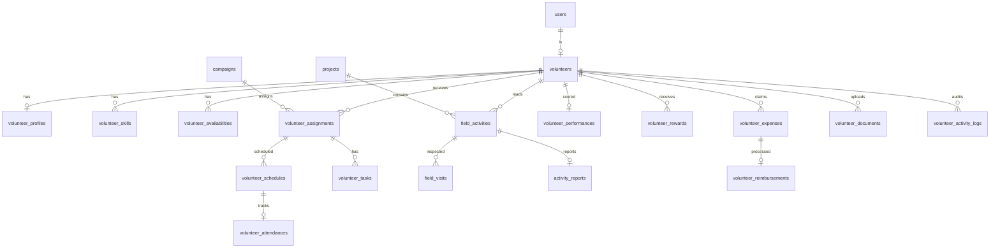

# Module 07: Volunteer & Field Operations

> Manages volunteer recruitment, assignments, scheduling, field operations, beneficiary verification, training, performance evaluation, rewards, reimbursements, and complete volunteer lifecycle management.

---

## Module Overview

| Property | Value |
|----------|-------|
| **Module ID** | `VOLUNTEER_OPS` |
| **Entities** | 21 |
| **Priority** | High |
| **Dependencies** | Authentication, Organization, Campaign |

Volunteers are the backbone of field execution. This module covers everything from skill-based assignment to expense reimbursement and performance scoring.

---

## Database Schema

### Table: `volunteers`

| Column | Type | Constraints | Description |
|--------|------|-------------|-------------|
| `id` | `BIGSERIAL` | PK | |
| `user_id` | `BIGINT` | FK → `users.id`, ON DELETE RESTRICT, UNIQUE | |
| `volunteer_code` | `VARCHAR(50)` | UNIQUE, NOT NULL | e.g., `VOL-2026-0001` |
| `branch_id` | `BIGINT` | FK → `branches.id` | Home branch |
| `membership_id` | `BIGINT` | FK → `memberships.id` | |
| `joining_date` | `DATE` | NOT NULL | |
| `experience` | `TEXT` | NULL | Prior volunteer experience |
| `status` | `VARCHAR(20)` | DEFAULT `active` | `active`, `inactive`, `suspended` |
| `created_at` | `TIMESTAMPTZ` | DEFAULT NOW() | |
| `updated_at` | `TIMESTAMPTZ` | DEFAULT NOW() | |

---

### Table: `volunteer_profiles`

| Column | Type | Constraints | Description |
|--------|------|-------------|-------------|
| `id` | `BIGSERIAL` | PK | |
| `volunteer_id` | `BIGINT` | FK → `volunteers.id`, ON DELETE CASCADE, UNIQUE | |
| `profession` | `VARCHAR(100)` | NULL | |
| `organization` | `VARCHAR(200)` | NULL | |
| `skills` | `TEXT[]` | NULL | PostgreSQL array |
| `languages` | `TEXT[]` | NULL | e.g., `["bn", "en"]` |
| `emergency_contact` | `VARCHAR(20)` | NULL | |
| `blood_group` | `VARCHAR(10)` | NULL | |
| `availability` | `VARCHAR(50)` | NULL | `weekdays`, `weekends`, `anytime` |
| `created_at` | `TIMESTAMPTZ` | DEFAULT NOW() | |
| `updated_at` | `TIMESTAMPTZ` | DEFAULT NOW() | |

---

### Table: `volunteer_skills`

Normalized skill records for matching.

| Column | Type | Constraints | Description |
|--------|------|-------------|-------------|
| `id` | `BIGSERIAL` | PK | |
| `volunteer_id` | `BIGINT` | FK → `volunteers.id`, ON DELETE CASCADE | |
| `skill_name` | `VARCHAR(100)` | NOT NULL | `fundraising`, `medical_support`, `photography`, `disaster_response`, `teaching`, `event_management` |
| `skill_level` | `VARCHAR(20)` | DEFAULT `beginner` | `beginner`, `intermediate`, `expert` |
| `experience_years` | `INT` | DEFAULT 0 | |
| `verified_by` | `BIGINT` | FK → `users.id` | Admin who verified |
| `created_at` | `TIMESTAMPTZ` | DEFAULT NOW() | |
| `updated_at` | `TIMESTAMPTZ` | DEFAULT NOW() | |

---

### Table: `volunteer_availabilities`

| Column | Type | Constraints | Description |
|--------|------|-------------|-------------|
| `id` | `BIGSERIAL` | PK | |
| `volunteer_id` | `BIGINT` | FK → `volunteers.id`, ON DELETE CASCADE | |
| `available_days` | `TEXT[]` | NOT NULL | `["monday", "tuesday"]` |
| `available_from` | `TIME` | NOT NULL | |
| `available_to` | `TIME` | NOT NULL | |
| `is_available` | `BOOLEAN` | DEFAULT TRUE | |
| `created_at` | `TIMESTAMPTZ` | DEFAULT NOW() | |
| `updated_at` | `TIMESTAMPTZ` | DEFAULT NOW() | |

---

### Table: `volunteer_assignments`

| Column | Type | Constraints | Description |
|--------|------|-------------|-------------|
| `id` | `BIGSERIAL` | PK | |
| `volunteer_id` | `BIGINT` | FK → `volunteers.id`, ON DELETE RESTRICT | |
| `campaign_id` | `BIGINT` | FK → `campaigns.id`, NULL, ON DELETE SET NULL | |
| `project_id` | `BIGINT` | FK → `projects.id`, NULL, ON DELETE SET NULL | |
| `assigned_by` | `BIGINT` | FK → `users.id` | |
| `assigned_role` | `VARCHAR(100)` | NOT NULL | `field_coordinator`, `distributor`, `recorder` |
| `assigned_date` | `DATE` | DEFAULT NOW() | |
| `status` | `VARCHAR(20)` | DEFAULT `active` | `active`, `completed`, `cancelled` |
| `created_at` | `TIMESTAMPTZ` | DEFAULT NOW() | |
| `updated_at` | `TIMESTAMPTZ` | DEFAULT NOW() | |

---

### Table: `volunteer_schedules`

| Column | Type | Constraints | Description |
|--------|------|-------------|-------------|
| `id` | `BIGSERIAL` | PK | |
| `volunteer_id` | `BIGINT` | FK → `volunteers.id`, ON DELETE CASCADE | |
| `assignment_id` | `BIGINT` | FK → `volunteer_assignments.id`, ON DELETE CASCADE | |
| `schedule_date` | `DATE` | NOT NULL | |
| `start_time` | `TIME` | NOT NULL | |
| `end_time` | `TIME` | NOT NULL | |
| `location` | `VARCHAR(255)` | NULL | |
| `status` | `VARCHAR(20)` | DEFAULT `scheduled` | `scheduled`, `completed`, `cancelled` |
| `created_at` | `TIMESTAMPTZ` | DEFAULT NOW() | |
| `updated_at` | `TIMESTAMPTZ` | DEFAULT NOW() | |

---

### Table: `volunteer_attendances`

| Column | Type | Constraints | Description |
|--------|------|-------------|-------------|
| `id` | `BIGSERIAL` | PK | |
| `volunteer_id` | `BIGINT` | FK → `volunteers.id`, ON DELETE CASCADE | |
| `schedule_id` | `BIGINT` | FK → `volunteer_schedules.id`, ON DELETE CASCADE | |
| `check_in_time` | `TIMESTAMPTZ` | NULL | GPS-verified |
| `check_out_time` | `TIMESTAMPTZ` | NULL | |
| `attendance_status` | `VARCHAR(20)` | DEFAULT `pending` | `present`, `absent`, `late`, `excused` |
| `remarks` | `TEXT` | NULL | |
| `created_at` | `TIMESTAMPTZ` | DEFAULT NOW() | |
| `updated_at` | `TIMESTAMPTZ` | DEFAULT NOW() | |

---

### Table: `volunteer_tasks`

| Column | Type | Constraints | Description |
|--------|------|-------------|-------------|
| `id` | `BIGSERIAL` | PK | |
| `assignment_id` | `BIGINT` | FK → `volunteer_assignments.id`, ON DELETE CASCADE | |
| `title` | `VARCHAR(255)` | NOT NULL | |
| `description` | `TEXT` | NULL | |
| `priority` | `VARCHAR(20)` | DEFAULT `medium` | `low`, `medium`, `high`, `urgent` |
| `due_date` | `DATE` | NULL | |
| `completed_at` | `TIMESTAMPTZ` | NULL | |
| `status` | `VARCHAR(20)` | DEFAULT `pending` | `pending`, `in_progress`, `completed`, `overdue` |
| `created_at` | `TIMESTAMPTZ` | DEFAULT NOW() | |
| `updated_at` | `TIMESTAMPTZ` | DEFAULT NOW() | |

---

### Table: `field_activities`

| Column | Type | Constraints | Description |
|--------|------|-------------|-------------|
| `id` | `BIGSERIAL` | PK | |
| `project_id` | `BIGINT` | FK → `projects.id`, ON DELETE RESTRICT | |
| `activity_title` | `VARCHAR(255)` | NOT NULL | |
| `activity_type` | `VARCHAR(50)` | NOT NULL | `food_distribution`, `medical_camp`, `education_program`, `relief_distribution`, `tree_plantation`, `blood_donation`, `awareness_campaign` |
| `location` | `VARCHAR(255)` | NOT NULL | |
| `description` | `TEXT` | NULL | |
| `performed_by` | `BIGINT` | FK → `users.id` | Lead volunteer |
| `activity_date` | `DATE` | NOT NULL | |
| `status` | `VARCHAR(20)` | DEFAULT `planned` | `planned`, `started`, `completed`, `cancelled` |
| `created_at` | `TIMESTAMPTZ` | DEFAULT NOW() | |
| `updated_at` | `TIMESTAMPTZ` | DEFAULT NOW() | |

---

### Table: `field_visits`

| Column | Type | Constraints | Description |
|--------|------|-------------|-------------|
| `id` | `BIGSERIAL` | PK | |
| `activity_id` | `BIGINT` | FK → `field_activities.id`, ON DELETE CASCADE | |
| `visited_by` | `BIGINT` | FK → `users.id` | Supervisor |
| `division_id` | `INT` | FK → `divisions.id` | |
| `district_id` | `INT` | FK → `districts.id` | |
| `upazila_id` | `INT` | FK → `upazilas.id` | |
| `union_id` | `INT` | FK → `unions.id` | |
| `visit_date` | `DATE` | NOT NULL | |
| `remarks` | `TEXT` | NULL | |
| `created_at` | `TIMESTAMPTZ` | DEFAULT NOW() | |
| `updated_at` | `TIMESTAMPTZ` | DEFAULT NOW() | |

---

### Table: `activity_reports`

| Column | Type | Constraints | Description |
|--------|------|-------------|-------------|
| `id` | `BIGSERIAL` | PK | |
| `activity_id` | `BIGINT` | FK → `field_activities.id`, ON DELETE CASCADE | |
| `report_title` | `VARCHAR(255)` | NOT NULL | |
| `summary` | `TEXT` | NOT NULL | |
| `beneficiaries_count` | `INT` | DEFAULT 0 | |
| `total_expense` | `DECIMAL(12,2)` | DEFAULT 0.00 | |
| `report_file` | `VARCHAR(500)` | NULL | PDF URL |
| `submitted_by` | `BIGINT` | FK → `users.id` | |
| `approved_by` | `BIGINT` | FK → `users.id`, NULL | |
| `created_at` | `TIMESTAMPTZ` | DEFAULT NOW() | |
| `updated_at` | `TIMESTAMPTZ` | DEFAULT NOW() | |

---

### Table: `volunteer_performances`

| Column | Type | Constraints | Description |
|--------|------|-------------|-------------|
| `id` | `BIGSERIAL` | PK | |
| `volunteer_id` | `BIGINT` | FK → `volunteers.id`, ON DELETE CASCADE, UNIQUE | |
| `total_assignments` | `INT` | DEFAULT 0 | |
| `completed_assignments` | `INT` | DEFAULT 0 | |
| `attendance_rate` | `DECIMAL(5,2)` | DEFAULT 0.00 | Percentage |
| `performance_score` | `DECIMAL(5,2)` | DEFAULT 0.00 | 0-100 |
| `rating` | `DECIMAL(2,1)` | DEFAULT 0.0 | 0-5 stars |
| `created_at` | `TIMESTAMPTZ` | DEFAULT NOW() | |
| `updated_at` | `TIMESTAMPTZ` | DEFAULT NOW() | |

---

### Table: `volunteer_rewards`

| Column | Type | Constraints | Description |
|--------|------|-------------|-------------|
| `id` | `BIGSERIAL` | PK | |
| `volunteer_id` | `BIGINT` | FK → `volunteers.id`, ON DELETE CASCADE | |
| `reward_type` | `VARCHAR(50)` | NOT NULL | `appreciation`, `gift`, `bonus`, `recognition`, `excellence_award` |
| `title` | `VARCHAR(255)` | NOT NULL | |
| `description` | `TEXT` | NULL | |
| `reward_date` | `DATE` | NOT NULL | |
| `created_at` | `TIMESTAMPTZ` | DEFAULT NOW() | |
| `updated_at` | `TIMESTAMPTZ` | DEFAULT NOW() | |

---

### Table: `volunteer_expenses`

| Column | Type | Constraints | Description |
|--------|------|-------------|-------------|
| `id` | `BIGSERIAL` | PK | |
| `volunteer_id` | `BIGINT` | FK → `volunteers.id`, ON DELETE RESTRICT | |
| `activity_id` | `BIGINT` | FK → `field_activities.id`, NULL | |
| `expense_type` | `VARCHAR(50)` | NOT NULL | `transport`, `food`, `communication`, `materials` |
| `amount` | `DECIMAL(12,2)` | NOT NULL | |
| `description` | `TEXT` | NULL | |
| `receipt_url` | `VARCHAR(500)` | NULL | |
| `status` | `VARCHAR(20)` | DEFAULT `pending` | `pending`, `approved`, `rejected` |
| `created_at` | `TIMESTAMPTZ` | DEFAULT NOW() | |
| `updated_at` | `TIMESTAMPTZ` | DEFAULT NOW() | |

---

### Table: `volunteer_reimbursements`

| Column | Type | Constraints | Description |
|--------|------|-------------|-------------|
| `id` | `BIGSERIAL` | PK | |
| `expense_id` | `BIGINT` | FK → `volunteer_expenses.id`, ON DELETE RESTRICT | |
| `approved_amount` | `DECIMAL(12,2)` | NOT NULL | |
| `approved_by` | `BIGINT` | FK → `users.id` | |
| `payment_method` | `VARCHAR(50)` | NOT NULL | `bkash`, `bank_transfer`, `cash` |
| `payment_status` | `VARCHAR(20)` | DEFAULT `pending` | |
| `paid_at` | `TIMESTAMPTZ` | NULL | |
| `created_at` | `TIMESTAMPTZ` | DEFAULT NOW() | |
| `updated_at` | `TIMESTAMPTZ` | DEFAULT NOW() | |

---

### Table: `volunteer_trainings`

| Column | Type | Constraints | Description |
|--------|------|-------------|-------------|
| `id` | `BIGSERIAL` | PK | |
| `training_title` | `VARCHAR(255)` | NOT NULL | |
| `description` | `TEXT` | NULL | |
| `trainer` | `VARCHAR(200)` | NULL | |
| `training_date` | `DATE` | NOT NULL | |
| `location` | `VARCHAR(255)` | NULL | |
| `certificate_available` | `BOOLEAN` | DEFAULT FALSE | |
| `status` | `VARCHAR(20)` | DEFAULT `upcoming` | `upcoming`, `ongoing`, `completed`, `cancelled` |
| `created_at` | `TIMESTAMPTZ` | DEFAULT NOW() | |
| `updated_at` | `TIMESTAMPTZ` | DEFAULT NOW() | |

---

### Table: `volunteer_documents`

| Column | Type | Constraints | Description |
|--------|------|-------------|-------------|
| `id` | `BIGSERIAL` | PK | |
| `volunteer_id` | `BIGINT` | FK → `volunteers.id`, ON DELETE CASCADE | |
| `document_type` | `VARCHAR(50)` | NOT NULL | `nid`, `passport`, `cv`, `certificate` |
| `document_name` | `VARCHAR(255)` | NOT NULL | |
| `file_url` | `VARCHAR(500)` | NOT NULL | |
| `verification_status` | `VARCHAR(20)` | DEFAULT `pending` | `pending`, `verified`, `rejected` |
| `uploaded_at` | `TIMESTAMPTZ` | DEFAULT NOW() | |
| `created_at` | `TIMESTAMPTZ` | DEFAULT NOW() | |

---

### Table: `volunteer_activity_logs`

| Column | Type | Constraints | Description |
|--------|------|-------------|-------------|
| `id` | `BIGSERIAL` | PK | |
| `volunteer_id` | `BIGINT` | FK → `volunteers.id`, ON DELETE CASCADE | |
| `activity` | `VARCHAR(100)` | NOT NULL | |
| `description` | `TEXT` | NULL | |
| `performed_by` | `BIGINT` | FK → `users.id` | |
| `created_at` | `TIMESTAMPTZ` | DEFAULT NOW() | |

---

## Entity Relationship Diagram



---

## API Endpoints

### 1. Register as Volunteer

**Endpoint:** `POST /api/v1/volunteers/register`  
**Access:** Authenticated (approved member)

**Request Body**
```json
{
  "branch_id": 5,
  "skills": ["disaster_response", "teaching"],
  "languages": ["bn", "en"],
  "emergency_contact": "+8801XXXXXXXXX",
  "blood_group": "O+",
  "availability": "weekends",
  "experience": "Worked with BDRCS during 2024 floods."
}
```

**Business Logic**
1. Verify user has active membership.
2. Check not already registered as volunteer.
3. Generate `volunteer_code`.
4. Create `volunteers`, `volunteer_profiles`, `volunteer_skills`.
5. Update `memberships.membership_type = volunteer`.

**Success Response (201 Created)**
```json
{
  "success": true,
  "message": "Volunteer registration successful",
  "data": {
    "volunteer_id": 25,
    "volunteer_code": "VOL-2026-0025",
    "status": "active",
    "branch": { "id": 5, "name": "Mohammadpur Branch" }
  }
}
```

---

### 2. Assign Volunteer to Project

**Endpoint:** `POST /api/v1/admin/volunteer-assignments`  
**Access:** Admin (`volunteer:assign`)

**Request Body**
```json
{
  "volunteer_id": 25,
  "project_id": 3,
  "assigned_role": "field_coordinator",
  "schedule": {
    "schedule_date": "2026-07-20",
    "start_time": "08:00",
    "end_time": "16:00",
    "location": "Sylhet City Corporation Field"
  }
}
```

**Business Logic**
1. Verify volunteer is active and has matching skills.
2. Verify project is active.
3. Check volunteer availability for schedule date/time.
4. Create `volunteer_assignments` and `volunteer_schedules`.
5. Notify volunteer via push + SMS.

**Success Response (201 Created)**
```json
{
  "success": true,
  "message": "Volunteer assigned",
  "data": {
    "assignment_id": 40,
    "volunteer": { "id": 25, "name": "Rahim Uddin" },
    "project": { "id": 3, "name": "Sylhet Food Distribution Phase 1" },
    "schedule": { "date": "2026-07-20", "start_time": "08:00", "location": "Sylhet City Corporation Field" }
  }
}
```

---

### 3. Check In (Volunteer App)

**Endpoint:** `POST /api/v1/volunteer-schedules/:id/check-in`  
**Access:** Authenticated (volunteer, own schedule)

**Request Body**
```json
{
  "latitude": 24.8949,
  "longitude": 91.8687,
  "device_id": "vol-phone-001"
}
```

**Business Logic**
1. Verify schedule belongs to volunteer.
2. Verify check-in is within 30 minutes of `start_time` and within 500m of `location` (GPS validation).
3. Create `volunteer_attendances` with `check_in_time = NOW()`, `attendance_status = present` (or `late` if > 15 min after start).

**Success Response (200 OK)**
```json
{
  "success": true,
  "message": "Checked in successfully",
  "data": { "attendance_id": 100, "status": "present", "check_in_time": "2026-07-20T08:05:00Z" }
}
```

---

### 4. Submit Field Activity Report

**Endpoint:** `POST /api/v1/field-activities/:id/reports`  
**Access:** Volunteer (assigned) or Project Manager

**Request Body**
```json
{
  "report_title": "Day 1 Distribution Report",
  "summary": "Distributed food packages to 120 families in Ward 3.",
  "beneficiaries_count": 120,
  "total_expense": 15000.00,
  "report_file": "https://cdn.ashray.org/reports/fa-5-day1.pdf",
  "photos": [
    { "title": "Distribution at Ward 3", "file_url": "https://cdn.ashray.org/gallery/fa-5-1.jpg", "media_type": "image" }
  ]
}
```

**Business Logic**
1. Verify activity exists and user is assigned.
2. Create `activity_reports`.
3. Create `project_gallery` entries for photos.
4. Update `field_activities.status = completed` if final report.
5. Update `volunteer_performances` metrics.

**Success Response (201 Created)**
```json
{
  "success": true,
  "message": "Report submitted",
  "data": { "report_id": 15, "status": "pending_approval" }
}
```

---

### 5. Submit Expense Claim

**Endpoint:** `POST /api/v1/volunteer-expenses`  
**Access:** Authenticated (volunteer)

**Request Body**
```json
{
  "activity_id": 5,
  "expense_type": "transport",
  "amount": 2500.00,
  "description": "Bus fare from Dhaka to Sylhet for relief distribution",
  "receipt_url": "https://cdn.ashray.org/receipts/vol-25-bus.jpg"
}
```

**Business Logic**
1. Verify activity assignment.
2. Create `volunteer_expenses` with `status = pending`.
3. Route to project manager for approval.

**Success Response (201 Created)**
```json
{
  "success": true,
  "message": "Expense claim submitted",
  "data": { "expense_id": 30, "status": "pending", "estimated_reimbursement": "3-5 business days" }
}
```

---

### 6. Approve Expense & Reimburse

**Endpoint:** `POST /api/v1/admin/volunteer-expenses/:id/approve`  
**Access:** Admin (`expense:approve`)

**Request Body**
```json
{
  "approved_amount": 2500.00,
  "payment_method": "bkash",
  "volunteer_phone": "+8801XXXXXXXXX"
}
```

**Business Logic**
1. Update `volunteer_expenses.status = approved`.
2. Create `volunteer_reimbursements`.
3. Initiate payment via bKash/Nagad disbursement API.
4. On success, update `payment_status = paid`, `paid_at = NOW()`.

**Success Response (200 OK)**
```json
{
  "success": true,
  "message": "Expense approved and reimbursement initiated",
  "data": { "reimbursement_id": 12, "approved_amount": 2500.00, "payment_status": "processing" }
}
```

---

### 7. Get Volunteer Performance

**Endpoint:** `GET /api/v1/volunteers/:id/performance`  
**Access:** Authenticated (own) or Admin

**Success Response (200 OK)**
```json
{
  "success": true,
  "message": "Performance retrieved",
  "data": {
    "volunteer_id": 25,
    "total_assignments": 15,
    "completed_assignments": 14,
    "attendance_rate": 93.33,
    "performance_score": 88.50,
    "rating": 4.5,
    "badges": ["reliability_star", "field_expert"],
    "recent_activity": [
      { "activity": "activity_report_submitted", "date": "2026-07-20" }
    ]
  }
}
```

---

### 8. List All Volunteers (Admin)

**Endpoint:** `GET /api/v1/admin/volunteers`  
**Access:** Admin (`volunteer:view`)
**Query:** `branch_id`, `skill`, `status`, `rating_min`, `page`, `limit`

**Success Response (200 OK)**
```json
{
  "success": true,
  "message": "Volunteers retrieved",
  "data": [
    {
      "id": 25,
      "volunteer_code": "VOL-2026-0025",
      "user": { "id": 42, "name": "Rahim Uddin", "phone": "+8801XXXXXXXXX" },
      "branch": "Mohammadpur Branch",
      "skills": ["disaster_response", "teaching"],
      "performance_score": 88.50,
      "status": "active"
    }
  ],
  "meta": { "page": 1, "limit": 20, "total": 320 }
}
```

---

## Business Rules Summary

1. **Volunteer Uniqueness**: A user can have only one `volunteers` record. `volunteer_code` is immutable.
2. **Skill Verification**: Skills marked as `expert` require admin verification before being used for AI matching.
3. **GPS Check-In**: Check-in must be within 500 meters of scheduled location and within ±30 minutes of start time. Exceptions require manual admin override.
4. **Attendance Scoring**: `present` = 100%, `late` = 75%, `excused` = 50%, `absent` = 0% for that schedule.
5. **Performance Score Calculation**: `performance_score` is a weighted average:
   - Attendance rate: 40%
   - Task completion rate: 30%
   - Activity report quality (admin rating): 20%
   - Peer/coordinator rating: 10%
6. **Expense Limits**: Transport claims require receipt for amounts > 500 BDT. Food claims limited to 300 BDT/day. Communication claims limited to 200 BDT/month.
7. **Reimbursement SLA**: Expenses approved by Friday are paid the following Monday. Emergency expenses (> 10,000 BDT) can be fast-tracked.
8. **Auto-Rewards**: Volunteers with `performance_score >= 90` for 3 consecutive months receive an `excellence_award` badge and certificate.
9. **Task Escalation**: Tasks with `priority = urgent` and `due_date < 24 hours` trigger SMS alerts to the volunteer and project manager.
10. **Document Retention**: Volunteer documents (NID, CV) are retained for 2 years after volunteer status becomes `inactive`.

---

*Next: See `08_BENEFICIARY_AND_RELIEF.md` for beneficiary registration, need assessment, and relief distribution.*
