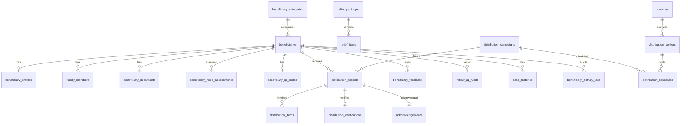

# Module 08: Beneficiary & Relief Distribution

> Manages beneficiary registration, verification, needs assessment, relief package distribution, QR-based verification, acknowledgements, follow-up visits, and complete humanitarian aid tracking.

---

## Module Overview

| Property | Value |
|----------|-------|
| **Module ID** | `BENEFICIARY_RELIEF` |
| **Entities** | 21 |
| **Priority** | Critical |
| **Dependencies** | Organization, Volunteer |

Every beneficiary is registered with a unique code and can be verified using QR code or barcode. Relief is organized into predefined packages, distributed at designated centers, and verified digitally to prevent fraud and duplication.

---

## Database Schema

### Table: `beneficiaries`

| Column | Type | Constraints | Description |
|--------|------|-------------|-------------|
| `id` | `BIGSERIAL` | PK | |
| `beneficiary_code` | `VARCHAR(50)` | UNIQUE, NOT NULL | e.g., `BEN-2026-000001` |
| `full_name` | `VARCHAR(200)` | NOT NULL | |
| `phone` | `VARCHAR(20)` | NULL | |
| `national_id` | `VARCHAR(50)` | NULL | |
| `date_of_birth` | `DATE` | NULL | |
| `gender` | `VARCHAR(20)` | NULL | |
| `branch_id` | `BIGINT` | FK → `branches.id` | Managing branch |
| `division_id` | `INT` | FK → `divisions.id` | |
| `district_id` | `INT` | FK → `districts.id` | |
| `upazila_id` | `INT` | FK → `upazilas.id` | |
| `union_id` | `INT` | FK → `unions.id` | |
| `address` | `TEXT` | NULL | |
| `status` | `VARCHAR(20)` | DEFAULT `active` | `active`, `inactive`, `deceased` |
| `created_at` | `TIMESTAMPTZ` | DEFAULT NOW() | |
| `updated_at` | `TIMESTAMPTZ` | DEFAULT NOW() | |

---

### Table: `beneficiary_profiles`

| Column | Type | Constraints | Description |
|--------|------|-------------|-------------|
| `id` | `BIGSERIAL` | PK | |
| `beneficiary_id` | `BIGINT` | FK → `beneficiaries.id`, ON DELETE CASCADE, UNIQUE | |
| `occupation` | `VARCHAR(100)` | NULL | |
| `monthly_income` | `DECIMAL(12,2)` | NULL | |
| `family_size` | `INT` | NULL | |
| `house_type` | `VARCHAR(50)` | NULL | `tin_shed`, `mud_house`, `brick`, `rented` |
| `education` | `VARCHAR(100)` | NULL | |
| `health_condition` | `TEXT` | NULL | |
| `special_needs` | `TEXT` | NULL | |
| `created_at` | `TIMESTAMPTZ` | DEFAULT NOW() | |
| `updated_at` | `TIMESTAMPTZ` | DEFAULT NOW() | |

---

### Table: `family_members`

| Column | Type | Constraints | Description |
|--------|------|-------------|-------------|
| `id` | `BIGSERIAL` | PK | |
| `beneficiary_id` | `BIGINT` | FK → `beneficiaries.id`, ON DELETE CASCADE | |
| `name` | `VARCHAR(200)` | NOT NULL | |
| `relationship` | `VARCHAR(50)` | NOT NULL | `spouse`, `son`, `daughter`, `parent` |
| `age` | `INT` | NULL | |
| `occupation` | `VARCHAR(100)` | NULL | |
| `monthly_income` | `DECIMAL(12,2)` | NULL | |
| `created_at` | `TIMESTAMPTZ` | DEFAULT NOW() | |
| `updated_at` | `TIMESTAMPTZ` | DEFAULT NOW() | |

---

### Table: `beneficiary_categories`

| Column | Type | Constraints | Description |
|--------|------|-------------|-------------|
| `id` | `SERIAL` | PK | |
| `category_name` | `VARCHAR(100)` | NOT NULL, UNIQUE | `poor_family`, `orphan`, `widow`, `elderly`, `disabled`, `disaster_victim`, `student`, `medical_patient` |
| `description` | `TEXT` | NULL | |
| `priority_level` | `INT` | DEFAULT 1 | 1 = highest |
| `status` | `VARCHAR(20)` | DEFAULT `active` | |
| `created_at` | `TIMESTAMPTZ` | DEFAULT NOW() | |
| `updated_at` | `TIMESTAMPTZ` | DEFAULT NOW() | |

---

### Table: `beneficiary_documents`

| Column | Type | Constraints | Description |
|--------|------|-------------|-------------|
| `id` | `BIGSERIAL` | PK | |
| `beneficiary_id` | `BIGINT` | FK → `beneficiaries.id`, ON DELETE CASCADE | |
| `document_type` | `VARCHAR(50)` | NOT NULL | `nid`, `birth_certificate`, `income_certificate`, `medical_report` |
| `document_number` | `VARCHAR(100)` | NULL | |
| `file_url` | `VARCHAR(500)` | NOT NULL | |
| `verification_status` | `VARCHAR(20)` | DEFAULT `pending` | |
| `created_at` | `TIMESTAMPTZ` | DEFAULT NOW() | |
| `updated_at` | `TIMESTAMPTZ` | DEFAULT NOW() | |

---

### Table: `beneficiary_need_assessments`

| Column | Type | Constraints | Description |
|--------|------|-------------|-------------|
| `id` | `BIGSERIAL` | PK | |
| `beneficiary_id` | `BIGINT` | FK → `beneficiaries.id`, ON DELETE CASCADE | |
| `assessment_type` | `VARCHAR(50)` | NOT NULL | `financial`, `medical`, `educational`, `housing` |
| `required_support` | `TEXT` | NOT NULL | |
| `priority` | `VARCHAR(20)` | DEFAULT `medium` | `low`, `medium`, `high`, `critical` |
| `assessed_by` | `BIGINT` | FK → `users.id` | |
| `assessment_date` | `DATE` | DEFAULT NOW() | |
| `created_at` | `TIMESTAMPTZ` | DEFAULT NOW() | |
| `updated_at` | `TIMESTAMPTZ` | DEFAULT NOW() | |

---

### Table: `relief_packages`

| Column | Type | Constraints | Description |
|--------|------|-------------|-------------|
| `id` | `BIGSERIAL` | PK | |
| `package_name` | `VARCHAR(200)` | NOT NULL | e.g., "Ramadan Family Pack" |
| `description` | `TEXT` | NULL | |
| `estimated_value` | `DECIMAL(12,2)` | NOT NULL | |
| `status` | `VARCHAR(20)` | DEFAULT `active` | |
| `created_at` | `TIMESTAMPTZ` | DEFAULT NOW() | |
| `updated_at` | `TIMESTAMPTZ` | DEFAULT NOW() | |

---

### Table: `relief_items`

| Column | Type | Constraints | Description |
|--------|------|-------------|-------------|
| `id` | `BIGSERIAL` | PK | |
| `package_id` | `BIGINT` | FK → `relief_packages.id`, ON DELETE CASCADE | |
| `item_name` | `VARCHAR(200)` | NOT NULL | `rice`, `lentils`, `oil`, `sugar`, `blanket`, `medicine`, `school_bag`, `clothes` |
| `quantity` | `DECIMAL(10,2)` | NOT NULL | |
| `unit` | `VARCHAR(50)` | NOT NULL | `kg`, `liter`, `piece`, `pack` |
| `estimated_price` | `DECIMAL(10,2)` | NULL | |
| `created_at` | `TIMESTAMPTZ` | DEFAULT NOW() | |
| `updated_at` | `TIMESTAMPTZ` | DEFAULT NOW() | |

---

### Table: `distribution_campaigns`

| Column | Type | Constraints | Description |
|--------|------|-------------|-------------|
| `id` | `BIGSERIAL` | PK | |
| `campaign_id` | `BIGINT` | FK → `campaigns.id`, NULL | Optional parent fundraising campaign |
| `title` | `VARCHAR(255)` | NOT NULL | |
| `distribution_date` | `DATE` | NOT NULL | |
| `location` | `VARCHAR(255)` | NOT NULL | |
| `status` | `VARCHAR(20)` | DEFAULT `planned` | `planned`, `ongoing`, `completed`, `cancelled` |
| `created_at` | `TIMESTAMPTZ` | DEFAULT NOW() | |
| `updated_at` | `TIMESTAMPTZ` | DEFAULT NOW() | |

---

### Table: `distribution_schedules`

| Column | Type | Constraints | Description |
|--------|------|-------------|-------------|
| `id` | `BIGSERIAL` | PK | |
| `distribution_campaign_id` | `BIGINT` | FK → `distribution_campaigns.id`, ON DELETE CASCADE | |
| `branch_id` | `BIGINT` | FK → `branches.id` | |
| `distribution_center_id` | `BIGINT` | FK → `distribution_centers.id` | |
| `schedule_date` | `DATE` | NOT NULL | |
| `start_time` | `TIME` | NOT NULL | |
| `end_time` | `TIME` | NOT NULL | |
| `status` | `VARCHAR(20)` | DEFAULT `scheduled` | |
| `created_at` | `TIMESTAMPTZ` | DEFAULT NOW() | |
| `updated_at` | `TIMESTAMPTZ` | DEFAULT NOW() | |

---

### Table: `distribution_centers`

| Column | Type | Constraints | Description |
|--------|------|-------------|-------------|
| `id` | `BIGSERIAL` | PK | |
| `center_name` | `VARCHAR(200)` | NOT NULL | |
| `branch_id` | `BIGINT` | FK → `branches.id` | |
| `address` | `TEXT` | NOT NULL | |
| `latitude` | `DECIMAL(10,8)` | NULL | |
| `longitude` | `DECIMAL(11,8)` | NULL | |
| `capacity` | `INT` | NOT NULL | Max beneficiaries per day |
| `status` | `VARCHAR(20)` | DEFAULT `active` | |
| `created_at` | `TIMESTAMPTZ` | DEFAULT NOW() | |
| `updated_at` | `TIMESTAMPTZ` | DEFAULT NOW() | |

---

### Table: `distribution_records`

The core distribution transaction.

| Column | Type | Constraints | Description |
|--------|------|-------------|-------------|
| `id` | `BIGSERIAL` | PK | |
| `beneficiary_id` | `BIGINT` | FK → `beneficiaries.id`, ON DELETE RESTRICT | |
| `distribution_campaign_id` | `BIGINT` | FK → `distribution_campaigns.id`, ON DELETE RESTRICT | |
| `package_id` | `BIGINT` | FK → `relief_packages.id` | |
| `distributed_by` | `BIGINT` | FK → `users.id` | Volunteer |
| `received_at` | `TIMESTAMPTZ` | NULL | |
| `status` | `VARCHAR(20)` | DEFAULT `pending` | `pending`, `distributed`, `received`, `cancelled` |
| `created_at` | `TIMESTAMPTZ` | DEFAULT NOW() | |
| `updated_at` | `TIMESTAMPTZ` | DEFAULT NOW() | |

---

### Table: `distribution_items`

Item-level tracking within a distribution.

| Column | Type | Constraints | Description |
|--------|------|-------------|-------------|
| `id` | `BIGSERIAL` | PK | |
| `distribution_record_id` | `BIGINT` | FK → `distribution_records.id`, ON DELETE CASCADE | |
| `relief_item_id` | `BIGINT` | FK → `relief_items.id`, ON DELETE RESTRICT | |
| `quantity` | `DECIMAL(10,2)` | NOT NULL | Actual quantity given |
| `remarks` | `TEXT` | NULL | |
| `created_at` | `TIMESTAMPTZ` | DEFAULT NOW() | |
| `updated_at` | `TIMESTAMPTZ` | DEFAULT NOW() | |

---

### Table: `beneficiary_qr_codes`

| Column | Type | Constraints | Description |
|--------|------|-------------|-------------|
| `id` | `BIGSERIAL` | PK | |
| `beneficiary_id` | `BIGINT` | FK → `beneficiaries.id`, ON DELETE CASCADE, UNIQUE | |
| `qr_code` | `TEXT` | NOT NULL | Image URL |
| `barcode` | `VARCHAR(255)` | UNIQUE, NOT NULL | |
| `verification_url` | `VARCHAR(500)` | NOT NULL | |
| `created_at` | `TIMESTAMPTZ` | DEFAULT NOW() | |
| `updated_at` | `TIMESTAMPTZ` | DEFAULT NOW() | |

---

### Table: `distribution_verifications`

| Column | Type | Constraints | Description |
|--------|------|-------------|-------------|
| `id` | `BIGSERIAL` | PK | |
| `distribution_record_id` | `BIGINT` | FK → `distribution_records.id`, ON DELETE CASCADE | |
| `verification_method` | `VARCHAR(50)` | NOT NULL | `qr_code`, `barcode`, `otp`, `national_id`, `manual` |
| `verified_by` | `BIGINT` | FK → `users.id` | |
| `verification_time` | `TIMESTAMPTZ` | DEFAULT NOW() | |
| `status` | `VARCHAR(20)` | DEFAULT `verified` | |
| `created_at` | `TIMESTAMPTZ` | DEFAULT NOW() | |
| `updated_at` | `TIMESTAMPTZ` | DEFAULT NOW() | |

---

### Table: `acknowledgements`

Digital proof of receipt.

| Column | Type | Constraints | Description |
|--------|------|-------------|-------------|
| `id` | `BIGSERIAL` | PK | |
| `distribution_record_id` | `BIGINT` | FK → `distribution_records.id`, ON DELETE CASCADE, UNIQUE | |
| `signature` | `VARCHAR(500)` | NULL | Image URL of digital signature |
| `photo` | `VARCHAR(500)` | NULL | Photo of beneficiary receiving package |
| `remarks` | `TEXT` | NULL | |
| `created_at` | `TIMESTAMPTZ` | DEFAULT NOW() | |
| `updated_at` | `TIMESTAMPTZ` | DEFAULT NOW() | |

---

### Table: `beneficiary_feedback`

| Column | Type | Constraints | Description |
|--------|------|-------------|-------------|
| `id` | `BIGSERIAL` | PK | |
| `beneficiary_id` | `BIGINT` | FK → `beneficiaries.id`, ON DELETE CASCADE | |
| `distribution_record_id` | `BIGINT` | FK → `distribution_records.id`, ON DELETE CASCADE | |
| `rating` | `INT` | CHECK 1-5 | |
| `feedback` | `TEXT` | NULL | |
| `submitted_at` | `TIMESTAMPTZ` | DEFAULT NOW() | |
| `created_at` | `TIMESTAMPTZ` | DEFAULT NOW() | |

---

### Table: `follow_up_visits`

| Column | Type | Constraints | Description |
|--------|------|-------------|-------------|
| `id` | `BIGSERIAL` | PK | |
| `beneficiary_id` | `BIGINT` | FK → `beneficiaries.id`, ON DELETE CASCADE | |
| `visited_by` | `BIGINT` | FK → `users.id` | |
| `visit_date` | `DATE` | NOT NULL | |
| `remarks` | `TEXT` | NULL | |
| `next_visit_date` | `DATE` | NULL | |
| `status` | `VARCHAR(20)` | DEFAULT `scheduled` | |
| `created_at` | `TIMESTAMPTZ` | DEFAULT NOW() | |
| `updated_at` | `TIMESTAMPTZ` | DEFAULT NOW() | |

---

### Table: `case_histories`

| Column | Type | Constraints | Description |
|--------|------|-------------|-------------|
| `id` | `BIGSERIAL` | PK | |
| `beneficiary_id` | `BIGINT` | FK → `beneficiaries.id`, ON DELETE CASCADE | |
| `case_type` | `VARCHAR(50)` | NOT NULL | `new_registration`, `follow_up`, `complaint`, `escalation` |
| `description` | `TEXT` | NOT NULL | |
| `assigned_officer` | `BIGINT` | FK → `users.id` | |
| `status` | `VARCHAR(20)` | DEFAULT `open` | `open`, `in_progress`, `resolved`, `closed` |
| `created_at` | `TIMESTAMPTZ` | DEFAULT NOW() | |
| `updated_at` | `TIMESTAMPTZ` | DEFAULT NOW() | |

---

### Table: `beneficiary_activity_logs`

| Column | Type | Constraints | Description |
|--------|------|-------------|-------------|
| `id` | `BIGSERIAL` | PK | |
| `beneficiary_id` | `BIGINT` | FK → `beneficiaries.id`, ON DELETE CASCADE | |
| `activity` | `VARCHAR(100)` | NOT NULL | |
| `description` | `TEXT` | NULL | |
| `performed_by` | `BIGINT` | FK → `users.id` | |
| `created_at` | `TIMESTAMPTZ` | DEFAULT NOW() | |

---

## Entity Relationship Diagram



---

## API Endpoints

### 1. Register Beneficiary

**Endpoint:** `POST /api/v1/beneficiaries`  
**Access:** Volunteer, Admin (`beneficiary:create`)

**Request Body**
```json
{
  "full_name": "Amina Begum",
  "phone": "+8801XXXXXXXXX",
  "national_id": "1234567890123",
  "date_of_birth": "1975-03-15",
  "gender": "female",
  "branch_id": 5,
  "division_id": 1,
  "district_id": 2,
  "upazila_id": 5,
  "union_id": 12,
  "address": "Village: Dighirpar, Ward 3",
  "category_id": 3,
  "profile": {
    "occupation": "Day laborer",
    "monthly_income": 8000.00,
    "family_size": 5,
    "house_type": "tin_shed",
    "special_needs": "Diabetic, requires monthly medicine"
  },
  "family_members": [
    { "name": "Rahim", "relationship": "son", "age": 12, "occupation": "student" }
  ],
  "need_assessment": {
    "assessment_type": "medical",
    "required_support": "Monthly diabetes medication and checkup",
    "priority": "high"
  }
}
```

**Business Logic**
1. Validate geographic chain.
2. Generate `beneficiary_code`.
3. Create `beneficiaries`, `beneficiary_profiles`, `family_members`, `beneficiary_need_assessments`.
4. Generate QR code and barcode. Create `beneficiary_qr_codes`.
5. Log to `beneficiary_activity_logs`.

**Success Response (201 Created)**
```json
{
  "success": true,
  "message": "Beneficiary registered",
  "data": {
    "id": 500,
    "beneficiary_code": "BEN-2026-000500",
    "qr_code_url": "https://cdn.ashray.org/qr/ben-500.png",
    "status": "active"
  }
}
```

---

### 2. Verify Beneficiary QR at Distribution

**Endpoint:** `POST /api/v1/distributions/:id/verify`  
**Access:** Volunteer (assigned to distribution)

**Request Body**
```json
{
  "qr_code": "BEN-QR-500",
  "verification_method": "qr_code",
  "latitude": 24.8949,
  "longitude": 91.8687
}
```

**Business Logic**
1. Start transaction. Lock `distribution_records` row.
2. Lookup beneficiary by QR code.
3. Verify beneficiary is registered for this distribution campaign.
4. Check not already received (idempotency).
5. Update `distribution_records.status = received`, `received_at = NOW()`.
6. Create `distribution_verifications`.
7. Prompt for digital signature / photo acknowledgement.

**Success Response (200 OK)**
```json
{
  "success": true,
  "message": "Beneficiary verified",
  "data": {
    "beneficiary": { "id": 500, "name": "Amina Begum", "code": "BEN-2026-000500" },
    "distribution_status": "received",
    "requires_acknowledgement": true
  }
}
```

**Error Responses**
| Status | Message | Condition |
|--------|---------|-----------|
| 404 | QR code not found | Invalid code |
| 409 | Already received | Duplicate scan |
| 403 | Not registered for this distribution | Beneficiary not in campaign list |

---

### 3. Submit Acknowledgement

**Endpoint:** `POST /api/v1/distributions/:id/acknowledge`  
**Access:** Volunteer
**Content-Type:** `multipart/form-data`

**Request Body**
- `signature`: File (PNG of digital signature)
- `photo`: File (JPEG of beneficiary receiving package)
- `remarks`: String

**Business Logic**
1. Verify distribution record exists and `status = received`.
2. Upload files to S3.
3. Create `acknowledgements`.

**Success Response (201 Created)**
```json
{
  "success": true,
  "message": "Acknowledgement recorded",
  "data": { "acknowledgement_id": 89, "signature_url": "...", "photo_url": "..." }
}
```

---

### 4. Create Relief Package

**Endpoint:** `POST /api/v1/admin/relief-packages`  
**Access:** Admin (`relief:manage`)

**Request Body**
```json
{
  "package_name": "Winter Relief Pack 2026",
  "description": "Blanket, warm clothes, and dry food for winter",
  "estimated_value": 2500.00,
  "items": [
    { "item_name": "blanket", "quantity": 2, "unit": "piece", "estimated_price": 800.00 },
    { "item_name": "dry_food", "quantity": 5, "unit": "kg", "estimated_price": 500.00 }
  ]
}
```

**Success Response (201 Created)**
```json
{
  "success": true,
  "message": "Relief package created",
  "data": { "package_id": 10, "item_count": 2, "estimated_value": 2500.00 }
}
```

---

### 5. Schedule Distribution

**Endpoint:** `POST /api/v1/admin/distribution-campaigns`  
**Access:** Admin (`distribution:manage`)

**Request Body**
```json
{
  "campaign_id": 10,
  "title": "Sylhet Flood Relief Distribution – Phase 1",
  "distribution_date": "2026-07-25",
  "location": "Sylhet City Corporation Field",
  "branch_id": 5,
  "distribution_center_id": 3,
  "schedule": {
    "start_time": "09:00",
    "end_time": "17:00"
  },
  "beneficiary_ids": [500, 501, 502, 503]
}
```

**Business Logic**
1. Create `distribution_campaigns`.
2. Create `distribution_schedules`.
3. Pre-create `distribution_records` for each beneficiary with `status = pending`.
4. Notify beneficiaries via SMS (if phone available).

**Success Response (201 Created)**
```json
{
  "success": true,
  "message": "Distribution scheduled",
  "data": {
    "distribution_campaign_id": 15,
    "beneficiaries_scheduled": 4,
    "location": "Sylhet City Corporation Field",
    "date": "2026-07-25"
  }
}
```

---

### 6. Record Follow-Up Visit

**Endpoint:** `POST /api/v1/beneficiaries/:id/follow-ups`  
**Access:** Volunteer, Admin

**Request Body**
```json
{
  "visit_date": "2026-08-15",
  "remarks": "Beneficiary reports improvement in health. Medicine supply sufficient for 2 more months.",
  "next_visit_date": "2026-10-15"
}
```

**Success Response (201 Created)**
```json
{
  "success": true,
  "message": "Follow-up scheduled",
  "data": { "follow_up_id": 20, "next_visit_date": "2026-10-15" }
}
```

---

### 7. Get Beneficiary Dashboard

**Endpoint:** `GET /api/v1/beneficiaries/:id`  
**Access:** Volunteer (assigned area), Admin

**Success Response (200 OK)**
```json
{
  "success": true,
  "message": "Beneficiary retrieved",
  "data": {
    "id": 500,
    "beneficiary_code": "BEN-2026-000500",
    "full_name": "Amina Begum",
    "profile": { "family_size": 5, "monthly_income": 8000.00, "house_type": "tin_shed" },
    "category": "widow",
    "needs": [
      { "type": "medical", "support": "Monthly diabetes medication", "priority": "high" }
    ],
    "distributions": [
      { "campaign": "Winter Relief 2026", "date": "2026-01-15", "status": "received", "items": ["blanket", "dry_food"] }
    ],
    "follow_ups": [
      { "date": "2026-08-15", "remarks": "Health improving", "next_visit": "2026-10-15" }
    ]
  }
}
```

---

## Business Rules Summary

1. **Beneficiary Code Uniqueness**: Immutable and globally unique. Format: `BEN-{YYYY}-{SEQUENCE}`.
2. **Duplicate Prevention**: Before registration, the system checks for existing beneficiaries with the same `national_id` or `phone` + `full_name` combination within the same union.
3. **QR Verification Idempotency**: A beneficiary cannot receive the same relief package twice. The system returns `409 Already received` on duplicate scans.
4. **GPS Proximity**: Distribution verification requires the volunteer's device to be within 1km of the `distribution_centers` coordinates.
5. **Acknowledgement Requirement**: Every distribution must have either a digital signature or a photo acknowledgement before the distribution record can be marked `completed`.
6. **Item-Level Tracking**: `distribution_items` records actual quantities distributed, which may differ from `relief_items` quantities due to supply shortages. Discrepancies are flagged for admin review.
7. **Need Assessment Priority**: Beneficiaries with `priority = critical` are automatically included in all active emergency distribution campaigns within their geographic area.
8. **Feedback Loop**: `beneficiary_feedback` ratings < 3 trigger a `case_histories` record for quality improvement investigation.
9. **Follow-Up Automation**: Follow-up visits are auto-scheduled 3 months after each distribution. Missed follow-ups escalate to the branch manager.
10. **Fraud Detection**: The AI module scans for duplicate beneficiaries (same NID, similar photos, same address) and flags potential fraud for admin review.

---

*Next: See `09_EVENTS_AND_MEDIA.md` for event management, galleries, and public-facing content.*
