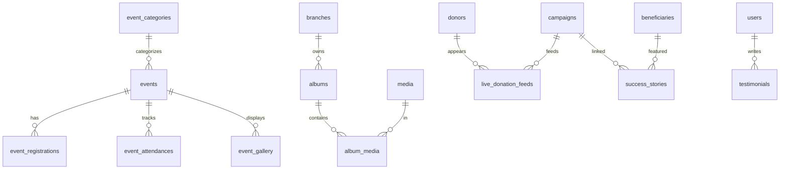

# Module 09: Events, Gallery & Media Management

> Manages foundation events, event participation, media galleries, live donation feeds, success stories, news, newsletters, testimonials, and all public-facing media content.

---

## Module Overview

| Property | Value |
|----------|-------|
| **Module ID** | `EVENTS_MEDIA` |
| **Entities** | 21 |
| **Priority** | Medium |
| **Dependencies** | Authentication, Organization, Campaign |

---

## Database Schema

### Table: `events`

| Column | Type | Constraints | Description |
|--------|------|-------------|-------------|
| `id` | `BIGSERIAL` | PK | |
| `event_code` | `VARCHAR(50)` | UNIQUE, NOT NULL | |
| `title` | `VARCHAR(255)` | NOT NULL | |
| `slug` | `VARCHAR(255)` | UNIQUE, NOT NULL | |
| `category_id` | `INT` | FK → `event_categories.id` | |
| `description` | `TEXT` | NOT NULL | |
| `banner` | `VARCHAR(500)` | NULL | |
| `thumbnail` | `VARCHAR(500)` | NULL | |
| `event_type` | `VARCHAR(50)` | NOT NULL | `foundation_program`, `blood_donation`, `food_distribution`, `tree_plantation`, `medical_camp`, `awareness_campaign`, `volunteer_meetup`, `fundraising_event`, `training_program` |
| `branch_id` | `BIGINT` | FK → `branches.id` | |
| `venue` | `VARCHAR(255)` | NOT NULL | |
| `start_date` | `TIMESTAMPTZ` | NOT NULL | |
| `end_date` | `TIMESTAMPTZ` | NOT NULL | |
| `registration_required` | `BOOLEAN` | DEFAULT TRUE | |
| `max_participants` | `INT` | NULL | NULL = unlimited |
| `status` | `VARCHAR(20)` | DEFAULT `upcoming` | `upcoming`, `ongoing`, `completed`, `cancelled` |
| `created_by` | `BIGINT` | FK → `users.id` | |
| `created_at` | `TIMESTAMPTZ` | DEFAULT NOW() | |
| `updated_at` | `TIMESTAMPTZ` | DEFAULT NOW() | |

---

### Table: `event_categories`

| Column | Type | Constraints | Description |
|--------|------|-------------|-------------|
| `id` | `SERIAL` | PK | |
| `name` | `VARCHAR(100)` | NOT NULL, UNIQUE | |
| `icon` | `VARCHAR(255)` | NULL | |
| `description` | `TEXT` | NULL | |
| `status` | `VARCHAR(20)` | DEFAULT `active` | |
| `created_at` | `TIMESTAMPTZ` | DEFAULT NOW() | |
| `updated_at` | `TIMESTAMPTZ` | DEFAULT NOW() | |

---

### Table: `event_registrations`

| Column | Type | Constraints | Description |
|--------|------|-------------|-------------|
| `id` | `BIGSERIAL` | PK | |
| `event_id` | `BIGINT` | FK → `events.id`, ON DELETE CASCADE | |
| `user_id` | `BIGINT` | FK → `users.id`, ON DELETE CASCADE | |
| `registration_number` | `VARCHAR(50)` | UNIQUE, NOT NULL | |
| `registration_date` | `TIMESTAMPTZ` | DEFAULT NOW() | |
| `status` | `VARCHAR(20)` | DEFAULT `registered` | `registered`, `attended`, `cancelled`, `no_show` |
| `created_at` | `TIMESTAMPTZ` | DEFAULT NOW() | |
| `updated_at` | `TIMESTAMPTZ` | DEFAULT NOW() | |

---

### Table: `event_attendances`

| Column | Type | Constraints | Description |
|--------|------|-------------|-------------|
| `id` | `BIGSERIAL` | PK | |
| `event_id` | `BIGINT` | FK → `events.id`, ON DELETE CASCADE | |
| `user_id` | `BIGINT` | FK → `users.id`, ON DELETE CASCADE | |
| `check_in_time` | `TIMESTAMPTZ` | NULL | |
| `check_out_time` | `TIMESTAMPTZ` | NULL | |
| `attendance_status` | `VARCHAR(20)` | DEFAULT `pending` | `present`, `absent`, `late` |
| `created_at` | `TIMESTAMPTZ` | DEFAULT NOW() | |
| `updated_at` | `TIMESTAMPTZ` | DEFAULT NOW() | |

---

### Table: `media`

Central media library.

| Column | Type | Constraints | Description |
|--------|------|-------------|-------------|
| `id` | `BIGSERIAL` | PK | |
| `title` | `VARCHAR(255)` | NULL | |
| `media_type` | `VARCHAR(20)` | NOT NULL | `image`, `video`, `audio`, `pdf` |
| `file_url` | `VARCHAR(500)` | NOT NULL | |
| `thumbnail` | `VARCHAR(500)` | NULL | |
| `uploaded_by` | `BIGINT` | FK → `users.id` | |
| `status` | `VARCHAR(20)` | DEFAULT `active` | |
| `created_at` | `TIMESTAMPTZ` | DEFAULT NOW() | |
| `updated_at` | `TIMESTAMPTZ` | DEFAULT NOW() | |

---

### Table: `albums`

| Column | Type | Constraints | Description |
|--------|------|-------------|-------------|
| `id` | `BIGSERIAL` | PK | |
| `title` | `VARCHAR(255)` | NOT NULL | |
| `description` | `TEXT` | NULL | |
| `cover_photo` | `VARCHAR(500)` | NULL | |
| `branch_id` | `BIGINT` | FK → `branches.id`, NULL | |
| `status` | `VARCHAR(20)` | DEFAULT `active` | |
| `created_at` | `TIMESTAMPTZ` | DEFAULT NOW() | |
| `updated_at` | `TIMESTAMPTZ` | DEFAULT NOW() | |

---

### Table: `album_media`

Junction table.

| Column | Type | Constraints | Description |
|--------|------|-------------|-------------|
| `id` | `BIGSERIAL` | PK | |
| `album_id` | `BIGINT` | FK → `albums.id`, ON DELETE CASCADE | |
| `media_id` | `BIGINT` | FK → `media.id`, ON DELETE CASCADE | |
| `sort_order` | `INT` | DEFAULT 0 | |
| `created_at` | `TIMESTAMPTZ` | DEFAULT NOW() | |
| `updated_at` | `TIMESTAMPTZ` | DEFAULT NOW() | |

---

### Table: `live_donation_feeds`

Real-time ticker data.

| Column | Type | Constraints | Description |
|--------|------|-------------|-------------|
| `id` | `BIGSERIAL` | PK | |
| `donor_id` | `BIGINT` | FK → `donors.id`, ON DELETE SET NULL | |
| `donor_name` | `VARCHAR(200)` | NOT NULL | Display name (may be "Anonymous") |
| `amount` | `DECIMAL(12,2)` | NOT NULL | |
| `campaign_id` | `BIGINT` | FK → `campaigns.id`, ON DELETE SET NULL | |
| `message` | `TEXT` | NULL | |
| `is_anonymous` | `BOOLEAN` | DEFAULT FALSE | |
| `display_status` | `VARCHAR(20)` | DEFAULT `visible` | `visible`, `hidden` |
| `created_at` | `TIMESTAMPTZ` | DEFAULT NOW() | |

**Partitioning:** Partitioned by `created_at` month for performance.

---

### Table: `success_stories`

| Column | Type | Constraints | Description |
|--------|------|-------------|-------------|
| `id` | `BIGSERIAL` | PK | |
| `title` | `VARCHAR(255)` | NOT NULL | |
| `slug` | `VARCHAR(255)` | UNIQUE, NOT NULL | |
| `beneficiary_id` | `BIGINT` | FK → `beneficiaries.id`, NULL | |
| `campaign_id` | `BIGINT` | FK → `campaigns.id`, NULL | |
| `summary` | `TEXT` | NOT NULL | |
| `content` | `TEXT` | NOT NULL | Full story |
| `published_by` | `BIGINT` | FK → `users.id` | |
| `published_at` | `TIMESTAMPTZ` | DEFAULT NOW() | |
| `status` | `VARCHAR(20)` | DEFAULT `draft` | `draft`, `published`, `archived` |
| `created_at` | `TIMESTAMPTZ` | DEFAULT NOW() | |
| `updated_at` | `TIMESTAMPTZ` | DEFAULT NOW() | |

---

### Table: `testimonials`

| Column | Type | Constraints | Description |
|--------|------|-------------|-------------|
| `id` | `BIGSERIAL` | PK | |
| `user_id` | `BIGINT` | FK → `users.id`, ON DELETE SET NULL | |
| `title` | `VARCHAR(255)` | NULL | |
| `message` | `TEXT` | NOT NULL | |
| `rating` | `INT` | CHECK 1-5 | |
| `photo` | `VARCHAR(500)` | NULL | |
| `status` | `VARCHAR(20)` | DEFAULT `pending` | `pending`, `approved`, `rejected` |
| `created_at` | `TIMESTAMPTZ` | DEFAULT NOW() | |
| `updated_at` | `TIMESTAMPTZ` | DEFAULT NOW() | |

---

### Table: `press_releases`

| Column | Type | Constraints | Description |
|--------|------|-------------|-------------|
| `id` | `BIGSERIAL` | PK | |
| `title` | `VARCHAR(255)` | NOT NULL | |
| `slug` | `VARCHAR(255)` | UNIQUE, NOT NULL | |
| `content` | `TEXT` | NOT NULL | |
| `attachment` | `VARCHAR(500)` | NULL | PDF URL |
| `published_by` | `BIGINT` | FK → `users.id` | |
| `published_at` | `TIMESTAMPTZ` | DEFAULT NOW() | |
| `status` | `VARCHAR(20)` | DEFAULT `draft` | |
| `created_at` | `TIMESTAMPTZ` | DEFAULT NOW() | |
| `updated_at` | `TIMESTAMPTZ` | DEFAULT NOW() | |

---

### Table: `news`

| Column | Type | Constraints | Description |
|--------|------|-------------|-------------|
| `id` | `BIGSERIAL` | PK | |
| `title` | `VARCHAR(255)` | NOT NULL | |
| `slug` | `VARCHAR(255)` | UNIQUE, NOT NULL | |
| `summary` | `TEXT` | NOT NULL | |
| `content` | `TEXT` | NOT NULL | |
| `featured_image` | `VARCHAR(500)` | NULL | |
| `published_by` | `BIGINT` | FK → `users.id` | |
| `published_at` | `TIMESTAMPTZ` | DEFAULT NOW() | |
| `status` | `VARCHAR(20)` | DEFAULT `draft` | |
| `created_at` | `TIMESTAMPTZ` | DEFAULT NOW() | |
| `updated_at` | `TIMESTAMPTZ` | DEFAULT NOW() | |

---

### Table: `newsletters`

| Column | Type | Constraints | Description |
|--------|------|-------------|-------------|
| `id` | `BIGSERIAL` | PK | |
| `title` | `VARCHAR(255)` | NOT NULL | |
| `subject` | `VARCHAR(255)` | NOT NULL | Email subject |
| `content` | `TEXT` | NOT NULL | HTML content |
| `sent_by` | `BIGINT` | FK → `users.id` | |
| `sent_at` | `TIMESTAMPTZ` | NULL | |
| `status` | `VARCHAR(20)` | DEFAULT `draft` | `draft`, `scheduled`, `sent` |
| `created_at` | `TIMESTAMPTZ` | DEFAULT NOW() | |
| `updated_at` | `TIMESTAMPTZ` | DEFAULT NOW() | |

---

## Entity Relationship Diagram



---

## API Endpoints

### 1. Create Event

**Endpoint:** `POST /api/v1/admin/events`  
**Access:** Admin (`event:create`)

**Request Body**
```json
{
  "title": "Annual Blood Donation Camp 2026",
  "slug": "blood-donation-2026",
  "category_id": 2,
  "description": "Join us to save lives...",
  "event_type": "blood_donation",
  "branch_id": 5,
  "venue": "Mohammadpur Community Center",
  "start_date": "2026-08-15T09:00:00Z",
  "end_date": "2026-08-15T17:00:00Z",
  "registration_required": true,
  "max_participants": 200
}
```

**Success Response (201 Created)**
```json
{
  "success": true,
  "message": "Event created",
  "data": { "id": 20, "event_code": "EVT-2026-0020", "status": "upcoming" }
}
```

---

### 2. Register for Event

**Endpoint:** `POST /api/v1/events/:id/register`  
**Access:** Authenticated

**Business Logic**
1. Verify event is upcoming and registration open.
2. Check `max_participants` not exceeded.
3. Create `event_registrations`.
4. Generate QR ticket for entry.

**Success Response (201 Created)**
```json
{
  "success": true,
  "message": "Registered successfully",
  "data": {
    "registration_id": 150,
    "registration_number": "REG-2026-00150",
    "qr_ticket": "https://cdn.ashray.org/tickets/150.png"
  }
}
```

---

### 3. Upload to Gallery

**Endpoint:** `POST /api/v1/admin/albums/:id/media`  
**Access:** Admin (`media:upload`)
**Content-Type:** `multipart/form-data`

**Request Body**
- `files[]`: Array of images/videos
- `titles[]`: Matching array of titles

**Business Logic**
1. Validate file types and sizes.
2. Virus scan.
3. Upload to S3/Cloudinary.
4. Create `media` and `album_media` records.

**Success Response (201 Created)**
```json
{
  "success": true,
  "message": "5 media items uploaded",
  "data": { "uploaded_count": 5, "album_id": 3 }
}
```

---

### 4. Get Live Donation Feed

**Endpoint:** `GET /api/v1/live-donation-feed`  
**Access:** Public  
**Query:** `campaign_id`, `limit` (default 20, max 100)

**Success Response (200 OK)**
```json
{
  "success": true,
  "message": "Live feed retrieved",
  "data": [
    {
      "id": 50001,
      "donor_name": "Anonymous",
      "amount": 10000.00,
      "campaign": "Flood Relief 2026 – Sylhet",
      "message": "Stay strong Sylhet!",
      "created_at": "2026-07-12T14:59:00Z"
    },
    {
      "id": 50000,
      "donor_name": "TechCorp Ltd",
      "amount": 50000.00,
      "campaign": "Flood Relief 2026 – Sylhet",
      "message": null,
      "created_at": "2026-07-12T14:58:00Z"
    }
  ]
}
```

---

### 5. Publish Success Story

**Endpoint:** `POST /api/v1/admin/success-stories`  
**Access:** Admin (`content:create`)

**Request Body**
```json
{
  "title": "How Your Zakat Changed Amina's Life",
  "slug": "ammina-zakat-story",
  "beneficiary_id": 500,
  "campaign_id": 10,
  "summary": "Amina Begum received medical support...",
  "content": "<p>Full story with photos...</p>",
  "media_ids": [101, 102, 103]
}
```

**Success Response (201 Created)**
```json
{
  "success": true,
  "message": "Success story published",
  "data": { "id": 8, "status": "published", "published_at": "2026-07-12T10:00:00Z" }
}
```

---

### 6. Send Newsletter

**Endpoint:** `POST /api/v1/admin/newsletters/:id/send`  
**Access:** Admin (`newsletter:send`)

**Business Logic**
1. Verify newsletter status = `draft` or `scheduled`.
2. Queue email dispatch to all subscribers.
3. Update `status = sent`, `sent_at = NOW()`.

**Success Response (200 OK)**
```json
{
  "success": true,
  "message": "Newsletter queued for sending",
  "data": { "newsletter_id": 5, "estimated_recipients": 15000, "status": "sending" }
}
```

---

## Business Rules Summary

1. **Event Capacity**: Registration closes automatically when `event_registrations.count >= max_participants`.
2. **Attendance QR**: Event check-in uses the same QR verification system as membership cards.
3. **Media Ownership**: Uploaded media is owned by the uploading branch. Super admins can access all branches' media.
4. **Live Feed Privacy**: Anonymous donations show "Anonymous" regardless of `donor_name` field. Admin view shows actual name.
5. **Content Moderation**: `testimonials` and `success_stories` require admin approval before public visibility.
6. **Newsletter Throttling**: Bulk emails are sent at a rate of 100 emails/second to prevent SMTP blacklisting.
7. **Slug Uniqueness**: All content slugs (`events`, `success_stories`, `news`, `press_releases`) are globally unique and immutable after publication.
8. **Auto-Archive**: Events with `end_date < NOW() - 30 days` are automatically set `status = archived`.

---

*Next: See `10_NOTIFICATIONS_AND_SUPPORT.md` for multi-channel notifications, support tickets, and emergency alerts.*
