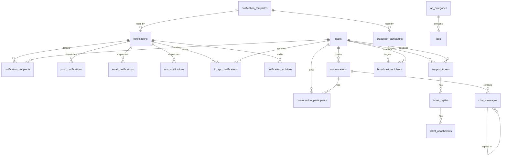

# Module 10: Notification, Communication & Support

> Manages multi-channel notifications (Push, Email, SMS, In-App), announcements, emergency alerts, one-to-one and group messaging, support tickets, FAQs, broadcast campaigns, and all communication channels across the ASHRAY Foundation Operating System.

---

## Module Overview

| Property | Value |
|----------|-------|
| **Module ID** | `NOTIFICATION_SUPPORT` |
| **Entities** | 23 |
| **Priority** | High |
| **Dependencies** | Authentication, Organization, Campaign |

ASHRAY operates a unified notification engine that dispatches messages across four channels (Push, Email, SMS, In-App) from a single orchestration layer. All delivery attempts, failures, and responses are logged for auditing and troubleshooting.

---

## Database Schema

### Core Notification Tables

#### Table: `notifications`

The central notification record. Every outbound message creates one notification row, which then fans out to channel-specific delivery records.

| Column | Type | Constraints | Description |
|--------|------|-------------|-------------|
| `id` | `BIGSERIAL` | PK | |
| `title` | `VARCHAR(255)` | NOT NULL | Notification headline |
| `message` | `TEXT` | NOT NULL | Body content (may contain template variables) |
| `type` | `VARCHAR(50)` | NOT NULL | `system`, `campaign`, `emergency`, `membership`, `donation`, `volunteer`, `general` |
| `priority` | `VARCHAR(20)` | DEFAULT `normal` | `low`, `normal`, `high`, `critical` |
| `sender_id` | `BIGINT` | FK → `users.id`, NULL | NULL = system-generated |
| `status` | `VARCHAR(20)` | DEFAULT `pending` | `pending`, `processing`, `sent`, `partial`, `failed`, `cancelled` |
| `scheduled_at` | `TIMESTAMPTZ` | NULL | NULL = send immediately |
| `sent_at` | `TIMESTAMPTZ` | NULL | Set when all channels complete |
| `created_at` | `TIMESTAMPTZ` | DEFAULT NOW() | |
| `updated_at` | `TIMESTAMPTZ` | DEFAULT NOW() | |

**Indexes:** `status`, `type`, `priority`, `scheduled_at`, `created_at`

---

#### Table: `notification_templates`

Reusable templates for consistent messaging across channels.

| Column | Type | Constraints | Description |
|--------|------|-------------|-------------|
| `id` | `BIGSERIAL` | PK | |
| `template_name` | `VARCHAR(100)` | NOT NULL, UNIQUE | e.g., `donation_receipt`, `emergency_alert` |
| `channel` | `VARCHAR(20)` | NOT NULL | `push`, `email`, `sms`, `in_app` |
| `subject` | `VARCHAR(255)` | NULL | Email subject line |
| `title` | `VARCHAR(255)` | NOT NULL | Push/In-App title |
| `body` | `TEXT` | NOT NULL | Template body with `{{variable}}` placeholders |
| `variables` | `JSONB` | NULL | Schema of expected variables `["user_name", "amount", "campaign_title"]` |
| `status` | `VARCHAR(20)` | DEFAULT `active` | `active`, `inactive` |
| `created_at` | `TIMESTAMPTZ` | DEFAULT NOW() | |
| `updated_at` | `TIMESTAMPTZ` | DEFAULT NOW() | |

---

#### Table: `notification_recipients`

Tracks per-user delivery status for each notification.

| Column | Type | Constraints | Description |
|--------|------|-------------|-------------|
| `id` | `BIGSERIAL` | PK | |
| `notification_id` | `BIGINT` | FK → `notifications.id`, ON DELETE CASCADE | |
| `user_id` | `BIGINT` | FK → `users.id`, ON DELETE CASCADE | |
| `delivery_status` | `VARCHAR(20)` | DEFAULT `pending` | `pending`, `sent`, `delivered`, `read`, `failed`, `bounced` |
| `read_at` | `TIMESTAMPTZ` | NULL | |
| `created_at` | `TIMESTAMPTZ` | DEFAULT NOW() | |
| `updated_at` | `TIMESTAMPTZ` | DEFAULT NOW() | |

**Unique:** `notification_id` + `user_id`
**Indexes:** `user_id` + `delivery_status`, `notification_id`

---

### Channel-Specific Delivery Tables

#### Table: `push_notifications`

| Column | Type | Constraints | Description |
|--------|------|-------------|-------------|
| `id` | `BIGSERIAL` | PK | |
| `notification_id` | `BIGINT` | FK → `notifications.id`, ON DELETE CASCADE | |
| `device_id` | `VARCHAR(255)` | NOT NULL | Target FCM/APNS device token |
| `title` | `VARCHAR(255)` | NOT NULL | |
| `message` | `TEXT` | NOT NULL | |
| `data_payload` | `JSONB` | NULL | Deep link, action buttons, campaign_id |
| `status` | `VARCHAR(20)` | DEFAULT `pending` | `pending`, `sent`, `delivered`, `failed` |
| `sent_at` | `TIMESTAMPTZ` | NULL | |
| `error_message` | `TEXT` | NULL | FCM error response |
| `created_at` | `TIMESTAMPTZ` | DEFAULT NOW() | |

---

#### Table: `email_notifications`

| Column | Type | Constraints | Description |
|--------|------|-------------|-------------|
| `id` | `BIGSERIAL` | PK | |
| `notification_id` | `BIGINT` | FK → `notifications.id`, ON DELETE CASCADE | |
| `email` | `VARCHAR(255)` | NOT NULL | |
| `subject` | `VARCHAR(255)` | NOT NULL | |
| `html_body` | `TEXT` | NOT NULL | |
| `text_body` | `TEXT` | NULL | Plain text fallback |
| `attachment_urls` | `TEXT[]` | NULL | Array of S3 URLs |
| `status` | `VARCHAR(20)` | DEFAULT `pending` | `pending`, `queued`, `sent`, `delivered`, `bounced`, `failed` |
| `smtp_response` | `TEXT` | NULL | |
| `sent_at` | `TIMESTAMPTZ` | NULL | |
| `created_at` | `TIMESTAMPTZ` | DEFAULT NOW() | |

---

#### Table: `sms_notifications`

| Column | Type | Constraints | Description |
|--------|------|-------------|-------------|
| `id` | `BIGSERIAL` | PK | |
| `notification_id` | `BIGINT` | FK → `notifications.id`, ON DELETE CASCADE | |
| `phone` | `VARCHAR(20)` | NOT NULL | E.164 format |
| `message` | `TEXT` | NOT NULL | Max 1600 chars (concatenated SMS) |
| `sender_id` | `VARCHAR(20)` | NULL | Alphanumeric sender (e.g., "ASHRAY") |
| `status` | `VARCHAR(20)` | DEFAULT `pending` | `pending`, `sent`, `delivered`, `failed` |
| `gateway_response` | `JSONB` | NULL | Twilio/local gateway raw response |
| `sent_at` | `TIMESTAMPTZ` | NULL | |
| `created_at` | `TIMESTAMPTZ` | DEFAULT NOW() | |

---

#### Table: `in_app_notifications`

Stored for retrieval by the client app/website.

| Column | Type | Constraints | Description |
|--------|------|-------------|-------------|
| `id` | `BIGSERIAL` | PK | |
| `notification_id` | `BIGINT` | FK → `notifications.id`, ON DELETE CASCADE | |
| `user_id` | `BIGINT` | FK → `users.id`, ON DELETE CASCADE | |
| `title` | `VARCHAR(255)` | NOT NULL | |
| `message` | `TEXT` | NOT NULL | |
| `action_url` | `VARCHAR(500)` | NULL | Deep link to relevant screen |
| `icon` | `VARCHAR(255)` | NULL | |
| `is_read` | `BOOLEAN` | DEFAULT FALSE | |
| `read_at` | `TIMESTAMPTZ` | NULL | |
| `created_at` | `TIMESTAMPTZ` | DEFAULT NOW() | |
| `updated_at` | `TIMESTAMPTZ` | DEFAULT NOW() | |

**Indexes:** `user_id` + `is_read`, `created_at DESC`

---

### Announcement & Alert Tables

#### Table: `announcements`

| Column | Type | Constraints | Description |
|--------|------|-------------|-------------|
| `id` | `BIGSERIAL` | PK | |
| `title` | `VARCHAR(255)` | NOT NULL | |
| `description` | `TEXT` | NOT NULL | |
| `target_audience` | `JSONB` | NOT NULL | `{"roles": ["volunteer"], "branches": [5], "divisions": [1]}` |
| `start_date` | `TIMESTAMPTZ` | NOT NULL | Visibility window start |
| `end_date` | `TIMESTAMPTZ` | NOT NULL | Visibility window end |
| `published_by` | `BIGINT` | FK → `users.id` | |
| `status` | `VARCHAR(20)` | DEFAULT `draft` | `draft`, `published`, `archived` |
| `created_at` | `TIMESTAMPTZ` | DEFAULT NOW() | |
| `updated_at` | `TIMESTAMPTZ` | DEFAULT NOW() | |

---

#### Table: `emergency_alerts`

| Column | Type | Constraints | Description |
|--------|------|-------------|-------------|
| `id` | `BIGSERIAL` | PK | |
| `title` | `VARCHAR(255)` | NOT NULL | |
| `description` | `TEXT` | NOT NULL | |
| `campaign_id` | `BIGINT` | FK → `campaigns.id`, NULL | Linked fundraising campaign |
| `priority` | `VARCHAR(20)` | DEFAULT `high` | `low`, `medium`, `high`, `critical` |
| `target_area` | `JSONB` | NOT NULL | `{"division_ids": [1], "district_ids": [2]}` |
| `expires_at` | `TIMESTAMPTZ` | NOT NULL | Auto-hide after expiry |
| `status` | `VARCHAR(20)` | DEFAULT `active` | `active`, `resolved`, `cancelled` |
| `created_at` | `TIMESTAMPTZ` | DEFAULT NOW() | |
| `updated_at` | `TIMESTAMPTZ` | DEFAULT NOW() | |

---

### Messaging Tables

#### Table: `conversations`

| Column | Type | Constraints | Description |
|--------|------|-------------|-------------|
| `id` | `BIGSERIAL` | PK | |
| `conversation_type` | `VARCHAR(20)` | NOT NULL | `direct`, `group`, `support` |
| `title` | `VARCHAR(255)` | NULL | For group chats |
| `created_by` | `BIGINT` | FK → `users.id` | |
| `status` | `VARCHAR(20)` | DEFAULT `active` | `active`, `archived`, `blocked` |
| `created_at` | `TIMESTAMPTZ` | DEFAULT NOW() | |
| `updated_at` | `TIMESTAMPTZ` | DEFAULT NOW() | |

---

#### Table: `conversation_participants`

| Column | Type | Constraints | Description |
|--------|------|-------------|-------------|
| `id` | `BIGSERIAL` | PK | |
| `conversation_id` | `BIGINT` | FK → `conversations.id`, ON DELETE CASCADE | |
| `user_id` | `BIGINT` | FK → `users.id`, ON DELETE CASCADE | |
| `role` | `VARCHAR(20)` | DEFAULT `member` | `admin`, `member`, `observer` |
| `joined_at` | `TIMESTAMPTZ` | DEFAULT NOW() | |
| `left_at` | `TIMESTAMPTZ` | NULL | |
| `status` | `VARCHAR(20)` | DEFAULT `active` | `active`, `removed` |

**Unique:** `conversation_id` + `user_id`

---

#### Table: `chat_messages`

| Column | Type | Constraints | Description |
|--------|------|-------------|-------------|
| `id` | `BIGSERIAL` | PK | |
| `conversation_id` | `BIGINT` | FK → `conversations.id`, ON DELETE CASCADE | |
| `sender_id` | `BIGINT` | FK → `users.id`, ON DELETE SET NULL | |
| `message` | `TEXT` | NOT NULL | |
| `message_type` | `VARCHAR(20)` | DEFAULT `text` | `text`, `image`, `file`, `system` |
| `attachment_url` | `VARCHAR(500)` | NULL | |
| `reply_to_id` | `BIGINT` | FK → `chat_messages.id`, NULL | Threading |
| `seen_at` | `TIMESTAMPTZ` | NULL | |
| `created_at` | `TIMESTAMPTZ` | DEFAULT NOW() | |
| `updated_at` | `TIMESTAMPTZ` | DEFAULT NOW() | |

**Indexes:** `conversation_id` + `created_at DESC`

---

### Support Ticket Tables

#### Table: `support_tickets`

| Column | Type | Constraints | Description |
|--------|------|-------------|-------------|
| `id` | `BIGSERIAL` | PK | |
| `ticket_number` | `VARCHAR(50)` | UNIQUE, NOT NULL | e.g., `TKT-2026-000001` |
| `user_id` | `BIGINT` | FK → `users.id`, ON DELETE RESTRICT | |
| `category` | `VARCHAR(50)` | NOT NULL | `account`, `donation`, `technical`, `volunteer`, `general` |
| `priority` | `VARCHAR(20)` | DEFAULT `medium` | `low`, `medium`, `high`, `urgent` |
| `subject` | `VARCHAR(255)` | NOT NULL | |
| `description` | `TEXT` | NOT NULL | |
| `assigned_to` | `BIGINT` | FK → `users.id`, NULL | Support agent |
| `status` | `VARCHAR(20)` | DEFAULT `open` | `open`, `in_progress`, `waiting_user`, `resolved`, `closed`, `escalated` |
| `created_at` | `TIMESTAMPTZ` | DEFAULT NOW() | |
| `updated_at` | `TIMESTAMPTZ` | DEFAULT NOW() | |

**Indexes:** `user_id`, `assigned_to`, `status`, `priority`, `created_at`

---

#### Table: `ticket_replies`

| Column | Type | Constraints | Description |
|--------|------|-------------|-------------|
| `id` | `BIGSERIAL` | PK | |
| `ticket_id` | `BIGINT` | FK → `support_tickets.id`, ON DELETE CASCADE | |
| `user_id` | `BIGINT` | FK → `users.id`, ON DELETE RESTRICT | |
| `message` | `TEXT` | NOT NULL | |
| `is_admin_reply` | `BOOLEAN` | DEFAULT FALSE | |
| `created_at` | `TIMESTAMPTZ` | DEFAULT NOW() | |
| `updated_at` | `TIMESTAMPTZ` | DEFAULT NOW() | |

---

#### Table: `ticket_attachments`

| Column | Type | Constraints | Description |
|--------|------|-------------|-------------|
| `id` | `BIGSERIAL` | PK | |
| `ticket_reply_id` | `BIGINT` | FK → `ticket_replies.id`, ON DELETE CASCADE | |
| `file_name` | `VARCHAR(255)` | NOT NULL | |
| `file_url` | `VARCHAR(500)` | NOT NULL | |
| `file_type` | `VARCHAR(50)` | NOT NULL | `image`, `pdf`, `document` |
| `created_at` | `TIMESTAMPTZ` | DEFAULT NOW() | |

---

### FAQ Tables

#### Table: `faq_categories`

| Column | Type | Constraints | Description |
|--------|------|-------------|-------------|
| `id` | `SERIAL` | PK | |
| `name` | `VARCHAR(100)` | NOT NULL, UNIQUE | `Donations`, `Membership`, `Volunteering`, `Technical` |
| `description` | `TEXT` | NULL | |
| `status` | `VARCHAR(20)` | DEFAULT `active` | |
| `created_at` | `TIMESTAMPTZ` | DEFAULT NOW() | |
| `updated_at` | `TIMESTAMPTZ` | DEFAULT NOW() | |

---

#### Table: `faqs`

| Column | Type | Constraints | Description |
|--------|------|-------------|-------------|
| `id` | `BIGSERIAL` | PK | |
| `category_id` | `INT` | FK → `faq_categories.id`, ON DELETE RESTRICT | |
| `question` | `TEXT` | NOT NULL | |
| `answer` | `TEXT` | NOT NULL | |
| `sort_order` | `INT` | DEFAULT 0 | |
| `view_count` | `INT` | DEFAULT 0 | |
| `status` | `VARCHAR(20)` | DEFAULT `active` | `active`, `inactive` |
| `created_at` | `TIMESTAMPTZ` | DEFAULT NOW() | |
| `updated_at` | `TIMESTAMPTZ` | DEFAULT NOW() | |

---

### Broadcast Campaign Tables

#### Table: `broadcast_campaigns`

| Column | Type | Constraints | Description |
|--------|------|-------------|-------------|
| `id` | `BIGSERIAL` | PK | |
| `title` | `VARCHAR(255)` | NOT NULL | Internal campaign name |
| `channel` | `VARCHAR(20)` | NOT NULL | `push`, `email`, `sms`, `all` |
| `target_audience` | `JSONB` | NOT NULL | `{"roles": ["donor"], "membership_types": ["individual_donor"], "branches": [5]}` |
| `notification_template_id` | `BIGINT` | FK → `notification_templates.id` | |
| `scheduled_at` | `TIMESTAMPTZ` | NULL | |
| `sent_at` | `TIMESTAMPTZ` | NULL | |
| `status` | `VARCHAR(20)` | DEFAULT `draft` | `draft`, `scheduled`, `sending`, `sent`, `cancelled` |
| `created_at` | `TIMESTAMPTZ` | DEFAULT NOW() | |
| `updated_at` | `TIMESTAMPTZ` | DEFAULT NOW() | |

---

#### Table: `broadcast_recipients`

| Column | Type | Constraints | Description |
|--------|------|-------------|-------------|
| `id` | `BIGSERIAL` | PK | |
| `broadcast_id` | `BIGINT` | FK → `broadcast_campaigns.id`, ON DELETE CASCADE | |
| `user_id` | `BIGINT` | FK → `users.id`, ON DELETE CASCADE | |
| `delivery_status` | `VARCHAR(20)` | DEFAULT `pending` | `pending`, `sent`, `delivered`, `failed` |
| `opened_at` | `TIMESTAMPTZ` | NULL | For email tracking pixel |
| `created_at` | `TIMESTAMPTZ` | DEFAULT NOW() | |

---

### Audit & Log Tables

#### Table: `communication_logs`

Immutable record of every communication attempt.

| Column | Type | Constraints | Description |
|--------|------|-------------|-------------|
| `id` | `BIGSERIAL` | PK | |
| `channel` | `VARCHAR(20)` | NOT NULL | `push`, `email`, `sms`, `in_app` |
| `reference_id` | `BIGINT` | NOT NULL | ID from channel-specific table |
| `reference_type` | `VARCHAR(50)` | NOT NULL | `push_notification`, `email_notification`, etc. |
| `recipient` | `VARCHAR(255)` | NOT NULL | Phone, email, or user_id |
| `status` | `VARCHAR(20)` | NOT NULL | `sent`, `delivered`, `failed`, `bounced` |
| `response` | `JSONB` | NULL | Gateway response |
| `sent_at` | `TIMESTAMPTZ` | DEFAULT NOW() | |
| `created_at` | `TIMESTAMPTZ` | DEFAULT NOW() | |

---

#### Table: `notification_activities`

Tracks admin actions on notifications.

| Column | Type | Constraints | Description |
|--------|------|-------------|-------------|
| `id` | `BIGSERIAL` | PK | |
| `notification_id` | `BIGINT` | FK → `notifications.id`, ON DELETE CASCADE | |
| `activity` | `VARCHAR(50)` | NOT NULL | `created`, `sent`, `cancelled`, `retried` |
| `performed_by` | `BIGINT` | FK → `users.id` | |
| `remarks` | `TEXT` | NULL | |
| `created_at` | `TIMESTAMPTZ` | DEFAULT NOW() | |

---

## Entity Relationship Diagram



---

## API Endpoints

### 1. Send Notification

**Endpoint:** `POST /api/v1/admin/notifications`  
**Access:** Admin (`notification:send`)

**Request Body**
```json
{
  "title": "Flood Relief Update: 50% Goal Reached!",
  "message": "Thanks to your generosity, we have reached 50% of our flood relief target. Help us reach 100% today!",
  "type": "campaign",
  "priority": "high",
  "channels": ["push", "email", "in_app"],
  "target_audience": {
    "roles": ["donor", "volunteer"],
    "divisions": [1, 2],
    "campaign_donors": [10]
  },
  "template_variables": {
    "campaign_title": "Flood Relief 2026 – Sylhet",
    "progress_percentage": 50
  },
  "scheduled_at": null
}
```

**Validation Rules**
- `title`: required, max 255
- `message`: required, max 2000
- `type`: required, oneof enum
- `priority`: required, oneof `low`, `normal`, `high`, `critical`
- `channels`: required, array, min 1, each oneof `push`, `email`, `sms`, `in_app`
- `target_audience`: required, at least one filter criterion
- `scheduled_at`: omitempty, must be in future if provided

**Business Logic**
1. Validate `target_audience` resolves to at least one user.
2. If `scheduled_at` provided, create `notifications` with `status = pending` and schedule queue job.
3. If immediate:
   a. Create `notifications` with `status = processing`.
   b. Resolve target audience to user list (deduplicated).
   c. Create `notification_recipients` rows for each user.
   d. Fan out to channel workers:
      - **Push**: Queue FCM messages per active device.
      - **Email**: Queue SMTP batch via SendGrid/SES.
      - **SMS**: Queue Twilio/local gateway batch.
      - **In-App**: Insert `in_app_notifications` rows immediately.
   e. Update `notifications.status` based on aggregate delivery results.
4. Log to `notification_activities`.

**Success Response (201 Created)**
```json
{
  "success": true,
  "message": "Notification queued for delivery",
  "data": {
    "notification_id": 5001,
    "status": "processing",
    "recipient_count": 12500,
    "channels": ["push", "email", "in_app"],
    "estimated_delivery": "2-5 minutes"
  }
}
```

**Error Responses**
| Status | Message | Condition |
|--------|---------|-----------|
| 400 | No recipients match target audience | Filter too restrictive |
| 400 | Scheduled time must be in future | `scheduled_at <= NOW()` |
| 403 | Insufficient quota for SMS broadcast | Daily SMS limit exceeded |

---

### 2. Get My Notifications (In-App)

**Endpoint:** `GET /api/v1/notifications/my`  
**Access:** Authenticated

**Query:** `is_read` (filter), `page`, `limit`

**Business Logic**
1. Extract `user_id` from JWT.
2. Query `in_app_notifications` where `user_id = ?`.
3. Order by `created_at DESC`.

**Success Response (200 OK)**
```json
{
  "success": true,
  "message": "Notifications retrieved",
  "data": [
    {
      "id": 8901,
      "title": "Flood Relief Update",
      "message": "Thanks to your generosity...",
      "action_url": "/campaigns/flood-relief-2026-sylhet",
      "is_read": false,
      "created_at": "2026-07-12T14:00:00Z"
    },
    {
      "id": 8890,
      "title": "Your donation receipt is ready",
      "message": "Download your tax-deductible receipt for DON-2026-00150.",
      "action_url": "/donations/150/receipt",
      "is_read": true,
      "read_at": "2026-07-12T10:05:00Z",
      "created_at": "2026-07-12T10:00:00Z"
    }
  ],
  "meta": { "page": 1, "limit": 20, "total": 45, "unread_count": 12 }
}
```

---

### 3. Mark Notification as Read

**Endpoint:** `PATCH /api/v1/notifications/:id/read`  
**Access:** Authenticated (owner only)

**Business Logic**
1. Verify `in_app_notification.user_id` matches JWT user_id.
2. Update `is_read = true`, `read_at = NOW()`.
3. Update `notification_recipients.delivery_status = read`.

**Success Response (200 OK)**
```json
{
  "success": true,
  "message": "Notification marked as read",
  "data": { "id": 8901, "is_read": true, "read_at": "2026-07-12T15:00:00Z" }
}
```

---

### 4. Create Emergency Alert

**Endpoint:** `POST /api/v1/admin/emergency-alerts`  
**Access:** Admin (`emergency:alert`)

**Request Body**
```json
{
  "title": "URGENT: Flash Flood Warning – Sylhet District",
  "description": "Rising water levels in Sylhet city. Emergency relief teams deployed. Donate now to support rescue operations.",
  "campaign_id": 10,
  "priority": "critical",
  "target_area": {
    "division_ids": [1],
    "district_ids": [2, 3],
    "upazila_ids": [15, 16, 17]
  },
  "expires_at": "2026-07-20T00:00:00Z",
  "channels": ["push", "sms", "email"]
}
```

**Business Logic**
1. Validate `campaign_id` exists and is active emergency campaign.
2. Create `emergency_alerts` with `status = active`.
3. Immediately dispatch to all users in target area via specified channels.
4. Override user quiet hours and DND settings for `priority = critical`.
5. Display alert banner on website and mobile app until `expires_at`.

**Success Response (201 Created)**
```json
{
  "success": true,
  "message": "Emergency alert activated",
  "data": {
    "alert_id": 45,
    "priority": "critical",
    "recipient_count": 45000,
    "channels": ["push", "sms", "email"],
    "status": "active",
    "expires_at": "2026-07-20T00:00:00Z"
  }
}
```

---

### 5. Resolve Emergency Alert

**Endpoint:** `POST /api/v1/admin/emergency-alerts/:id/resolve`  
**Access:** Admin (`emergency:alert`)

**Business Logic**
1. Update `emergency_alerts.status = resolved`.
2. Send follow-up notification: "Emergency alert resolved. Thank you for your support."
3. Remove banner from public-facing surfaces.

**Success Response (200 OK)**
```json
{
  "success": true,
  "message": "Emergency alert resolved",
  "data": { "alert_id": 45, "status": "resolved", "resolved_at": "2026-07-15T10:00:00Z" }
}
```

---

### 6. Create Support Ticket

**Endpoint:** `POST /api/v1/support/tickets`  
**Access:** Authenticated

**Request Body**
```json
{
  "category": "donation",
  "priority": "high",
  "subject": "Duplicate donation charge on my card",
  "description": "I was charged twice for donation DON-2026-00150. Please review and refund the duplicate.",
  "attachments": [
    { "file_name": "bank_statement.pdf", "file_url": "https://cdn.ashray.org/tickets/att1.pdf", "file_type": "pdf" }
  ]
}
```

**Validation Rules**
- `category`: required, oneof `account`, `donation`, `technical`, `volunteer`, `general`
- `priority`: required, oneof `low`, `medium`, `high`, `urgent`
- `subject`: required, max 255
- `description`: required, min 20, max 5000

**Business Logic**
1. Generate `ticket_number`: `TKT-{YYYY}-{SEQUENCE}`.
2. Create `support_tickets` with `status = open`.
3. Auto-assign to support agent based on category round-robin.
4. Create initial `ticket_replies` (system message: "Ticket received. Agent will respond within 24 hours.").
5. Notify assigned agent via push + email.
6. If `priority = urgent`, escalate to supervisor immediately.

**Success Response (201 Created)**
```json
{
  "success": true,
  "message": "Support ticket created",
  "data": {
    "ticket_id": 120,
    "ticket_number": "TKT-2026-00120",
    "status": "open",
    "assigned_to": { "id": 8, "name": "Support Agent Rina" },
    "estimated_response": "24 hours"
  }
}
```

---

### 7. Reply to Support Ticket

**Endpoint:** `POST /api/v1/support/tickets/:id/replies`  
**Access:** Authenticated (ticket owner or assigned agent)

**Request Body**
```json
{
  "message": "Thank you for reporting. We have verified the duplicate charge and initiated a refund. It will appear in your account within 5-7 business days.",
  "attachments": []
}
```

**Business Logic**
1. Verify user is ticket owner or assigned agent.
2. Create `ticket_replies`.
3. If agent replies, update `support_tickets.status = waiting_user`.
4. If user replies, update `status = in_progress`.
5. Notify the other party.

**Success Response (201 Created)**
```json
{
  "success": true,
  "message": "Reply added",
  "data": {
    "reply_id": 45,
    "ticket_status": "waiting_user",
    "is_admin_reply": true,
    "created_at": "2026-07-12T15:30:00Z"
  }
}
```

---

### 8. Get Ticket Detail

**Endpoint:** `GET /api/v1/support/tickets/:id`  
**Access:** Authenticated (owner or admin)

**Success Response (200 OK)**
```json
{
  "success": true,
  "message": "Ticket retrieved",
  "data": {
    "id": 120,
    "ticket_number": "TKT-2026-00120",
    "category": "donation",
    "priority": "high",
    "subject": "Duplicate donation charge on my card",
    "description": "I was charged twice...",
    "status": "waiting_user",
    "assigned_to": { "id": 8, "name": "Support Agent Rina" },
    "replies": [
      {
        "id": 1,
        "message": "Ticket received. Agent will respond within 24 hours.",
        "is_admin_reply": false,
        "created_at": "2026-07-12T10:00:00Z"
      },
      {
        "id": 45,
        "message": "Thank you for reporting. We have verified...",
        "is_admin_reply": true,
        "created_at": "2026-07-12T15:30:00Z"
      }
    ],
    "created_at": "2026-07-12T10:00:00Z",
    "updated_at": "2026-07-12T15:30:00Z"
  }
}
```

---

### 9. List My Tickets

**Endpoint:** `GET /api/v1/support/tickets/my`  
**Access:** Authenticated

**Query:** `status`, `category`, `page`, `limit`

**Success Response (200 OK)**
```json
{
  "success": true,
  "message": "Tickets retrieved",
  "data": [
    {
      "id": 120,
      "ticket_number": "TKT-2026-00120",
      "subject": "Duplicate donation charge",
      "status": "waiting_user",
      "priority": "high",
      "last_reply_at": "2026-07-12T15:30:00Z",
      "reply_count": 2
    }
  ],
  "meta": { "page": 1, "limit": 10, "total": 3 }
}
```

---

### 10. List All Tickets (Admin)

**Endpoint:** `GET /api/v1/admin/support/tickets`  
**Access:** Admin (`support:manage`)

**Query:** `status`, `priority`, `category`, `assigned_to`, `page`, `limit`, `sort`

**Success Response (200 OK)**
```json
{
  "success": true,
  "message": "Tickets retrieved",
  "data": [
    {
      "id": 120,
      "ticket_number": "TKT-2026-00120",
      "user": { "id": 42, "name": "John Doe", "email": "john@example.com" },
      "subject": "Duplicate donation charge",
      "status": "waiting_user",
      "priority": "high",
      "assigned_to": { "id": 8, "name": "Support Agent Rina" },
      "created_at": "2026-07-12T10:00:00Z"
    }
  ],
  "meta": { "page": 1, "limit": 20, "total": 150 }
}
```

---

### 11. Assign Ticket

**Endpoint:** `POST /api/v1/admin/support/tickets/:id/assign`  
**Access:** Admin (`support:assign`)

**Request Body**
```json
{
  "assigned_to": 8,
  "note": "Rina has experience with payment gateway issues."
}
```

**Business Logic**
1. Update `support_tickets.assigned_to`.
2. Create system reply noting assignment.
3. Notify new assignee.

**Success Response (200 OK)**
```json
{
  "success": true,
  "message": "Ticket assigned",
  "data": { "ticket_id": 120, "assigned_to": { "id": 8, "name": "Support Agent Rina" } }
}
```

---

### 12. Close Ticket

**Endpoint:** `POST /api/v1/admin/support/tickets/:id/close`  
**Access:** Admin (`support:manage`) or Ticket Owner

**Request Body**
```json
{
  "resolution": "Refund processed. Duplicate charge reversed.",
  "satisfaction_rating": 5
}
```

**Business Logic**
1. Verify ticket is in a closable state (`resolved`, `waiting_user`).
2. Update `status = closed`.
3. Create system reply with resolution summary.
4. If satisfaction rating provided, store for analytics.

**Success Response (200 OK)**
```json
{
  "success": true,
  "message": "Ticket closed",
  "data": { "ticket_id": 120, "status": "closed", "closed_at": "2026-07-13T10:00:00Z" }
}
```

---

### 13. List FAQs

**Endpoint:** `GET /api/v1/faqs`  
**Access:** Public

**Query:** `category_id`, `search` (full-text), `page`, `limit`

**Success Response (200 OK)**
```json
{
  "success": true,
  "message": "FAQs retrieved",
  "data": [
    {
      "id": 15,
      "category": { "id": 1, "name": "Donations" },
      "question": "How do I get a tax receipt for my donation?",
      "answer": "Tax receipts are automatically generated and emailed within 24 hours of payment confirmation. You can also download them from your donor dashboard.",
      "view_count": 1250,
      "sort_order": 1
    }
  ],
  "meta": { "page": 1, "limit": 20, "total": 45 }
}
```

---

### 14. Create FAQ (Admin)

**Endpoint:** `POST /api/v1/admin/faqs`  
**Access:** Admin (`content:create`)

**Request Body**
```json
{
  "category_id": 1,
  "question": "Can I cancel a recurring donation?",
  "answer": "Yes, you can cancel or pause any recurring donation from your donor dashboard under 'My Subscriptions'. Changes take effect from the next billing cycle.",
  "sort_order": 5
}
```

**Success Response (201 Created)**
```json
{
  "success": true,
  "message": "FAQ created",
  "data": { "id": 46, "category": "Donations", "status": "active" }
}
```

---

### 15. Start Conversation (Direct Message)

**Endpoint:** `POST /api/v1/conversations`  
**Access:** Authenticated

**Request Body**
```json
{
  "recipient_id": 25,
  "initial_message": "Hi Rahim, can you help me with the Sylhet distribution schedule?"
}
```

**Business Logic**
1. Check if conversation already exists between these two users.
2. If not, create `conversations` (type = `direct`) and `conversation_participants` for both users.
3. Create first `chat_messages`.
4. Notify recipient via push + in-app.

**Success Response (201 Created)**
```json
{
  "success": true,
  "message": "Conversation started",
  "data": {
    "conversation_id": 80,
    "type": "direct",
    "participants": [
      { "id": 42, "name": "John Doe" },
      { "id": 25, "name": "Rahim Uddin" }
    ],
    "first_message": { "id": 1, "message": "Hi Rahim...", "created_at": "2026-07-12T16:00:00Z" }
  }
}
```

---

### 16. Send Chat Message

**Endpoint:** `POST /api/v1/conversations/:id/messages`  
**Access:** Authenticated (participant only)

**Request Body**
```json
{
  "message": "The distribution starts at 9 AM tomorrow at Sylhet City Field.",
  "message_type": "text",
  "reply_to_id": null,
  "attachment_url": null
}
```

**Business Logic**
1. Verify user is active participant in conversation.
2. Create `chat_messages`.
3. Update `conversations.updated_at` for sorting.
4. Notify other participants via push + in-app (real-time via WebSocket if connected).

**Success Response (201 Created)**
```json
{
  "success": true,
  "message": "Message sent",
  "data": {
    "message_id": 25,
    "conversation_id": 80,
    "sender": { "id": 42, "name": "John Doe" },
    "message": "The distribution starts at 9 AM...",
    "created_at": "2026-07-12T16:05:00Z"
  }
}
```

---

### 17. Get Conversation Messages

**Endpoint:** `GET /api/v1/conversations/:id/messages`  
**Access:** Authenticated (participant only)

**Query:** `before_id` (pagination cursor), `limit`

**Success Response (200 OK)**
```json
{
  "success": true,
  "message": "Messages retrieved",
  "data": [
    {
      "id": 25,
      "sender": { "id": 42, "name": "John Doe", "profile_photo": "..." },
      "message": "The distribution starts at 9 AM...",
      "message_type": "text",
      "reply_to": null,
      "seen_at": null,
      "created_at": "2026-07-12T16:05:00Z"
    }
  ],
  "meta": { "has_more": true, "next_cursor": 20 }
}
```

---

### 18. Create Broadcast Campaign

**Endpoint:** `POST /api/v1/admin/broadcasts`  
**Access:** Admin (`broadcast:create`)

**Request Body**
```json
{
  "title": "Monthly Newsletter – July 2026",
  "channel": "email",
  "target_audience": {
    "roles": ["donor"],
    "membership_types": ["individual_donor", "corporate_donor"],
    "email_subscribed": true
  },
  "notification_template_id": 12,
  "template_variables": {
    "month": "July 2026",
    "total_donations": "৳25,00,000",
    "projects_completed": 8
  },
  "scheduled_at": "2026-07-20T09:00:00Z"
}
```

**Business Logic**
1. Resolve target audience to user list.
2. Validate template and variables match.
3. Create `broadcast_campaigns` with `status = scheduled`.
4. Create `broadcast_recipients` rows.
5. Schedule queue job for `scheduled_at`.

**Success Response (201 Created)**
```json
{
  "success": true,
  "message": "Broadcast campaign scheduled",
  "data": {
    "broadcast_id": 15,
    "recipient_count": 15000,
    "channel": "email",
    "scheduled_at": "2026-07-20T09:00:00Z",
    "status": "scheduled"
  }
}
```

---

### 19. Cancel Broadcast

**Endpoint:** `POST /api/v1/admin/broadcasts/:id/cancel`  
**Access:** Admin (`broadcast:manage`)

**Business Logic**
1. Verify `status` is `draft` or `scheduled`. Cannot cancel `sending` or `sent`.
2. Update `status = cancelled`.
3. Remove scheduled queue job.

**Success Response (200 OK)**
```json
{
  "success": true,
  "message": "Broadcast cancelled",
  "data": { "broadcast_id": 15, "status": "cancelled" }
}
```

---

### 20. Get Notification Delivery Report

**Endpoint:** `GET /api/v1/admin/notifications/:id/report`  
**Access:** Admin (`notification:view`)

**Success Response (200 OK)**
```json
{
  "success": true,
  "message": "Delivery report retrieved",
  "data": {
    "notification_id": 5001,
    "title": "Flood Relief Update",
    "total_recipients": 12500,
    "channel_breakdown": {
      "push": { "sent": 8000, "delivered": 7800, "failed": 200 },
      "email": { "sent": 12000, "delivered": 11500, "bounced": 300, "failed": 200 },
      "sms": { "sent": 9000, "delivered": 8900, "failed": 100 },
      "in_app": { "sent": 12500, "delivered": 12500, "read": 8500 }
    },
    "overall_status": "sent",
    "sent_at": "2026-07-12T14:05:00Z"
  }
}
```

---

## Business Rules Summary

1. **Unified Notification Engine**: A single `notifications` record fans out to channel-specific tables. Status cascades: `pending` → `processing` → `sent`/`partial`/`failed`.
2. **Template Variable Validation**: Before sending, the system validates that all `{{variables}}` in the template are provided in `template_variables`. Missing variables cause the send to fail with 400.
3. **Deduplication**: A user receives only one notification per `notifications` record, even if they match multiple target audience criteria.
4. **Quiet Hours Override**: `priority = critical` (emergency alerts) bypasses user quiet hours and DND settings. All other priorities respect `user_notification_settings`.
5. **Rate Limiting per Channel**:
   - Push: 1 message per user per 5 minutes for non-critical
   - Email: Max 3 per user per day for marketing; unlimited for transactional
   - SMS: Max 1 per user per day; BDT 0.50 per SMS budget tracked per branch
6. **In-App Notification Retention**: In-app messages are retained for 90 days, then archived. Users can pin up to 10 messages.
7. **Ticket SLA**:
   - `urgent`: First response within 1 hour, resolution within 4 hours
   - `high`: First response within 4 hours, resolution within 24 hours
   - `medium`: First response within 24 hours, resolution within 72 hours
   - `low`: First response within 72 hours, resolution within 7 days
8. **Auto-Escalation**: Tickets with `priority = high` or `urgent` that exceed first response SLA are auto-escalated to the supervisor and logged in `security_incidents`.
9. **Conversation Privacy**: Direct messages are encrypted at rest (AES-256). Group conversations are visible only to participants. Support conversations (`type = support`) are visible to the user and all support agents.
10. **Broadcast Throttling**: Email broadcasts > 10,000 recipients are sent in batches of 1,000 every 5 minutes to prevent SMTP throttling and maintain sender reputation.
11. **Communication Log Immutability**: `communication_logs` is append-only. No API endpoint permits modification or deletion. Retention: 2 years.
12. **Failed Retry Policy**: Failed push notifications retry 3 times with exponential backoff (5s, 25s, 125s). Failed SMS retry once after 60 seconds. Failed emails are quarantined for manual review after 2 attempts.

---

*Next: See `11_ANALYTICS_AND_REPORTS.md` for dashboards, KPIs, scheduled reports, and audit trails.*
