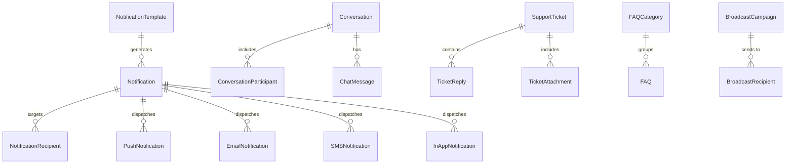

# Module 10: Notification, Communication & Support

> Unified notification engine, emergency broadcasting, user-to-user messaging, support ticket lifecycle, and FAQ management.

---

## Module Overview

| Property | Value |
|----------|-------|
| **Module ID** | `NOTIFICATION_COMMUNICATION_SUPPORT` |
| **Entities** | 23 |
| **Priority** | Medium |
| **Dependencies** | Authentication, Organization |

---

## Database Schema

### Table: `Notification`
| Column | Type | Constraints | Description |
|--------|------|-------------|-------------|
| `id` | `UUID` | PK | Unique identifier |
| `templateId` | `UUID` | FK → `NotificationTemplate.id`, NULL | Optional template link |
| `title` | `VARCHAR` | NOT NULL | Title of alert |
| `message` | `TEXT` | NOT NULL | Message payload |
| `type` | `VARCHAR` | NOT NULL | e.g. `SYSTEM`, `CAMPAIGN`, `EMERGENCY` |
| `priority` | `VARCHAR` | DEFAULT `NORMAL` | `LOW`, `NORMAL`, `HIGH`, `URGENT` |
| `senderId` | `VARCHAR` | NULL | Sending admin ID |
| `status` | `VARCHAR` | DEFAULT `PENDING` | `PENDING`, `SENT`, `FAILED` |
| `scheduledAt` | `TIMESTAMPTZ` | NULL | Scheduled trigger time |
| `sentAt` | `TIMESTAMPTZ` | NULL | Dispatched timestamp |
| `createdAt` | `TIMESTAMPTZ` | DEFAULT NOW() | Creation time |
| `updatedAt` | `TIMESTAMPTZ` | Updated on mutation | Last update time |

---

### Table: `NotificationTemplate`
| Column | Type | Constraints | Description |
|--------|------|-------------|-------------|
| `id` | `UUID` | PK | Unique identifier |
| `templateName` | `VARCHAR` | UNIQUE, NOT NULL | Machine name e.g. `welcome_email` |
| `templateType` | `VARCHAR` | NOT NULL | `EMAIL`, `SMS`, `PUSH` |
| `subject` | `VARCHAR` | NULL | Subject for email templates |
| `body` | `TEXT` | NOT NULL | Body structure with template placeholders |
| `variables` | `VARCHAR[]` | NOT NULL | Expected variables list |
| `status` | `VARCHAR` | DEFAULT `ACTIVE` | `ACTIVE`, `INACTIVE` |

---

### Table: `SupportTicket`
| Column | Type | Constraints | Description |
|--------|------|-------------|-------------|
| `id` | `UUID` | PK | Unique identifier |
| `ticketNumber` | `VARCHAR` | UNIQUE, NOT NULL | e.g. `TKT-1025-001` |
| `userId` | `VARCHAR` | FK → `User.id` | Owner of the ticket |
| `subject` | `VARCHAR` | NOT NULL | Ticket title |
| `description` | `TEXT` | NOT NULL | Detailed issue explanation |
| `category` | `VARCHAR` | NOT NULL | e.g. `TECHNICAL`, `DONATION_ISSUE` |
| `priority` | `VARCHAR` | DEFAULT `MEDIUM` | `LOW`, `MEDIUM`, `HIGH`, `CRITICAL` |
| `assignedTo` | `VARCHAR` | NULL | Staff member ID |
| `resolvedAt` | `TIMESTAMPTZ` | NULL | Resolution date |
| `status` | `VARCHAR` | DEFAULT `OPEN` | `OPEN`, `IN_PROGRESS`, `RESOLVED`, `CLOSED` |

---

## Entity Relationship Diagram



---

## API Endpoints

### 1. Queue Alert Notification
* **Endpoint:** `POST /api/v1/notifications/queue`
* **Access:** Authenticated / Admin
* **Body:**
```json
{
  "recipientId": "usr-uuid-1234",
  "type": "CAMPAIGN_UPDATE",
  "title": "New Winter Campaign Launch!",
  "body": "Check out the new Winter Clothes campaign in your area.",
  "priority": "NORMAL"
}
```
* **Success Response (201 Created):**
```json
{
  "success": true,
  "message": "Notification queued successfully",
  "data": { "id": "notif-uuid-456", "status": "PENDING" }
}
```

### 2. Submit Support Ticket
* **Endpoint:** `POST /api/v1/support-tickets`
* **Access:** Authenticated
* **Body:**
```json
{
  "subject": "Missing Donation Receipt",
  "description": "I donated 5000 BDT via bKash but have not received a PDF receipt.",
  "category": "DONATION_ISSUE",
  "priority": "HIGH"
}
```
* **Success Response (201 Created):**
```json
{
  "success": true,
  "message": "Support ticket created successfully",
  "data": { "id": "tkt-uuid-789", "ticketNumber": "TKT-1714-987" }
}
```

---

## Business Rules Summary

1. **Verification Safeguards**: OTP templates cannot contain dynamic HTML elements; only plain alphanumeric sequences are allowed.
2. **Support Ticket Routing**: Tickets are automatically assigned to coordinators based on the branch mapping of the submitting user.
3. **Audit Tracking**: Any edit, deletion, or dispatch attempt of template configurations is logged in `NotificationActivity` for compliance.
