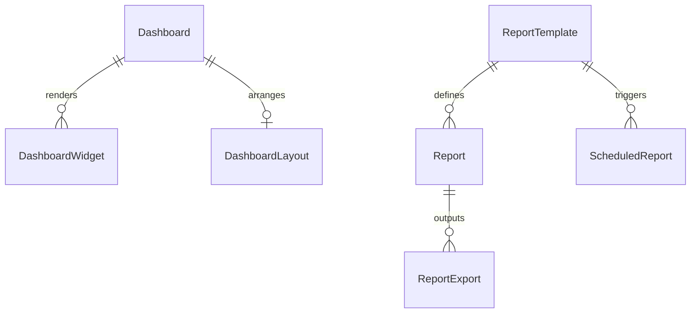

# Module 11: Analytics, Reports & Dashboard

> System-wide analytics snapshots, custom PDF/Excel reporting, scheduled report triggers, KPI targets, and customizable widget layouts.

---

## Module Overview

| Property | Value |
|----------|-------|
| **Module ID** | `ANALYTICS_REPORTS_DASHBOARD` |
| **Entities** | 23 |
| **Priority** | Low |
| **Dependencies** | Authentication, Donation, Campaign, Volunteer |

---

## Database Schema

### Table: `Dashboard`
| Column | Type | Constraints | Description |
|--------|------|-------------|-------------|
| `id` | `UUID` | PK | Unique identifier |
| `name` | `VARCHAR` | NOT NULL | Dashboard name |
| `description` | `TEXT` | NULL | Description of layout |
| `userId` | `VARCHAR` | NOT NULL | Owner ID |
| `isDefault` | `BOOLEAN` | DEFAULT FALSE | Default layout flag |
| `status` | `VARCHAR` | DEFAULT `ACTIVE` | `ACTIVE`, `INACTIVE` |

---

### Table: `DashboardWidget`
| Column | Type | Constraints | Description |
|--------|------|-------------|-------------|
| `id` | `UUID` | PK | Unique identifier |
| `dashboardId` | `UUID` | FK → `Dashboard.id` | Link to owner dashboard |
| `widgetType` | `VARCHAR` | NOT NULL | e.g. `LINE_CHART`, `KPI_CARD` |
| `title` | `VARCHAR` | NOT NULL | Widget title |
| `dataSource` | `VARCHAR` | NOT NULL | API endpoint or query link |
| `config` | `TEXT` | NULL | JSON layout/color settings |
| `positionX` | `INT` | DEFAULT 0 | Horizontal grid position |
| `positionY` | `INT` | DEFAULT 0 | Vertical grid position |
| `width` | `INT` | DEFAULT 4 | Grid width units |
| `height` | `INT` | DEFAULT 3 | Grid height units |

---

### Table: `KPI`
| Column | Type | Constraints | Description |
|--------|------|-------------|-------------|
| `id` | `UUID` | PK | Unique identifier |
| `kpiName` | `VARCHAR` | NOT NULL | e.g., `TOTAL_RAISED` |
| `category` | `VARCHAR` | NOT NULL | e.g. `DONATION`, `VOLUNTEER` |
| `targetValue` | `DOUBLE` | NOT NULL | Goal threshold |
| `currentValue` | `DOUBLE` | DEFAULT 0 | Current aggregated value |
| `unit` | `VARCHAR` | NULL | e.g. `BDT`, `HOURS` |
| `period` | `VARCHAR` | NOT NULL | e.g. `MONTHLY`, `YEARLY` |
| `branchId` | `VARCHAR` | NULL | Optional branch filter |

---

### Table: `Report`
| Column | Type | Constraints | Description |
|--------|------|-------------|-------------|
| `id` | `UUID` | PK | Unique identifier |
| `reportName` | `VARCHAR` | NOT NULL | File display name |
| `reportType` | `VARCHAR` | NOT NULL | e.g. `FINANCIAL`, `IMPACT` |
| `templateId` | `UUID` | FK → `ReportTemplate.id` | Layout template |
| `parameters` | `TEXT` | NULL | JSON criteria |
| `generatedBy` | `VARCHAR` | NOT NULL | Generating admin ID |
| `fileUrl` | `VARCHAR` | NULL | Generated S3 URL |
| `status` | `VARCHAR` | DEFAULT `GENERATED` | `PROCESSING`, `GENERATED`, `FAILED` |

---

## Entity Relationship Diagram



---

## API Endpoints

### 1. Generate Report
* **Endpoint:** `POST /api/v1/reports`
* **Access:** Admin (`report:create`)
* **Body:**
```json
{
  "reportName": "Q2 Financial Audit",
  "reportType": "FINANCIAL",
  "templateId": "tmpl-uuid-888",
  "parameters": {
    "startDate": "2026-04-01",
    "endDate": "2026-06-30"
  }
}
```
* **Success Response (201 Created):**
```json
{
  "success": true,
  "message": "Report generation initiated",
  "data": { "id": "rep-uuid-999", "status": "PROCESSING" }
}
```

### 2. Retrieve Dashboard Layout
* **Endpoint:** `GET /api/v1/dashboards/me`
* **Access:** Authenticated
* **Success Response (200 OK):**
```json
{
  "success": true,
  "message": "Dashboard retrieved",
  "data": {
    "id": "dash-uuid-111",
    "name": "My Workspace",
    "widgets": [
      { "id": "wid-uuid-222", "title": "Donations Growth", "widgetType": "LINE_CHART" }
    ]
  }
}
```

---

## Business Rules Summary

1. **Dashboard Widget Boundaries**: Widgets cannot overlap on the grid coordinates system.
2. **Immutable Audit Logs**: Audit metrics are logged in `AuditLog` asynchronously.
3. **Data Retention**: Generated reports expire and are deleted from S3 after 90 days.
