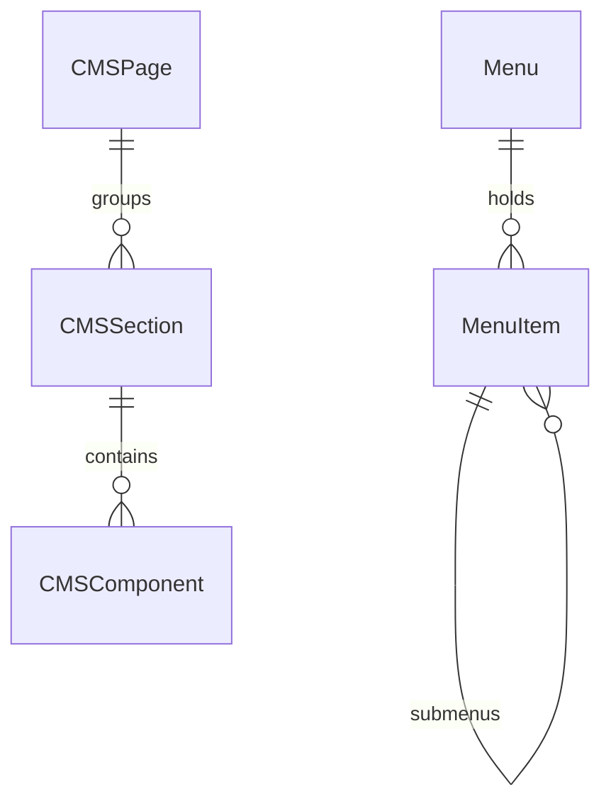

# Module 12: Admin, CMS & System Configuration

> Admin dashboard settings, custom CMS pages, banner slides, menus, multi-environment configurations, maintenance toggle, and system health telemetry.

---

## Module Overview

| Property | Value |
|----------|-------|
| **Module ID** | `ADMIN_CMS_CONFIGURATION` |
| **Entities** | 36 |
| **Priority** | High |
| **Dependencies** | Authentication |

---

## Database Schema

### Table: `CMSPage`
| Column | Type | Constraints | Description |
|--------|------|-------------|-------------|
| `id` | `UUID` | PK | Unique identifier |
| `title` | `VARCHAR` | NOT NULL | Title of page |
| `slug` | `VARCHAR` | UNIQUE, NOT NULL | URL-friendly slug e.g. `about-us` |
| `content` | `TEXT` | NULL | Main page body |
| `metaTitle` | `VARCHAR` | NULL | SEO metadata title |
| `metaDesc` | `VARCHAR` | NULL | SEO description |
| `template` | `VARCHAR` | NULL | Layout template name |
| `publishedAt` | `TIMESTAMPTZ` | NULL | Publication date |
| `status` | `VARCHAR` | DEFAULT `DRAFT` | `DRAFT`, `PUBLISHED`, `ARCHIVED` |

---

### Table: `SystemSetting`
| Column | Type | Constraints | Description |
|--------|------|-------------|-------------|
| `id` | `UUID` | PK | Unique identifier |
| `settingKey` | `VARCHAR` | UNIQUE, NOT NULL | Machine name e.g. `payment_retry_limit` |
| `settingValue` | `VARCHAR` | NOT NULL | Stored config value |
| `category` | `VARCHAR` | NOT NULL | e.g. `SECURITY`, `PAYMENTS`, `EMAILS` |
| `description` | `TEXT` | NULL | Explanatory description |
| `isPublic` | `BOOLEAN` | DEFAULT FALSE | Is visible to clients without auth |

---

### Table: `SystemHealth`
| Column | Type | Constraints | Description |
|--------|------|-------------|-------------|
| `id` | `UUID` | PK | Unique identifier |
| `serviceName` | `VARCHAR` | NOT NULL | e.g. `DATABASE`, `AUTH_SERVICE` |
| `status` | `VARCHAR` | DEFAULT `HEALTHY` | `HEALTHY`, `DEGRADED`, `CRITICAL` |
| `responseTime` | `DOUBLE` | DEFAULT 0 | Millisecond response latency |
| `cpuUsage` | `DOUBLE` | DEFAULT 0 | Percentage CPU utilization |
| `memoryUsage` | `DOUBLE` | DEFAULT 0 | Percentage Memory utilization |
| `diskUsage` | `DOUBLE` | DEFAULT 0 | Percentage Disk utilization |

---

## Entity Relationship Diagram



---

## API Endpoints

### 1. Create CMS Page
* **Endpoint:** `POST /api/v1/admin/cms/pages`
* **Access:** Admin (`cms:manage`)
* **Body:**
```json
{
  "title": "About Us",
  "slug": "about-us",
  "content": "ASHRAY is committed to transparent charity operations across Bangladesh.",
  "metaTitle": "About ASHRAY Foundation",
  "metaDesc": "Read about our history, mission, and how we distribute relief."
}
```
* **Success Response (201 Created):**
```json
{
  "success": true,
  "message": "CMS Page created successfully",
  "data": { "id": "page-uuid-555", "status": "DRAFT" }
}
```

### 2. Update System Configuration
* **Endpoint:** `PUT /api/v1/admin/system/settings/:key`
* **Access:** Super Admin (`settings:write`)
* **Body:**
```json
{
  "settingValue": "true",
  "description": "Force OTP verification for all new individual donor registrations."
}
```
* **Success Response (200 OK):**
```json
{
  "success": true,
  "message": "System setting updated successfully"
}
```

---

## Business Rules Summary

1. **Unique Slug Safeguard**: CMS Page slugs must be unique, lowercase, and cannot contain spaces or special characters except hyphens.
2. **Maintenance Mode Restrictions**: When `MaintenanceMode.isActive` is `true`, all non-admin API routes immediately return `503 Service Unavailable`.
3. **Audit Log Trail**: All changes to `SystemSetting` are tracked under `ActivityLog` with details of the previous value, new value, and who modified it.
