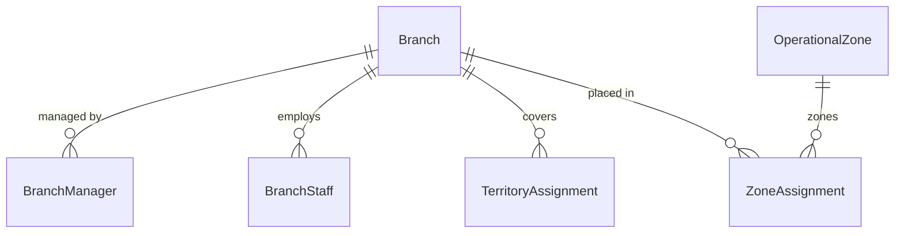

# Module 13: Multi-Branch, Regional Management & Organizational Hierarchy

> Multi-branch structure, regional manager mapping, geographic coverage scopes, territory assignments, and organizational reporting flows.

---

## Module Overview

| Property | Value |
|----------|-------|
| **Module ID** | `MULTI_BRANCH_REGIONAL_MANAGEMENT` |
| **Entities** | 36 |
| **Priority** | High |
| **Dependencies** | Authentication, Organization |

---

## Database Schema

### Table: `RegionalCoordinator`
| Column | Type | Constraints | Description |
|--------|------|-------------|-------------|
| `id` | `UUID` | PK | Unique identifier |
| `userId` | `VARCHAR` | FK → `User.id` | Coordinator user profile |
| `regionName` | `VARCHAR` | NOT NULL | e.g. `Greater Dhaka Region` |
| `divisionId` | `VARCHAR` | NULL | Assigned Division |
| `districtId` | `VARCHAR` | NULL | Optional District assignment |
| `assignedDate` | `TIMESTAMPTZ` | DEFAULT NOW() | Date assigned |
| `status` | `VARCHAR` | DEFAULT `ACTIVE` | `ACTIVE`, `INACTIVE` |

---

### Table: `TerritoryAssignment`
| Column | Type | Constraints | Description |
|--------|------|-------------|-------------|
| `id` | `UUID` | PK | Unique identifier |
| `userId` | `VARCHAR` | NOT NULL | Staff or volunteer user ID |
| `branchId` | `UUID` | FK → `Branch.id` | Linked branch |
| `divisionId` | `VARCHAR` | NULL | Scope Division |
| `districtId` | `VARCHAR` | NULL | Scope District |
| `upazilaId` | `VARCHAR` | NULL | Scope Upazila |
| `unionId` | `VARCHAR` | NULL | Scope Union |
| `assignedBy` | `VARCHAR` | NOT NULL | Admin user ID |

---

### Table: `AreaCoverage`
| Column | Type | Constraints | Description |
|--------|------|-------------|-------------|
| `id` | `UUID` | PK | Unique identifier |
| `branchId` | `UUID` | NOT NULL | Owning branch ID |
| `divisionId` | `VARCHAR` | NULL | Covered Division |
| `districtId` | `VARCHAR` | NULL | Covered District |
| `upazilaId` | `VARCHAR` | NULL | Covered Upazila |
| `unionId` | `VARCHAR` | NULL | Covered Union |
| `population` | `INT` | DEFAULT 0 | Estimated population in covered area |

---

## Entity Relationship Diagram



---

## API Endpoints

### 1. Assign Regional Coordinator
* **Endpoint:** `POST /api/v1/admin/coordinators`
* **Access:** Super Admin (`coordinators:write`)
* **Body:**
```json
{
  "userId": "usr-uuid-222",
  "regionName": "Chittagong Relief Command",
  "divisionId": "div-chittagong"
}
```
* **Success Response (201 Created):**
```json
{
  "success": true,
  "message": "Regional coordinator assigned successfully",
  "data": { "id": "coord-uuid-333", "status": "ACTIVE" }
}
```

### 2. Record Territory Assignment
* **Endpoint:** `POST /api/v1/admin/territories`
* **Access:** Regional Coordinator / Admin (`territory:assign`)
* **Body:**
```json
{
  "userId": "usr-uuid-888",
  "branchId": "br-dhaka-1",
  "divisionId": "div-dhaka",
  "districtId": "dist-dhaka",
  "upazilaId": "up-mohammadpur"
}
```
* **Success Response (201 Created):**
```json
{
  "success": true,
  "message": "Territory assigned successfully",
  "data": { "id": "terr-uuid-444" }
}
```

---

## Business Rules Summary

1. **Manager Hierarchy Safeguard**: A coordinator or manager cannot be assigned to oversee a region if their own profile has an `INACTIVE` or `SUSPENDED` status.
2. **Jurisdiction Limits**: A coordinator can only assign territory targets within their own division or district.
3. **Audit Log Trail**: All changes to `BranchManager` or `BranchStaff` roles are logged in `BranchActivityLog` for compliance.
