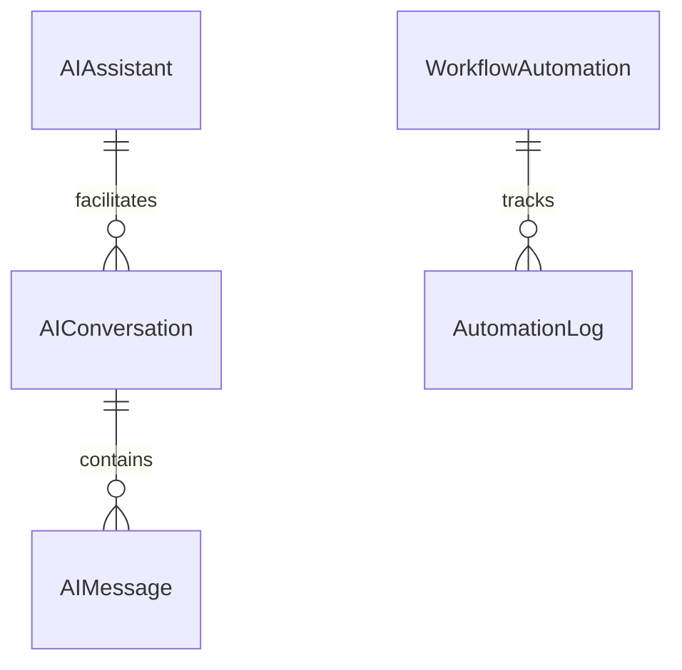

# Module 14: AI, Automation & Smart Foundation Services

> LLM Assistant chat, donor/volunteer matching recommendations, route optimizations for field relief runs, triggered workflow automations, and cron schedulers.

---

## Module Overview

| Property | Value |
|----------|-------|
| **Module ID** | `AI_AUTOMATION_SMART_SERVICES` |
| **Entities** | 32 |
| **Priority** | Low |
| **Dependencies** | Authentication, Campaign, Volunteer, Beneficiary |

---

## Database Schema

### Table: `AIAssistant`
| Column | Type | Constraints | Description |
|--------|------|-------------|-------------|
| `id` | `UUID` | PK | Unique identifier |
| `name` | `VARCHAR` | NOT NULL | Assistant instance name |
| `description` | `TEXT` | NULL | Capability description |
| `modelType` | `VARCHAR` | NOT NULL | LLM variant e.g. `gemini-3.5-flash` |
| `capabilities` | `VARCHAR[]` | NOT NULL | Enabled functions e.g. `['matching', 'prediction']` |
| `status` | `VARCHAR` | DEFAULT `ACTIVE` | `ACTIVE`, `INACTIVE` |

---

### Table: `AIRecommendation`
| Column | Type | Constraints | Description |
|--------|------|-------------|-------------|
| `id` | `UUID` | PK | Unique identifier |
| `recommendationType` | `VARCHAR` | NOT NULL | e.g. `DONOR_CAMPAIGN`, `VOLUNTEER_PROJECT` |
| `targetUserId` | `VARCHAR` | NULL | Optional user target profile |
| `title` | `VARCHAR` | NOT NULL | Short summary of advice |
| `description` | `TEXT` | NULL | In-depth recommendation rationale |
| `confidenceScore` | `DOUBLE` | DEFAULT 0 | Model score from `0.0` to `1.0` |
| `metadata` | `TEXT` | NULL | Stored model parameters |
| `status` | `VARCHAR` | DEFAULT `PENDING` | `PENDING`, `ACCEPTED`, `DISMISSED` |

---

### Table: `RouteOptimization`
| Column | Type | Constraints | Description |
|--------|------|-------------|-------------|
| `id` | `UUID` | PK | Unique identifier |
| `optimizationType` | `VARCHAR` | NOT NULL | e.g. `RELIEF_DISTRIBUTION` |
| `startLocation` | `VARCHAR` | NOT NULL | Start address coordinates |
| `endLocation` | `VARCHAR` | NOT NULL | End address coordinates |
| `waypoints` | `VARCHAR[]` | NOT NULL | Distribution spot coordinates array |
| `optimizedRoute` | `TEXT` | NULL | Output route coordinate array |
| `distanceKm` | `DOUBLE` | DEFAULT 0 | Total route distance |
| `durationMinutes` | `DOUBLE` | DEFAULT 0 | Total route duration estimate |

---

## Entity Relationship Diagram



---

## API Endpoints

### 1. Send Assistant Chat Prompt
* **Endpoint:** `POST /api/v1/ai/assistant/chat`
* **Access:** Authenticated
* **Body:**
```json
{
  "assistantId": "ast-uuid-111",
  "message": "Which ongoing campaigns need urgent volunteer assignments in Dhaka?"
}
```
* **Success Response (200 OK):**
```json
{
  "success": true,
  "message": "Response generated",
  "data": {
    "reply": "Based on current needs, the 'Flood Relief 2026' campaign has 5 vacant spots in Mohammadpur."
  }
}
```

### 2. Request Route Optimization
* **Endpoint:** `POST /api/v1/ai/route-optimizations`
* **Access:** Admin / Coordinator
* **Body:**
```json
{
  "optimizationType": "RELIEF_DISTRIBUTION",
  "startLocation": "23.7645,90.3542",
  "endLocation": "23.7700,90.3600",
  "waypoints": [
    "23.7650,90.3550",
    "23.7680,90.3590"
  ]
}
```
* **Success Response (201 Created):**
```json
{
  "success": true,
  "message": "Optimized route calculated successfully",
  "data": {
    "id": "route-uuid-101",
    "optimizedRoute": "['23.7645,90.3542', '23.7650,90.3550', '23.7680,90.3590', '23.7700,90.3600']",
    "distanceKm": 2.4,
    "durationMinutes": 18.5
  }
}
```

---

## Business Rules Summary

1. **Threshold Filtering**: Recommendations are only stored or presented if `confidenceScore` meets a threshold of `0.70` or higher.
2. **Execution Retries**: Failed `AutoTask` executions retry up to `maxRetries` (default `3`) before flagging an alert.
3. **Audit Log Trail**: All assistant calls and automation outcomes are recorded under `AutomationLog` for inspection.
